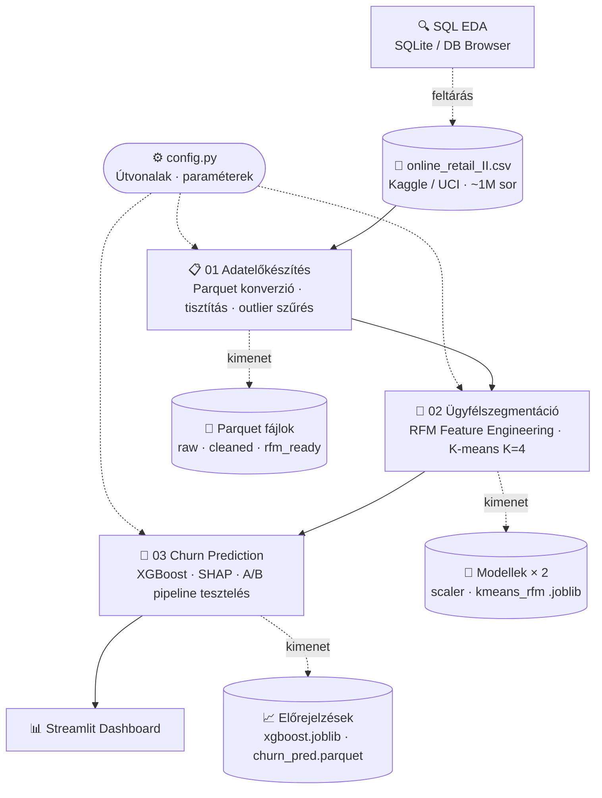

<a id="teteje"></a>
# E-kereskedelmi vásárlói szegmentáció és churn-elemzés 

<div align="right">
  <strong>Magyar</strong> | <a href="README_en.md">English</a>
</div>

---


<p align="center">
  
  
  
  
  
  
</p>

<p align="center">
  <a href="#adathalmaz">Adathalmaz</a> &bull;
  <a href="#elemzes-lepesek">Elemzési lépések</a> &bull;
  <a href="#dashboard">Dashboard</a> &bull;
  <a href="#setup">Setup</a> &bull;
  <a href="#architektura">Architektúra</a> &bull;
  <a href="#mappastruktura">Mappastruktúra</a> &bull;
  <a href="#gyik">GYIK</a> &bull;
  <a href="#kapcsolat">Kapcsolat</a>
</p>

<p align="center">
🛒End-to-end data product interaktív dashboarddal.
</p>

[](https://csabatatrai.hu/)


<p align="center">
  <a href="https://csabatatrai.hu/">🌐 Látogasd meg a portfóliómat (külső weboldal)</a>
</p>

<a id="adathalmaz"></a>

## Adathalmaz

Az elemzés alapja egy [Kaggle-ről](https://www.kaggle.com/datasets/mashlyn/online-retail-ii-uci/data) (eredeti: [UCI Machine Learning Repository](https://archive.ics.uci.edu/dataset/502/online+retail+ii)) származó valódi, ~1 millió soros tranzakciós adathalmaz 2009 és 2011 közti, Egyesült Királyságban működő kereskedő tranzakcióival.

> Az adathalmazban B2B és B2C ügyfelek vegyesen szerepelnek. Ez különösen indokolja az RFM-alapú szegmentációs megközelítést, ahol a visszatérő vásárlók azonosítása és a churn előrejelzése üzletileg kritikus..

## Eredmények

### Adattisztítás

Az 1 067 371 nyers sorból 5 lépéses pipeline után **793 900 sor** maradt elemzésre kész állapotban (az eredeti adathalmaz **74,4%-a**):

| Szűrési lépés | Eldobott sorok |
|---|---|
| Anonim tranzakciók (hiányzó Customer ID) | −243 007 |
| Adminisztratív kódok (BANK CHARGES, C2, stb.) | −3 709 |
| Duplikátumok | −26 402 |
| Érvénytelen ár (≤ 0) | −71 |
| Fejlesztői tesztkódok | −14 |
| Technikai outlierek (>10 000 db-os tételek) | ~−268 |
| **Elemzésre kész sorok** | **793 900** |

> A visszáru/sztornó sorok (`C` prefix az Invoice oszlopban) szándékosan megmaradtak, `return_ratio` feature-ként épültek be a modellbe.

---

### Ügyfélszegmentáció (K-means, K=4)

5 243 ügyfelet sorolt 4 szegmensbe a modell:

| Szegmens | Ügyfelek | Átl. vásárlások | Átl. bevétel / fő | Utolsó vásárlás |
|---|---|---|---|---|
| 🏆 VIP Bajnokok | 861 (16%) | 19,5 alkalom | £10 391 | 30 napja |
| 💤 Lemorzsolódó / Alvó | 1 624 (31%) | 5,1 alkalom | £1 888 | 195 napja |
| 👻 Elvesztett / Inaktív | 2 098 (40%) | 1,4 alkalom | £330 | 340 napja |
| 🌱 Új / Ígéretes | 660 (13%) | 2,8 alkalom | £758 | 30 napja |

A VIP szegmens az ügyfelek 16%-a, de fejenként ~31-szeresét költi az Elvesztett szegmenshez képest (£10 391 vs £330). A SHAP-elemzés megerősítette, hogy a visszaküldési arány a VIP-eknél a legmagasabb (~16%), ez tipikus B2B viselkedés, nem lemorzsolódási jel.

> ℹ️ A szegmensenkénti teljes bevételarány a notebookokból közvetlenül nem olvasható ki, a dashboard tartalmaz erre vonatkozó aggregált nézetet.

---

### Churn-előrejelzés (XGBoost + A/B pipeline)

Az ügyfelek **55,7%-a** lemorzsolódott a 2011-09-09-es cutoff után, ami erősen imbalanced osztályeloszlást jelent. Ezért a fő metrika a **PR-AUC**, nem az Accuracy (és nem a ROC-AUC, amely imbalanced esetben félrevezető lehet).

**5-fold keresztvalidáció eredményei:**

| Pipeline | PR-AUC | F1-Score | Recall |
|---|---|---|---|
| A – Csak RFM | 0,818 | 0,750 | 0,745 |
| **B – RFM + K-Means** | **0,819** | **0,758** | **0,752** |

A két modell teljesítménye szorosan egyforma, a klasztercímkék marginális javulást adnak, ezért az **A pipeline** az ajánlottabb produkciós megoldás (kisebb komplexitás, azonos teljesítmény). A tréning PR-AUC 0,882, ami minimális overfittingre utal.

Az optimális döntési küszöb **0,35** (az alapértelmezett 0,5 helyett), ahol a modell **Recall = 0,92**-t ér el 0,73-as Precision mellett, azaz a valóban lemorzsolódó ügyfelek 92%-át elkapja, 27%-os hamis riasztás árán.

A legfontosabb feature mindkét modellben: `recency_days` (SHAP-hatás ~+0,4), ezt követi a `monetary_total` és a `frequency`.

> ℹ️ Explicit baseline összehasonlítás nem szerepel a notebookokban, a PR-AUC random baseline értéke imbalanced adatnál az osztályok arányával egyenlő (~0,557), tehát a modell (~0,819) közel **1,47×-es javulást** jelent a véletlenszerű osztályozóhoz képest.

<a id="elemzes-lepesek"></a>
## Elemzési lépések

| # | Lépés | Notebook | Lefutott eredmények megtekintése (ugrás adott részhez) |
|---|-------|----------|----------------------------------|
| 0 | Adatbetöltés és Parquet-konverzió | `01_data_preparation.ipynb` | [📊 Megtekintés](docs/01_data_preparation.md#0-adatbetöltés-és-parquet-konverzió) |
| 1 | Adattisztítás | `01_data_preparation.ipynb` | [📊 Megtekintés](docs/01_data_preparation.md#1-adattisztítás) |
| 2 | Feature Engineering és az adatszivárgás megelőzése | `02_customer_segmentation.ipynb` | [📊 Megtekintés](docs/02_customer_segmentation.md#2-feature-engineering-és-az-adatszivárgás-megelőzése) |
| 3 | Statisztikai Outlier-kezelés és skálázás | `02_customer_segmentation.ipynb` | [📊 Megtekintés](docs/02_customer_segmentation.md#3-statisztikai-outlier-kezelés-és-skálázás) |
| 4 | K-means Klaszterezés | `02_customer_segmentation.ipynb` | [📊 Megtekintés](docs/02_customer_segmentation.md#4-k-means-klaszterezés) |
| 5 | Kiterjesztett EDA | `02_customer_segmentation.ipynb` | [📊 Megtekintés](docs/02_customer_segmentation.md#5-kiterjesztett-eda) |
| 6 | Adatbetöltés, Time-Split és Célváltozó (Churn) kialakítása | `03_churn_prediction.ipynb` | [📊 Megtekintés](docs/03_churn_prediction.md#6-adatbetöltés-time-split-és-célváltozó-churn-kialakítása) |
| 7 | A/B Modellezés: Pipeline-ok felépítése | `03_churn_prediction.ipynb` | [📊 Megtekintés](docs/03_churn_prediction.md#7-ab-modellezés-pipeline-ok-felépítése) |
| 8 | Keresztvalidáció és modellek összehasonlítása | `03_churn_prediction.ipynb` | [📊 Megtekintés](docs/03_churn_prediction.md#8-keresztvalidáció-és-modellek-összehasonlítása) |
| 9 | Modell magyarázata SHAP segítségével | `03_churn_prediction.ipynb` | [📊 Megtekintés](docs/03_churn_prediction.md#9-modell-magyarázata-shap-segítségével) |
| 10 | Üzleti kiértékelés és Akciótervek | `03_churn_prediction.ipynb` | [📊 Megtekintés](docs/03_churn_prediction.md#10-üzleti-kiértékelés-és-akciótervek) |
| 11 | Export - A modell és az előrejelzések mentése | `03_churn_prediction.ipynb` | [📊 Megtekintés](docs/03_churn_prediction.md#11-export---a-modell-és-az-előrejelzések-mentése) |

<a id="dashboard"></a>
## Dashboard

> Az alábbi animáció a vásárlási tranzakciók időbeli dinamikáját és a projekt interaktív felületét mutatja be.

<p align="center">
  <a href="https://csabatatrai.hu/">
    
  </a>
  <br>
  <a href="https://csabatatrai.hu/">
    
  </a>
</p>

<a id="setup"></a>
## Lokális futtatás és környezet beállítása (Setup)

> **💡 Megjegyzés:** A projekt alapértelmezett bemeneti/kimeneti fájlútvonalait és a főbb paramétereket (pl. `CUTOFF_DATE`) a `config.py` fájl tartalmazza. Az útvonalakat itt lehet módosítani eltérő mappastruktúra használatához.

A projekt futtatásához javasolt egy izolált virtuális környezet (pl. Conda) használata:

1. Klónozd a repót és navigálj a mappába:
```bash
git clone https://github.com/csabatatrai/ecommerce-customer-segmentation
cd ecommerce-customer-segmentation
```

2. Hozz létre egy új környezetet:
```bash
conda create --name ecommerce_env python=3.10
conda activate ecommerce_env
```

3. Telepítsd a függőségeket:
```bash
pip install -r requirements.txt
```

4. A nyers adathalmazt a 01_data_preparation.ipynb notebook automatikusan letölti, de beszerezhető innen is: [online-retail-II letöltése](https://archive.ics.uci.edu/static/public/502/online+retail+ii.zip) . A `data/raw/` mappában lesz megtalálható az első notebook futtatása után!  

5. Indítsd el a Jupytert:
```bash
jupyter notebook
```

6. Futtasd a notebookokat **sorrendben**:
   - `01_data_preparation.ipynb` – Adatelőkészítés: Data Preparation (Adattisztítás és Parquet Pipeline)
   - `02_customer_segmentation.ipynb` – Ügyfélszegmentáció: Customer Segmentation (RFM Elemzés és K-means)
   - `03_churn_prediction.ipynb` – Prediktív Modellezés: Churn Prediction (XGBoost Klasszifikáció)

7. A Streamlit dashboardok lokális megnyitásához navigálj terminállal a gyökérkönyvtárba, és használd a `streamlit run app.py` parancsot!

---

<a id="mappastruktura"></a>
## Mappastruktúra
>A notebookok futtatásakor a kód automatikusan létrehozza a teljes szükséges mappastruktúrát.
<pre>
ecommerce-customer-segmentation/
│
├── <a href="LICENSE">LICENSE</a>                           # MIT – szabadon tanulmányozható és futtatható
├── <a href="config.py">config.py</a>                         # közös útvonal-konstansok és pipeline paraméterek
├── <a href="requirements.txt">requirements.txt</a>
├── .gitignore
│
├── data/                             # 🚨 notebook hozza létre config.py segítségével
│   ├── raw/                          # 🚨 notebook hozza létre, ide tölti le a nyers datasetet
│   └── processed/                    # 💾 notebook hozza létre, tisztított, parquet fájlok
│
├── <a href="sql/">sql/</a>
│   └── <a href="sql/eda_exploratory_analysis.sql">eda_exploratory_analysis.sql</a>  # SQL szkriptek
│
├── <a href="01_data_preparation.ipynb">01_data_preparation.ipynb</a>         # adattisztítás
├── <a href="02_customer_segmentation.ipynb">02_customer_segmentation.ipynb</a>    # RFM feature engineering és K-means klaszterezés
├── <a href="03_churn_prediction.ipynb">03_churn_prediction.ipynb</a>         # XGBoost churn predikció
│
├── models/                           # 🚨notebook hozza létre, szerializált modell- és transzformátor-objektumok (joblib)
│
├── <a href="app.py">app.py</a>                            # Streamlit dashboard főfájl
├── <a href="pages/">pages/</a>                            # Streamlitnek további dashboardok
│
├── <a href="docs/">docs/</a>                             # 🟢 Lefuttatott notebookok markdownban
│   ├── <a href="docs/images/">images/</a>
│   │   ├── <a href="docs/images/01_data_preparation/">01_data_preparation/</a>
│   │   ├── <a href="docs/images/02_customer_segmentation/">02_customer_segmentation/</a>
│   │   └── <a href="docs/images/03_churn_prediction/">03_churn_prediction/</a>
│   ├── <a href="docs/01_data_preparation.md">01_data_preparation.md</a>
│   ├── <a href="docs/02_customer_segmentation.md">02_customer_segmentation.md</a>
│   └── <a href="docs/03_churn_prediction.md">03_churn_prediction.md</a>
│
└── <a href="update_docs.py">update_docs.py</a>                    # 💡 dokumentáció-automatizáló szkript (részben dokumentálja magát a kód)
</pre>

<a id="architektura"></a>
## Architektúra


<a id="gyik"></a>
## GYIK

<details>
<summary>💡 Hogyan használtam AI-eszközöket a projekt során?</summary>

> A projekt tervezési döntései, az elemzési logika és a pipeline-architektúra 
> saját munkám. AI-eszközöket (főként Claude) a következőkre 
> használtam: kódgenerálás, dokumentáció és kommentek megfogalmazása, hibakeresés iteratív módszerrel, visszajelzések kérése. A modellek kiválasztása és az üzleti értelmezés emberi döntés maradt.
</summary>
</details>

---

<details>
<summary>💡 Milyen módszerrel történt az adatfeltárás (EDA)?</summary>

> Az elsődleges adatfeltárás **(EDA)** ebben a projektben SQLite-ban történt ([DB Browser for SQLite](https://sqlitebrowser.org/)), nem közvetlenül Pandasban. A futtatott lekérdezések megtalálhatók a `sql/eda_exploratory_analysis.sql` fájlban; az itt szerzett felismerések épültek be a Python pipeline tisztítási és szegmentációs logikájába.
</details>

---

<details>
<summary>💡 Miért Parquet fájlokban van a kimenet?</summary>

> A Parquet fájlok legnagyobb előnye az oszlopos tárolási formátum, gyorsabb I/O, típusbiztos séma, kisebb méret — ezért ez az iparági standard analitikai pipeline-okban
</details>

---

<details>
<summary>💡 Hogyan biztosítja a projekt a notebookok tiszta verziókövetését?</summary>

> A projekt az **nbstripout** eszközt használja Git pre-commit hook formájában. Ez automatikusan megtisztítja a notebookok (`.ipynb`) JSON struktúráját a futtatási kimenetektől (output cellák) és a metaadatoktól, megelőzve a repo indokolatlan méretnövekedését és a felesleges merge konfliktusokat.
>
> **Használat:** A fejlesztői környezetben a terminálból kiadott `nbstripout --install` paranccsal konfigurálható a lokális hook.
</details>

---

<details>
<summary>💡 Akartál ajánlani valami bővítményt Visual Studio Code-hoz, nem?</summary>

> De! Kódolvasás Visual Studio Code-ban: a projekt megtekintéséhez erősen ajánlott a [Better Comments](https://marketplace.visualstudio.com/items?itemName=aaron-bond.better-comments) bővítmény telepítése. A forráskódban tudatosan használok színkódolt kommenteket a fontos megjegyzések, összefüggések és kiemelések jelölésére, így a bővítmény használatával sokkal átláthatóbbá válik a kód logikája.
</details>

---

<a id="kapcsolat"></a>
## Kapcsolat

Ha kérdésed van a projekttel kapcsolatban, vagy szívesen beszélgetnél hasonló témákról, keress bátran az alábbi elérhetőségeken:

* **Weboldal:** [csabatatrai.hu](https://csabatatrai.hu/)
* **LinkedIn:** [linkedin.com/in/csabatatrai-datascientist](https://www.linkedin.com/in/csabatatrai-datascientist/)
* **E-mail:** [tatraicsababprof@gmail.com](mailto:tatraicsababprof@gmail.com)

---

<div align="center">
  © 2026 Tátrai Csaba Attila · <a href="LICENSE">MIT licensz</a>
  <br><br>
  <a href="#teteje">
    
  </a>
</div>


