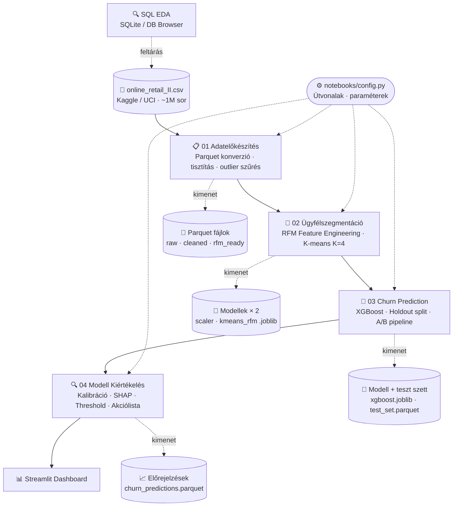

<a id="teteje"></a>
# E-kereskedelmi vásárlói szegmentáció és churn-elemzés 

<div align="right">
  <strong>Magyar</strong> | <a href="README_en.md">English</a>
</div>

---


<p align="center">
  
  
  
  
  
  
</p>

<p align="center">
  <a href="#adathalmaz">Adathalmaz</a> &bull;
  <a href="#eredmenyek">Eredmények</a> &bull;
  <a href="#elemzes-lepesek">Elemzési lépések</a> &bull;
  <a href="#dashboard">Dashboard</a> &bull;
  <a href="#setup">Setup</a> &bull;
  <a href="#architektura">Architektúra</a> &bull;
  <a href="#mappastruktura">Mappastruktúra</a> &bull;
  <a href="#gyik">GYIK</a> &bull;
  <a href="#kapcsolat">Kapcsolat</a>
</p>

<p align="center">
🛒End-to-end data product interaktív dashboarddal.
</p>

[](https://csabatatrai.hu/)


<p align="center">
  <a href="https://csabatatrai.hu/">🌐 Látogasd meg a portfóliómat (külső weboldal)</a>
</p>

<a id="adathalmaz"></a>
## Adathalmaz

Az elemzés alapja egy [Kaggle-ről](https://www.kaggle.com/datasets/mashlyn/online-retail-ii-uci/data) (eredeti: [UCI Machine Learning Repository](https://archive.ics.uci.edu/dataset/502/online+retail+ii)) származó valódi, ~1 millió soros tranzakciós adathalmaz 2009 és 2011 közti, Egyesült Királyságban működő kereskedő tranzakcióival.

> Az adathalmazban B2B és B2C ügyfelek vegyesen szerepelnek. Ez különösen indokolja az RFM-alapú szegmentációs megközelítést, ahol a visszatérő vásárlók azonosítása és a churn előrejelzése üzletileg kritikus..

<a id="eredmenyek"></a>
## Eredmények

### Adattisztítás

Az 1 067 371 nyers sorból 6 lépéses pipeline után **793 900 sor** maradt elemzésre kész állapotban (az eredeti adathalmaz **74,4%-a**):

| Szűrési lépés | Eldobott sorok |
|---|---|
| Anonim tranzakciók (hiányzó Customer ID) | −243 007 |
| Érvénytelen ár (≤ 0) | −71 |
| Adminisztratív kódok (BANK CHARGES, C2, stb.) | −3 709 |
| Fejlesztői tesztkódok | −14 |
| Duplikátumok | −26 402 |
| Technikai outlierek (>10 000 db-os tételek) | ~−268 |
| **Elemzésre kész sorok** | **793 900** |

> A visszáru/sztornó sorok (`C` prefix az Invoice oszlopban) szándékosan megmaradtak – `return_ratio` feature-ként épültek be a modellbe.

---

### Ügyfélszegmentáció (K-means, K=4)

>Bár matematikailag 2 klaszter lett volna indokolt, üzletileg a 4 jobban szegmentálja a vásárlókat és meg tudtam indokolni mint másodlagos optimum (lásd 02-es notebook).

5 243 ügyfelet sorolt 4 szegmensbe a modell:

| Szegmens | Ügyfelek | Átl. vásárlások | Átl. bevétel / fő | Utolsó vásárlás | Return ratio |
|---|---|---|---|---|---|
| 🏆 VIP Bajnokok | 861 (16%) | 19,5 alkalom | £10 391 | 30 napja | ~15,9% |
| 💤 Lemorzsolódó / Alvó | 1 624 (31%) | 5,1 alkalom | £1 888 | 195 napja | ~14,3% |
| 👻 Elvesztett / Inaktív | 2 098 (40%) | 1,4 alkalom | £330 | 340 napja | ~8,0% |
| 🌱 Új / Ígéretes | 660 (13%) | 2,8 alkalom | £758 | 30 napja | ~8,8% |

A VIP szegmens az ügyfelek 16%-a, de fejenként ~31-szeresét költi az Elvesztett szegmenshez képest. A legmagasabb visszaküldési aránnyal (~15,9%) szintén a VIP-ek rendelkeznek – ez tipikus B2B viselkedés, nem lemorzsolódási jel, amit a SHAP-elemzés is megerősít.

> ℹ️ A szegmensenkénti teljes bevételarány a dashboard aggregált nézetében olvasható.

---

### Churn-előrejelzés (XGBoost + A/B pipeline)

Az ügyfelek **55,7%-a** lemorzsolódott a 2011-09-09-es cutoff után – az osztályok közel kiegyensúlyozottak, de a **PR-AUC** így is informatívabb, mint az Accuracy vagy ROC-AUC.

**A/B modellválasztás** – 5-fold CV (X_train-en):

| Pipeline | PR-AUC | F1 | Recall |
|---|---|---|---|
| A – Csak RFM (5 feature) | 0,8098 | 0,740 | 0,734 |
| B – RFM + K-Means OHE (9 feature) | 0,8098 | 0,743 | 0,738 |

A két pipeline CV PR-AUC-ja negyedik tizedesjegyig azonos – a klasztercímkék nem adnak hozzá prediktív erőt. Az **A pipeline** a nyertes: nemcsak egyszerűbb, hanem **stabilabb is**, a B pipeline PR-AUC szórása fold-ok között lényegesen nagyobb, ami élesben kiszámíthatatlanabb teljesítményt jelent.

**RandomizedSearchCV hangolás után** (100 iteráció, X_train-en): CV PR-AUC → **0,8121**, holdout teszt PR-AUC → **0,8253**, overfitting rés → **0,0017** (hangolás előtt: 0,0504).

**Teljesítményértékelés:**

A pipeline két PR-AUC értéket produkál, amelyek különböző célokat szolgálnak:

| | PR-AUC | Mire vonatkozik |
|---|---|---|
| **Fejlesztési modell** (X_train-en tanult) | **0,8253** | Konzervatív holdout becslés – a modell valódi általánosítási képessége |
| **Produkciós modell** (teljes X+y-on retanítva) | **0,8322** | Visszaellenőrzési szám – a végleges exportált modellé |

> Az iparági best practice szerint a hiperparaméterek és az architektúra validálása után a produkciós modell a teljes adathalmazon kerül betanításra a maximális prediktív erő érdekében. A konzervatív holdout becslés (0,8253) az érvényes generalizációs metrika; a 0,8322 a retanított modell visszaellenőrzési értéke.

**Produkciós modell metrikái** (threshold-optimalizálás a holdout szetten):

| Metrika | Érték |
|---|---|
| F1-score (opt. threshold) | 0,785 |
| Recall | 0,856 |
| Precision | 0,724 |
| Brier-score | 0,1824 |
| Optimális küszöb | **0,419** *(F1-maximalizáló, nem hardcoded 0,5)* |

**Threshold trade-off:** a 0,5 → 0,419 váltás csökkenti az elszalasztott churnöket (FN: 149 → 84), de növeli a téves riasztásokat (FP: 111 → 191) – churn-megelőzési kontextusban szándékos döntés.

**Kalibráció:** a Brier-score elfogadható, de a reliability diagram jelzi, hogy **0,6 feletti becsléseknél a modell alábecsüli a tényleges churn-arányt** (0,60-os becslésnél ~78%, 0,75-ösnél ~90% a tényleges arány). A szürke zónában (0,30–0,70) elhelyezkedő ügyfelekre érdemes kiegészítő üzleti szabályokat alkalmazni.

**Feature fontosság** – SHAP és XGBoost Gain Spearman ρ = 0,900 egyezéssel:

| Feature | SHAP-fontosság |
|---|---|
| `recency_days` | ~55,7% |
| `frequency` | ~20,8% |
| `monetary_total` | ~19,2% |
| `return_ratio`, `monetary_avg` | ~4,3% |

> ℹ️ **Baseline:** PR-AUC véletlen alapvonal ~0,557 (osztályarány); a fejlesztési modell (0,8253) közel **1,48×-es javulást** jelent.
<a id="elemzes-lepesek"></a>
## Elemzési lépések 
>A dokumentációnak ez a része automatikusan frissül új notebookok és új H2 headerek hozzáadásakor az update_docs.py segítségével! Ennek feltétele, hogy a fejléc a `## {szám}. {cím}` formátumot kövesse (pl. `## 14. Export – Előrejelzések mentése`) - csak az így strukturált fejlécek kerülnek be a táblázatba és lesznek kattinthatók GitHub-on.

| # | Lépés | Notebook | Lefutott eredmények megtekintése (ugrás adott részhez) |
|---|-------|----------|----------------------------------|
| 0 | Adatbetöltés és Parquet-konverzió | `01_data_preparation.ipynb` | [📊 Megtekintés](notebooks/docs/01_data_preparation.md#0-adatbetöltés-és-parquet-konverzió) |
| 1 | Adattisztítás | `01_data_preparation.ipynb` | [📊 Megtekintés](notebooks/docs/01_data_preparation.md#1-adattisztítás) |
| 2 | Feature Engineering és az adatszivárgás megelőzése | `02_customer_segmentation.ipynb` | [📊 Megtekintés](notebooks/docs/02_customer_segmentation.md#2-feature-engineering-és-az-adatszivárgás-megelőzése) |
| 3 | Statisztikai Outlier-kezelés és skálázás | `02_customer_segmentation.ipynb` | [📊 Megtekintés](notebooks/docs/02_customer_segmentation.md#3-statisztikai-outlier-kezelés-és-skálázás) |
| 4 | K-means Klaszterezés | `02_customer_segmentation.ipynb` | [📊 Megtekintés](notebooks/docs/02_customer_segmentation.md#4-k-means-klaszterezés) |
| 5 | Kiterjesztett EDA | `02_customer_segmentation.ipynb` | [📊 Megtekintés](notebooks/docs/02_customer_segmentation.md#5-kiterjesztett-eda) |
| 6 | Adatbetöltés, Time-Split és Célváltozó (Churn) kialakítása | `03_churn_prediction.ipynb` | [📊 Megtekintés](notebooks/docs/03_churn_prediction.md#6-adatbetöltés-time-split-és-célváltozó-churn-kialakítása) |
| 7 | A/B Modellezés: Pipeline-ok felépítése | `03_churn_prediction.ipynb` | [📊 Megtekintés](notebooks/docs/03_churn_prediction.md#7-ab-modellezés-pipeline-ok-felépítése) |
| 8 | Keresztvalidáció és modellek összehasonlítása | `03_churn_prediction.ipynb` | [📊 Megtekintés](notebooks/docs/03_churn_prediction.md#8-keresztvalidáció-és-modellek-összehasonlítása) |
| 9 | Végleges modell exportja | `03_churn_prediction.ipynb` | [📊 Megtekintés](notebooks/docs/03_churn_prediction.md#9-végleges-modell-exportja) |
| 10 | Modell betöltése és adatok előkészítése | `04_model_evaluation.ipynb` | [📊 Megtekintés](notebooks/docs/04_model_evaluation.md#10-modell-betöltése-és-adatok-előkészítése) |
| 11 | Modell kiértékelése | `04_model_evaluation.ipynb` | [📊 Megtekintés](notebooks/docs/04_model_evaluation.md#11-modell-kiértékelése) |
| 12 | Modell magyarázata, SHAP elemzés | `04_model_evaluation.ipynb` | [📊 Megtekintés](notebooks/docs/04_model_evaluation.md#12-modell-magyarázata-shap-elemzés) |
| 13 | Üzleti kiértékelés és akciótervek | `04_model_evaluation.ipynb` | [📊 Megtekintés](notebooks/docs/04_model_evaluation.md#13-üzleti-kiértékelés-és-akciótervek) |
| 14 | Export, előrejelzések mentése | `04_model_evaluation.ipynb` | [📊 Megtekintés](notebooks/docs/04_model_evaluation.md#14-export-előrejelzések-mentése) |

<a id="dashboard"></a>
## Dashboard

> Az alábbi animáció a vásárlási tranzakciók időbeli dinamikáját és a projekt interaktív felületét mutatja be.

<p align="center">
  <a href="https://churn-elemzes.streamlit.app/">
    
  </a>
  <br>
  <a href="https://churn-elemzes.streamlit.app/">
    
  </a>
</p>

<details>
<summary>💡 Streamlit memóriaoptimalizálás – tanulságok éles üzemeltetésből</summary>

> A dashboard Streamlit Community Cloudra van deployolva. Magas látogatószám esetén az app memórialimitbe ütközött. Az alábbi változtatások oldották meg a problémát:
>
> **1. `@st.cache_resource` a `@st.cache_data` helyett**
> A `cache_data` minden egyes felhasználónak külön másolatot készít az adatból – sok egyidejű látogató esetén ez arányosan növeli a memóriaigényt. A `cache_resource` egyetlen objektumot tárol, amelyet az összes munkamenet oszt. Kizárólag olvasásra használt adatnál (DataFrame-ek) ez biztonságos és lényegesen hatékonyabb.
>
> **2. Közös `data_loader.py` modul**
> A többoldalas Streamlit appban (`app.py` + `pages/`) minden oldal saját `@st.cache_data` függvényt definiált – ezek külön cache-bejegyzésként éltek, így a nagyméretű tranzakciós fájl kétszer töltődött be a memóriába. Egy megosztott modul egyetlen `@st.cache_resource` funkcióval ezt megszünteti.
>
> **3. Csak a szükséges oszlopok betöltése**
> A `pd.read_parquet(path, columns=[...])` paraméterrel csak a ténylegesen használt oszlopok kerülnek be a memóriába. A ~1 milliós tranzakciós Parquet-fájlnál ez érdemi méretcsökkentést jelent.
>
> **Összefoglalás:** sok egyidejű felhasználó esetén a Streamlit memóriaproblémájának első gyanúsítottjai a `cache_data` és a duplikált betöltések.

</details>

---

<a id="setup"></a>
## Lokális futtatás és környezet beállítása (Setup)

> **💡 Megjegyzés:** A projekt alapértelmezett bemeneti/kimeneti fájlútvonalait és a főbb paramétereket (pl. `CUTOFF_DATE`) a `notebooks/config.py` fájl tartalmazza. Az útvonalakat itt lehet módosítani eltérő mappastruktúra használatához.

A projekt futtatásához javasolt egy izolált virtuális környezet (pl. Conda) használata:

1. Klónozd a repót és navigálj a mappába:
```bash
git clone https://github.com/csabatatrai/ecommerce-customer-segmentation
cd ecommerce-customer-segmentation
```

2. Hozz létre egy új környezetet:
```bash
conda create --name ecommerce_env python=3.10
conda activate ecommerce_env
```

3. Telepítsd a függőségeket:
```bash
pip install -r requirements.txt
```

4. A nyers adathalmazt a 01_data_preparation.ipynb notebook automatikusan letölti, de beszerezhető innen is: [online-retail-II letöltése](https://archive.ics.uci.edu/static/public/502/online+retail+ii.zip) . A `data/raw/` mappában lesz megtalálható az első notebook futtatása után!  

5. Indítsd el a Jupytert:
```bash
jupyter notebook
```

6. Futtasd a notebookokat **sorrendben** (a `notebooks/` mappából):
   - `notebooks/01_data_preparation.ipynb` – Adatelőkészítés: Data Preparation (Adattisztítás és Parquet Pipeline)
   - `notebooks/02_customer_segmentation.ipynb` – Ügyfélszegmentáció: Customer Segmentation (RFM Elemzés és K-means)
   - `notebooks/03_churn_prediction.ipynb` – Prediktív Modellezés: Churn Prediction (XGBoost Klasszifikáció)
   - `notebooks/04_model_evaluation.ipynb` – Modell Kiértékelés: Kalibráció, SHAP, Threshold & üzleti akciótervek

7. A Streamlit dashboardok lokális megnyitásához navigálj terminállal a gyökérkönyvtárba, és használd a `streamlit run app.py` parancsot!

---

<a id="mappastruktura"></a>
## Mappastruktúra
>A notebookok futtatásakor a kód automatikusan létrehozza a teljes szükséges mappastruktúrát.
<pre>
ecommerce-customer-segmentation/
│
├── <a href="data/">data/</a>                    # 💾 nyers és feldolgozott adatfájlok, a nyers adatot notebook tölti le
├── <a href="sql/">sql/</a>                     # SQL szkriptek (EDA)
├── <a href="notebooks/">notebooks/</a>               # Jupyter notebookok, pipeline szkriptek, exportált notebook kimenetek
├── models/                  # 🚨 notebook hozza létre – szerializált modellek (joblib)
├── <a href="pages/">pages/</a>                   # Streamlit oldalak
└── <a href="src/">src/</a>                     # Streamlit segédmodulok, segédfájlok
</pre>

<details>
<summary>📁 Generált adatfájlok és modellek részletesen</summary>

> Ezek a fájlok nem részei a repónak – a notebookok futtatásakor keletkeznek.

**`data/processed/`**

| Fájl | Leírás | Forrás → Cél |
|---|---|---|
| `online_retail_cleaned.parquet` | Köztes tisztított tranzakciós adat | 01 kimenet |
| `online_retail_ready_for_rfm.parquet` | RFM-re kész végső tranzakciós adat | 01 kimenet → 02, 03 bemenet |
| `rfm_features.parquet` | RFM-aggregátum outlier-szűrés előtt | 02 közbenső kimenet |
| `customer_segments.parquet` | K-means szegmenscímkékkel ellátott ügyféladatok | 02 kimenet |
| `test_set.parquet` | Holdout teszt szett (~1 049 ügyfél) | 03 kimenet → 04 bemenet |
| `churn_predictions.parquet` | Teljes ügyfélbázis churn-valószínűségekkel és akciócímkékkel | 04 kimenet → Streamlit bemenet |

**`data/raw/`**

| Fájl | Leírás |
|---|---|
| `online_retail_II.xlsx` | UCI-ről letöltött nyers forrás (cache) |
| `online_retail_raw.parquet` | Nyers adat Parquet-be konvertálva (cache) |

**`models/`**

| Fájl | Leírás |
|---|---|
| `scaler_rfm.joblib` | RFM feature-ökhöz illesztett StandardScaler |
| `kmeans_rfm.joblib` | Tanított K-means szegmentációs modell |
| `xgboost_churn.joblib` | Teljes adathalmazon betanított végleges XGBoost churn modell |

</details>

<a id="architektura"></a>
## Architektúra


<a id="gyik"></a>
## GYIK

<details>
<summary>💡 Hogyan használtam AI-eszközöket a projekt során?</summary>

> Kifejezett célja volt a projektnek tesztelni, hogy az LLM-ek nyújtotta lehetőségek által magasabb absztrakciós szinten dolgozva milyen összetettségű data product elkészítése lehetséges viszonylag rövid idő alatt egyedül. A projekt tervezési döntései, az elemzési logika és a pipeline-architektúra 
> saját munkám. AI-eszközöket (főként Claude) a következőkre 
> használtam: kódgenerálás, dokumentáció és kommentek megfogalmazása, hibakeresés iteratív módszerrel, visszajelzések kérése. A modellek kiválasztása és az üzleti értelmezés emberi döntés maradt.
</summary>
</details>

---

<details>
<summary>💡 Milyen módszerrel történt az adatfeltárás (EDA)?</summary>

> Az elsődleges adatfeltárás **(EDA)** ebben a projektben SQLite-ban történt ([DB Browser for SQLite](https://sqlitebrowser.org/)), nem közvetlenül Pandasban. A futtatott lekérdezések megtalálhatók a `sql/eda_exploratory_analysis.sql` fájlban; az itt szerzett felismerések épültek be a Python pipeline tisztítási és szegmentációs logikájába.
</details>

---

<details>
<summary>💡 Miért Parquet fájlokban van a kimenet?</summary>

> A Parquet fájlok legnagyobb előnye az oszlopos tárolási formátum, gyorsabb I/O, típusbiztos séma, kisebb méret.
</details>

---

<details>
<summary>💡 Hogyan biztosítja a projekt a notebookok tiszta verziókövetését?</summary>

> A projekt az **nbstripout** eszközt használja Git pre-commit hook formájában. Ez automatikusan megtisztítja a notebookok (`.ipynb`) JSON struktúráját a futtatási kimenetektől (output cellák) és a metaadatoktól, megelőzve a repo indokolatlan méretnövekedését és a felesleges merge konfliktusokat.
>
> **Használat:** A fejlesztői környezetben a terminálból kiadott `nbstripout --install` paranccsal konfigurálható a lokális hook.
</details>

---

<details>
<summary>💡 Ajánlott Visual Studio Code bővítmény</summary>

>[Better Comments](https://marketplace.visualstudio.com/items?itemName=aaron-bond.better-comments): A forráskódban tudatosan használok színkódolt kommenteket a fontos megjegyzések, összefüggések és kiemelések jelölésére, így a bővítmény használatával átláthatóbbá válik a kód logikája.
</details>

---

<a id="kapcsolat"></a>
## Kapcsolat

Ha kérdésed van a projekttel kapcsolatban, vagy szívesen beszélgetnél hasonló témákról, keress bátran az alábbi elérhetőségeken:

* **Weboldal:** [csabatatrai.hu](https://csabatatrai.hu/)
* **LinkedIn:** [linkedin.com/in/csabatatrai-datascientist](https://www.linkedin.com/in/csabatatrai-datascientist/)
* **E-mail:** [tatraicsababprof@gmail.com](mailto:tatraicsababprof@gmail.com)

---

<div align="center">
  © 2026 Tátrai Csaba Attila · <a href="LICENSE">MIT licensz</a>
  <br><br>
  <a href="#teteje">
    
  </a>
</div>


