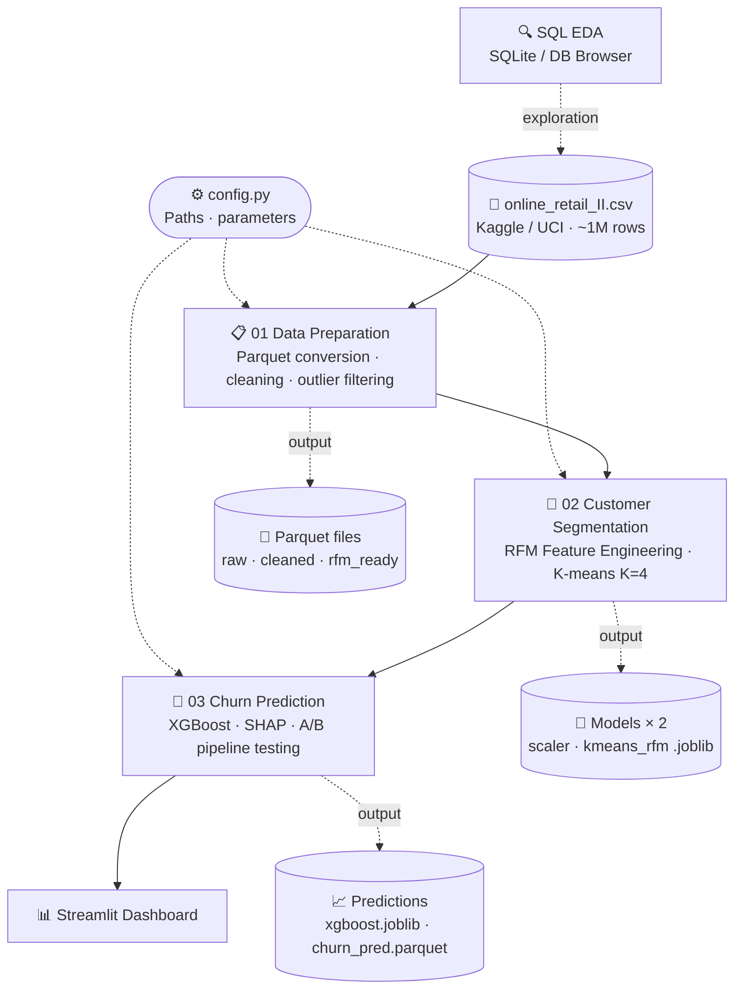

<a id="top"></a>
# E-commerce Customer Segmentation and Churn Analysis

<div align="right">
  <a href="README.md">Magyar</a> | <strong>English</strong>
</div>

 

**An end-to-end data product combining RFM-based segmentation with predictive churn modelling, SQL-driven exploration, and an interactive Streamlit dashboard — built with a data engineering and MLOps-oriented mindset.**

[](https://csabatatrai.hu/)

<p align="center">
  <a href="https://csabatatrai.hu/">🌐 Visit my portfolio (external website)</a>
</p>

## Dataset

The dataset and the original analysis idea come from [Kaggle](https://www.kaggle.com/datasets/mashlyn/online-retail-ii-uci/data) (original source: [UCI Machine Learning Repository](https://archive.ics.uci.edu/dataset/502/online+retail+ii)).

The dataset contains transactions from a UK-based gift article wholesaler covering 2009–2011, with nearly 1 million rows. Customers are a mix of resellers (B2B) and individuals (B2C), which motivates the RFM-based segmentation approach: identifying high-value returning customers and predicting churn is especially relevant in this segment.

## Analysis Steps

| # | Step | Notebook | View pre-run results (jump to section) |
|---|------|----------|----------------------------------------|
| 0 | Data loading and Parquet conversion | `01_data_preparation.ipynb` | [📊 View](docs/01_data_preparation.md#0-adatbetöltés-és-parquet-konverzió) |
| 1 | Data cleaning | `01_data_preparation.ipynb` | [📊 View](docs/01_data_preparation.md#1-adattisztítás) |
| 2 | Feature Engineering and data leakage prevention | `02_customer_segmentation.ipynb` | [📊 View](docs/02_customer_segmentation.md#2-feature-engineering-és-az-adatszivárgás-megelőzése) |
| 3 | Statistical outlier handling and scaling | `02_customer_segmentation.ipynb` | [📊 View](docs/02_customer_segmentation.md#3-statisztikai-outlier-kezelés-és-skálázás) |
| 4 | K-means Clustering | `02_customer_segmentation.ipynb` | [📊 View](docs/02_customer_segmentation.md#4-k-means-klaszterezés) |
| 5 | Extended EDA | `02_customer_segmentation.ipynb` | [📊 View](docs/02_customer_segmentation.md#5-kiterjesztett-eda) |
| 6 | Data loading, Time-Split and Churn target variable creation | `03_churn_prediction.ipynb` | [📊 View](docs/03_churn_prediction.md#6-adatbetöltés-time-split-és-célváltozó-churn-kialakítása) |
| 7 | A/B Modelling: Building pipelines | `03_churn_prediction.ipynb` | [📊 View](docs/03_churn_prediction.md#7-ab-modellezés-pipeline-ok-felépítése) |
| 8 | Cross-validation and model comparison | `03_churn_prediction.ipynb` | [📊 View](docs/03_churn_prediction.md#8-keresztvalidáció-és-modellek-összehasonlítása) |
| 9 | Model explainability with SHAP | `03_churn_prediction.ipynb` | [📊 View](docs/03_churn_prediction.md#9-modell-magyarázata-shap-segítségével) |
| 10 | Business evaluation and Action plans | `03_churn_prediction.ipynb` | [📊 View](docs/03_churn_prediction.md#10-üzleti-kiértékelés-és-akciótervek) |
| 11 | Export — Saving the model and predictions | `03_churn_prediction.ipynb` | [📊 View](docs/03_churn_prediction.md#11-export---a-modell-és-az-előrejelzések-mentése) |

### 📊 Interactive Dashboard & Visualisation

> **Preview:** The animation below shows the temporal dynamics of purchase transactions and the project's interactive interface.

<p align="center">
  <a href="https://csabatatrai.hu/">
    
  </a>
  <br>
  <a href="https://csabatatrai.hu/">
    
  </a>
</p>

## Local Setup

> **💡 Note:** Default input/output file paths and key parameters (e.g. `CUTOFF_DATE`) are defined in `config.py`. Paths can be adjusted there for a different folder structure.

An isolated virtual environment (e.g. Conda) is recommended:

1. Clone the repo and navigate to the folder:
```bash
git clone https://github.com/csabatatrai/ecommerce-customer-segmentation
cd ecommerce-customer-segmentation
```

2. Create a new environment:
```bash
conda create --name ecommerce_env python=3.10
conda activate ecommerce_env
```

3. Install dependencies:
```bash
pip install -r requirements.txt
```

4. The raw dataset is downloaded automatically by `01_data_preparation.ipynb`, but can also be obtained here: [download online-retail-II](https://archive.ics.uci.edu/static/public/502/online+retail+ii.zip). It will be available in the `data/raw/` folder after running the first notebook.

5. Launch Jupyter:
```bash
jupyter notebook
```

6. Run the notebooks **in order**:
   - `01_data_preparation.ipynb` – Data Preparation (cleaning and Parquet pipeline)
   - `02_customer_segmentation.ipynb` – Customer Segmentation (RFM analysis and K-means)
   - `03_churn_prediction.ipynb` – Predictive Modelling: Churn Prediction (XGBoost classification)

7. To open the Streamlit dashboards locally, navigate to the project root in your terminal and run `streamlit run app.py`.

## FAQ

<details>
<summary>💡 What method was used for exploratory data analysis (EDA)?</summary>

> The primary **EDA** in this project was conducted in SQLite using [DB Browser for SQLite](https://sqlitebrowser.org/), rather than directly in Pandas. The executed queries can be found in `sql/eda_exploratory_analysis.sql`; the insights gained there were incorporated into the cleaning and segmentation logic of the Python pipeline.
</details>

---

<details>
<summary>💡 Why are outputs stored in Parquet files?</summary>

> The key advantage of Parquet is its columnar storage format, which enables highly efficient data compression and much faster queries — the system only needs to read the relevant columns instead of entire rows. This design drastically reduces storage costs and I/O load, and the format natively supports complex, nested data structures. For these reasons, Parquet is an outstanding and widely adopted choice in Big Data and analytical systems (e.g. Apache Spark or Hadoop environments), where fast, cost-efficient, and high-performance processing of massive datasets is the primary goal.
</details>

---

<details>
<summary>💡 How does the project keep notebook outputs from polluting the repo?</summary>

> Version control uses an **nbstripout** Git filter, preventing notebook execution metadata from cluttering the repository. Run `nbstripout --install` from your terminal to set up the local Git hook.
</details>

---

<details>
<summary>💡 Did you want to recommend a Visual Studio Code extension?</summary>

> Yes! For reading the code in Visual Studio Code, the [Better Comments](https://marketplace.visualstudio.com/items?itemName=aaron-bond.better-comments) extension is highly recommended. The source code intentionally uses colour-coded comments to highlight important notes, relationships, and key points — with the extension installed, the logic becomes much more readable at a glance.
</details>

---

## Folder Structure
> When the notebooks are run, the code automatically creates the entire required folder structure.
<pre>
ecommerce-customer-segmentation/
│
├── <a href="LICENSE">LICENSE</a>                           # MIT – free to study and run
├── <a href="config.py">config.py</a>                         # shared path constants and pipeline parameters
├── <a href="requirements.txt">requirements.txt</a>
├── .gitignore
│
├── data/                             # 🚨 created by notebook via config.py
│   ├── raw/                          # 🚨 created by notebook; raw dataset downloaded here
│   └── processed/                    # 💾 created by notebook; cleaned Parquet files
│
├── <a href="sql/">sql/</a>
│   └── <a href="sql/eda_exploratory_analysis.sql">eda_exploratory_analysis.sql</a>  # SQL scripts
│
├── <a href="01_data_preparation.ipynb">01_data_preparation.ipynb</a>         # data cleaning
├── <a href="02_customer_segmentation.ipynb">02_customer_segmentation.ipynb</a>    # RFM feature engineering and K-means clustering
├── <a href="03_churn_prediction.ipynb">03_churn_prediction.ipynb</a>         # XGBoost churn prediction
│
├── models/                           # 🚨 created by notebook; serialised model and transformer objects (joblib)
│
├── <a href="app.py">app.py</a>                            # Streamlit dashboard main file
├── <a href="pages/">pages/</a>                            # additional Streamlit dashboards
│
├── <a href="docs/">docs/</a>                             # 🟢 Pre-run notebooks in Markdown
│   ├── <a href="docs/images/">images/</a>
│   │   ├── <a href="docs/images/01_data_preparation/">01_data_preparation/</a>
│   │   ├── <a href="docs/images/02_customer_segmentation/">02_customer_segmentation/</a>
│   │   └── <a href="docs/images/03_churn_prediction/">03_churn_prediction/</a>
│   ├── <a href="docs/01_data_preparation.md">01_data_preparation.md</a>
│   ├── <a href="docs/02_customer_segmentation.md">02_customer_segmentation.md</a>
│   └── <a href="docs/03_churn_prediction.md">03_churn_prediction.md</a>
│
└── <a href="update_docs.py">update_docs.py</a>                    # 💡 documentation automation script (the code partially documents itself)
</pre>

## Architecture Diagram



## Contact

If you have any questions about the project or would like to discuss similar topics, feel free to reach out:

* **Website:** [csabatatrai.hu](https://csabatatrai.hu/)
* **LinkedIn:** [linkedin.com/in/csabatatrai-datascientist](https://www.linkedin.com/in/csabatatrai-datascientist/)
* **E-mail:** [tatraicsababprof@gmail.com](mailto:tatraicsababprof@gmail.com)

---

<div align="center">
  © 2026 Csaba Attila Tátrai · <a href="LICENSE">MIT License</a>
  <br><br>
  <a href="#top">
    
  </a>
</div>

---
