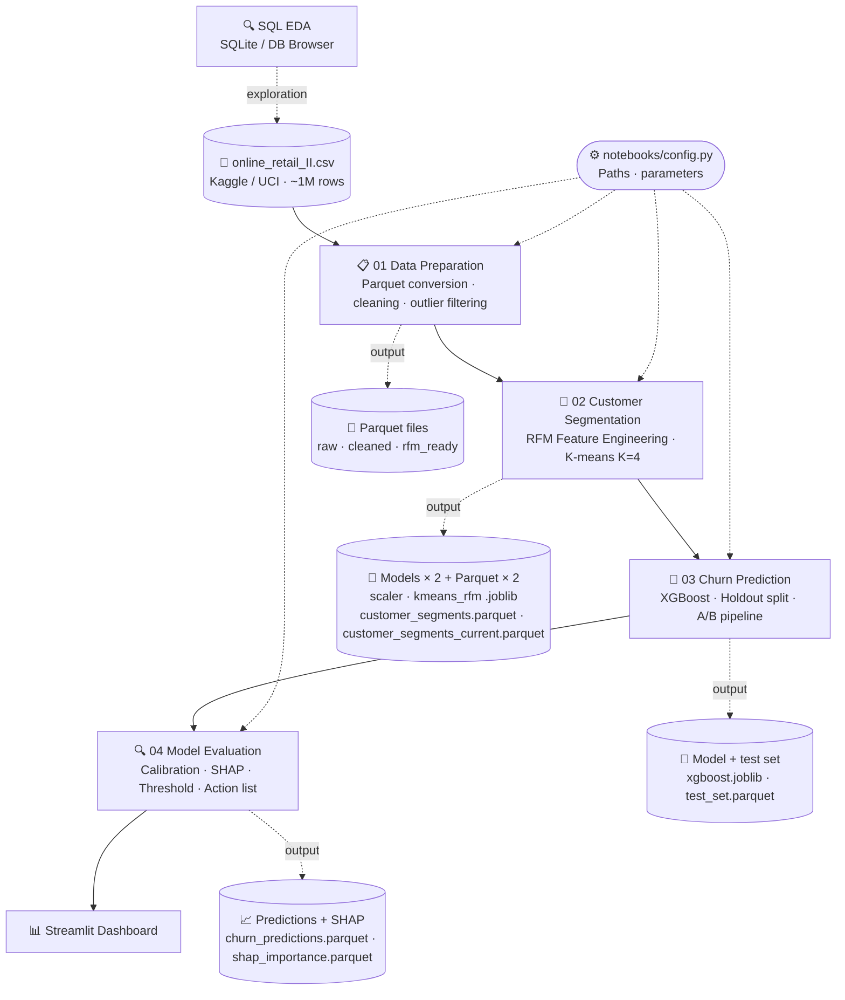

<a id="teteje"></a>
# E-Commerce Customer Segmentation and Churn Analysis

<div align="right">
  <a href="README.md">Magyar</a> | <strong>English</strong>
</div>

---


<p align="center">
  
  
  
  
  
  
</p>

<p align="center">
  <a href="#adathalmaz">Dataset</a> &bull;
  <a href="#eredmenyek">Results</a> &bull;
  <a href="#elemzes-lepesek">Analysis Steps</a> &bull;
  <a href="#dashboard">Dashboard</a> &bull;
  <a href="#setup">Setup</a> &bull;
  <a href="#architektura">Architecture</a> &bull;
  <a href="#mappastruktura">Folder Structure</a> &bull;
  <a href="#gyik">FAQ</a> &bull;
  <a href="#kapcsolat">Contact</a>
</p>

<p align="center">
🛒 End-to-end data product with an interactive dashboard.
</p>

[](https://csabatatrai.hu/)


<p align="center">
  <a href="https://csabatatrai.hu/">🌐 Visit my portfolio (external website)</a>
</p>

<a id="adathalmaz"></a>
## Dataset

The analysis is based on a real transactional dataset of ~1 million rows sourced from [Kaggle](https://www.kaggle.com/datasets/mashlyn/online-retail-ii-uci/data) (original: [UCI Machine Learning Repository](https://archive-beta.ics.uci.edu/dataset/502/online+retail+ii)), covering transactions from a UK-based retailer between 2009 and 2011.

> The dataset contains a mix of B2B and B2C customers. This particularly justifies the RFM-based segmentation approach, where identifying returning customers and predicting churn is business-critical.

<a id="eredmenyek"></a>
## Results

### Data Cleaning

After a 6-step pipeline applied to 1,067,371 raw rows, **793,900 rows** remained in analysis-ready state (**74.4%** of the original dataset):

| Filtering Step | Dropped Rows |
|---|---|
| Anonymous transactions (missing Customer ID) | −243,007 |
| Invalid price (≤ 0) | −71 |
| Administrative codes (BANK CHARGES, C2, etc.) | −3,709 |
| Developer test codes | −14 |
| Duplicates | −26,402 |
| Technical outliers (items with quantity > 10,000) | ~−268 |
| **Analysis-ready rows** | **793,900** |

> Return/cancellation rows (`C` prefix in the Invoice column) were intentionally retained and incorporated into the model as a `return_ratio` feature.

---

### Customer Segmentation (K-means, K=4)

> Although 2 clusters would have been mathematically optimal, 4 clusters provide better business segmentation and could be justified as a secondary optimum (see notebook 02).

The model assigned 5,243 customers to 4 segments:

| Segment | Customers | Avg. Purchases | Avg. Revenue / Customer | Last Purchase | Return Ratio |
|---|---|---|---|---|---|
| 🏆 VIP Champions | 861 (16%) | 19.5 times | £10,391 | 30 days ago | ~15.9% |
| 💤 Churning / Dormant | 1,624 (31%) | 5.1 times | £1,888 | 195 days ago | ~14.3% |
| 👻 Lost / Inactive | 2,098 (40%) | 1.4 times | £330 | 340 days ago | ~8.0% |
| 🌱 New / Promising | 660 (13%) | 2.8 times | £758 | 30 days ago | ~8.8% |

The VIP segment represents 16% of customers but spends ~31 times more per capita compared to the Lost segment. VIPs also have the highest return rate (~15.9%), which is typical B2B behaviour rather than a churn signal — a finding confirmed by the SHAP analysis.

> ℹ️ Segment-level total revenue shares are available in the aggregated view of the dashboard.

---

### Churn Prediction (XGBoost + A/B Pipeline)

**55.7%** of customers churned after the 2011-09-09 cutoff. The classes are nearly balanced, making **PR-AUC** a more informative metric than Accuracy or ROC-AUC.

**A/B Model Selection** — 5-fold CV (on X_train):

| Pipeline | PR-AUC | F1 | Recall |
|---|---|---|---|
| A – RFM only (5 features) | 0.8098 | 0.740 | 0.734 |
| B – RFM + K-Means OHE (9 features) | 0.8098 | 0.743 | 0.738 |

The CV PR-AUC of both pipelines is identical to the fourth decimal place, meaning cluster labels add no predictive value. **Pipeline A** is the winner: it is simpler, and its CV variance is marginally smaller (A: 0.0217 vs B: 0.0221), reinforcing Occam's Razor — when performance is equal, the simpler model is the correct choice.

**After RandomizedSearchCV tuning** (100 iterations, on X_train): CV PR-AUC → **0.8121**, holdout test PR-AUC → **0.8253**, overfitting gap → **0.0017** (before tuning: 0.0504).

**Performance Evaluation:**

The pipeline produces two PR-AUC values serving different purposes:

| | PR-AUC | Scope |
|---|---|---|
| **Development model** (trained on X_train) | **0.8253** | Conservative holdout estimate — the model's true generalisation capability |
| **Production model** (retrained on full X+y) | **0.8322** | Back-validation figure — belonging to the final exported model |

> Per industry best practice, after validating hyperparameters and architecture, the production model is retrained on the full dataset to maximise predictive power. The conservative holdout estimate (0.8253) is the valid generalisation metric; 0.8322 is the back-validation value of the retrained model.

**Production Model Metrics** (threshold optimisation on the holdout set):

| Metric | Value |
|---|---|
| F1-score (opt. threshold) | 0.785 |
| Recall | 0.856 |
| Precision | 0.724 |
| Brier score | 0.1824 |
| Optimal threshold | **0.419** *(F1-maximising, not hardcoded 0.5)* |

**Threshold trade-off:** shifting from 0.5 to 0.419 reduces missed churns (FN: 149 → 84) at the cost of more false alarms (FP: 111 → 191) — an intentional decision in the context of churn prevention.

**Calibration:** the Brier score is acceptable, but the reliability diagram indicates that **above 0.6 predicted probability, the model underestimates the actual churn rate** (at 0.60 predicted, the actual rate is ~78%; at 0.75, it is ~90%). Supplementary business rules are advisable for customers in the grey zone (0.30–0.70).

**Feature Importance** — SHAP and XGBoost Gain Spearman ρ = 0.900 agreement:

| Feature | SHAP Importance |
|---|---|
| `recency_days` | ~55.7% |
| `frequency` | ~20.8% |
| `monetary_total` | ~19.2% |
| `return_ratio`, `monetary_avg` | ~4.3% |

> ℹ️ **Baseline:** random PR-AUC baseline ~0.557 (class ratio); the development model (0.8253) represents a nearly **1.48× improvement**.

> **Development directions:** Given the development model's holdout PR-AUC of 0.8253 (XGBoost, 5 RFM features, StratifiedKFold CV), the performance ceiling is likely constrained by the feature set. The development priority is incorporating new features (seasonality, product categories) rather than refining the cross-validation strategy (e.g. rolling window CV).


<a id="elemzes-lepesek"></a>
## Analysis Steps
> This section of the documentation updates automatically when new notebooks and new H2 headers are added, using `update_docs.py`. The requirement is that the heading follows the `## {number}. {title}` format (e.g. `## 14. Export – Saving Predictions`) — only headings structured this way appear in the table and are clickable on GitHub.

| # | Step | Notebook | View Executed Results (jump to section) |
|---|-------|----------|----------------------------------|
| 0 | Data Loading and Parquet Conversion | `01_data_preparation.ipynb` | [📊 View](notebooks/docs/01_data_preparation.md#0-adatbetöltés-és-parquet-konverzió) |
| 1 | Data Cleaning | `01_data_preparation.ipynb` | [📊 View](notebooks/docs/01_data_preparation.md#1-adattisztítás) |
| 2 | Feature Engineering and Data Leakage Prevention | `02_customer_segmentation.ipynb` | [📊 View](notebooks/docs/02_customer_segmentation.md#2-feature-engineering-és-az-adatszivárgás-megelőzése) |
| 3 | Statistical Outlier Handling and Scaling | `02_customer_segmentation.ipynb` | [📊 View](notebooks/docs/02_customer_segmentation.md#3-statisztikai-outlier-kezelés-és-skálázás) |
| 4 | K-means Clustering (on pre-cutoff data only) | `02_customer_segmentation.ipynb` | [📊 View](notebooks/docs/02_customer_segmentation.md#4-k-means-klaszterezés-csak-cutoff-előtti-adatokon) |
| 5 | Extended EDA | `02_customer_segmentation.ipynb` | [📊 View](notebooks/docs/02_customer_segmentation.md#5-kiterjesztett-eda) |
| 6 | Clustering on Full Dataset (Operational Segmentation) | `02_customer_segmentation.ipynb` | [📊 View](notebooks/docs/02_customer_segmentation.md#6-klaszterezés-teljes-adatsoron-operatív-szegmentáció) |
| 7 | Data Loading, Time Split, and Target Variable (Churn) Definition | `03_churn_prediction.ipynb` | [📊 View](notebooks/docs/03_churn_prediction.md#7-adatbetöltés-time-split-és-célváltozó-churn-kialakítása) |
| 8 | A/B Modelling: Building the Pipelines | `03_churn_prediction.ipynb` | [📊 View](notebooks/docs/03_churn_prediction.md#8-ab-modellezés-pipeline-ok-felépítése) |
| 9 | Cross-Validation and Model Comparison | `03_churn_prediction.ipynb` | [📊 View](notebooks/docs/03_churn_prediction.md#9-keresztvalidáció-és-modellek-összehasonlítása) |
| 10 | Final Model Export | `03_churn_prediction.ipynb` | [📊 View](notebooks/docs/03_churn_prediction.md#10-végleges-modell-exportja) |
| 11 | Model Loading and Data Preparation | `04_model_evaluation.ipynb` | [📊 View](notebooks/docs/04_model_evaluation.md#11-modell-betöltése-és-adatok-előkészítése) |
| 12 | Model Evaluation | `04_model_evaluation.ipynb` | [📊 View](notebooks/docs/04_model_evaluation.md#12-modell-kiértékelése) |
| 13 | Model Explanation, SHAP Analysis | `04_model_evaluation.ipynb` | [📊 View](notebooks/docs/04_model_evaluation.md#13-modell-magyarázata-shap-elemzés) |
| 14 | Business Evaluation and Action Plans | `04_model_evaluation.ipynb` | [📊 View](notebooks/docs/04_model_evaluation.md#14-üzleti-kiértékelés-és-akciótervek) |
| 15 | Export, Saving Predictions | `04_model_evaluation.ipynb` | [📊 View](notebooks/docs/04_model_evaluation.md#15-export-előrejelzések-mentése) |

<a id="dashboard"></a>
## Dashboard

> The animation below illustrates the temporal dynamics of purchase transactions and the project's interactive interface. The dashboard is data-driven: instead of hardcoded values, it reads data dynamically from files — when the file content is updated, the dashboard reflects the changes automatically.

<p align="center">
  <a href="https://churn-elemzes.streamlit.app/">
    
  </a>
  <br>
  <a href="https://churn-elemzes.streamlit.app/">
    
  </a>
</p>

<details>
<summary>💡 Lessons learned: Streamlit memory optimisation</summary>

> The dashboard is deployed on Streamlit Community Cloud. Under heavy usage, the app hit memory limits and became unavailable. The following changes resolved the issue:
>
> **1. `@st.cache_resource` instead of `@st.cache_data`**
> `cache_data` creates a separate copy of the data for each user — with many concurrent visitors, memory usage grows proportionally. `cache_resource` stores a single object shared across all sessions. For read-only data (DataFrames) this is safe and significantly more efficient.
>
> **2. Shared `data_loader.py` module**
> In the multi-page Streamlit app (`app.py` + `pages/`), each page defined its own `@st.cache_data` function — these lived as separate cache entries, causing the large transactional file to be loaded into memory twice. A shared module with a single `@st.cache_resource` function eliminates this.
>
> **3. Loading only the required columns**
> Using `pd.read_parquet(path, columns=[...])` loads only the columns actually needed into memory. For the ~1 million row transactional Parquet file, this yields a meaningful reduction in memory footprint.
>
> **Summary:** when dealing with many concurrent users, `cache_data` and duplicated data loads are the prime suspects for Streamlit memory issues.

</details>

<details>
<summary>💡 Practical experience with AI-assisted chart generation</summary>

> During the project I experimented with various chart types. I found that generating charts in bulk is not advisable, and particular attention must be paid to ensuring correct data binding in generated charts, as the LLM tends to hardcode constant values. Business interpretability requires domain knowledge that cannot currently be delegated entirely to AI — human intuition and experience remain essential. For customisation, however, AI proved highly effective. The value of a data visualisation lies not in its visual quality but in its business utility as validated by a human.

</details>

---

<a id="setup"></a>
## Local Execution and Environment Setup (Setup)

> **💡 Note:** The default input/output file paths and key parameters (e.g. `CUTOFF_DATE`) for the project are defined in `notebooks/config.py`. Paths can be modified there to accommodate a different folder structure.

An isolated virtual environment (e.g. Conda) is recommended to run the project:

1. Clone the repo and navigate to the folder:
```bash
git clone https://github.com/csabatatrai/ecommerce-customer-segmentation
cd ecommerce-customer-segmentation
```

2. Create a new environment:
```bash
conda create --name ecommerce_env python=3.10
conda activate ecommerce_env
```

3. Install dependencies:
```bash
pip install -r requirements.txt
```

4. The raw dataset is downloaded automatically by the `01_data_preparation.ipynb` notebook, but can also be obtained here: [Download online-retail-II](https://cdn.uci-ics-mlr-prod.aws.uci.edu/502/online%2Bretail%2Bii.zip). It will be available in the `data/raw/` folder after running the first notebook.

5. Launch Jupyter:
```bash
jupyter notebook
```

6. Run the notebooks **in order** (from the `notebooks/` folder):
   - `notebooks/01_data_preparation.ipynb` – Data Preparation (Data Cleaning and Parquet Pipeline)
   - `notebooks/02_customer_segmentation.ipynb` – Customer Segmentation (RFM Analysis and K-means)
   - `notebooks/03_churn_prediction.ipynb` – Predictive Modelling: Churn Prediction (XGBoost Classification)
   - `notebooks/04_model_evaluation.ipynb` – Model Evaluation: Calibration, SHAP, Threshold & Business Action Plans

7. To open the Streamlit dashboards locally, navigate to the root directory in your terminal and run `streamlit run app.py`.

---

<a id="mappastruktura"></a>
## Folder Structure
> When the notebooks are executed, the code automatically creates the entire required folder structure.
<pre>
ecommerce-customer-segmentation/
│
├── <a href="data/">data/</a>                    # 💾 raw and processed data files; raw data is downloaded by the notebook
├── <a href="sql/">sql/</a>                     # SQL scripts (EDA)
├── <a href="notebooks/">notebooks/</a>               # Jupyter notebooks, pipeline scripts, exported notebook outputs
├── models/                  # 🚨 created by the notebook – serialised models (joblib)
├── <a href="pages/">pages/</a>                   # Streamlit pages
└── <a href="src/">src/</a>                     # Streamlit helper modules and utility files
</pre>

<details>
<summary>📁 Data files and serialised models in detail</summary>

> Items listed here but not present in the repository are created by a notebook during local execution.

**`data/processed/`**

| File | Description | Source → Target |
|---|---|---|
| `online_retail_cleaned.parquet` | Intermediate cleaned transactional data | Output of 01 |
| `online_retail_ready_for_rfm.parquet` | Final transactional data ready for RFM | Output of 01 → Input of 02, 03 |
| `rfm_features.parquet` | RFM aggregate before outlier filtering | Intermediate output of 02 |
| `customer_segments.parquet` | Customer data with K-means segment labels (on pre-cutoff data, for churn model training) | Output of 02 |
| `customer_segments_current.parquet` | Current segmentation run on the full dataset (5,838 customers, for RFM segment display in the dashboard) | Output of 02 → Streamlit input |
| `test_set.parquet` | Holdout test set (~1,049 customers) | Output of 03 → Input of 04 |
| `churn_predictions.parquet` | Full customer base with churn probabilities and action labels | Output of 04 → Streamlit input |
| `shap_importance.parquet` | SHAP-based feature importance values (mean\|SHAP\| / sum, normalised per feature) | Output of 04 → Streamlit input |

**`data/raw/`**

| File | Description |
|---|---|
| `online_retail_II.xlsx` | Raw source downloaded from UCI (cache) |
| `online_retail_raw.parquet` | Raw data converted to Parquet (cache) |

**`models/`**

| File | Description |
|---|---|
| `scaler_rfm.joblib` | StandardScaler fitted on RFM features |
| `kmeans_rfm.joblib` | Trained K-means segmentation model |
| `xgboost_churn.joblib` | Final XGBoost churn model trained on the full dataset |

</details>

<a id="architektura"></a>
## Architecture


<a id="gyik"></a>
## FAQ

<details>
<summary>💡 How were AI tools used during the project?</summary>

> An explicit goal of the project was to test what complexity of data product can be built by a single person in a relatively short time by working at a higher level of abstraction through the capabilities offered by LLMs. The project's design decisions, analysis logic, and pipeline architecture are my own work. AI tools (primarily Claude) were used for: code generation, drafting documentation and comments, iterative debugging, and requesting feedback. Model selection and business interpretation remained human decisions.
</summary>
</details>

---

<details>
<summary>💡 What method was used for exploratory data analysis (EDA)?</summary>

> The primary **EDA** in this project was conducted in SQLite ([DB Browser for SQLite](https://sqlitebrowser.org/)), not directly in Pandas. The executed queries can be found in `sql/eda_exploratory_analysis.sql`; insights gained there were incorporated into the cleaning and segmentation logic of the Python pipeline.
</details>

---

<details>
<summary>💡 Why is the output stored in Parquet files?</summary>

> The main advantages of Parquet files are the columnar storage format, faster I/O, type-safe schema, and smaller file size.
</details>

---

<details>
<summary>💡 How does the project ensure clean version control for notebooks?</summary>

> The project uses the **nbstripout** tool as a Git pre-commit hook. This automatically strips the JSON structure of notebooks (`.ipynb`) of execution outputs (output cells) and metadata, preventing unnecessary repository size growth and avoiding redundant merge conflicts.
>
> **Usage:** In the development environment, run `nbstripout --install` from the terminal to configure the local hook.
</details>

---

<details>
<summary>💡 Recommended Visual Studio Code extension</summary>

> [Better Comments](https://marketplace.visualstudio.com/items?itemName=aaron-bond.better-comments): The source code deliberately uses colour-coded comments to mark important notes, relationships, and highlights, making the code logic significantly more readable with this extension.
</details>

---

<a id="kapcsolat"></a>
## Contact

If you have questions about the project or would like to discuss similar topics, feel free to reach out through the following channels:

* **Website:** [csabatatrai.hu](https://csabatatrai.hu/)
* **LinkedIn:** [linkedin.com/in/csabatatrai-datascientist](https://www.linkedin.com/in/csabatatrai-datascientist/)
* **E-mail:** [tatraicsababprof@gmail.com](mailto:tatraicsababprof@gmail.com)

---

<div align="center">
  © 2026 Tátrai Csaba Attila · <a href="LICENSE">MIT License</a>
  <br><br>
  <a href="#teteje">
    
  </a>
</div>