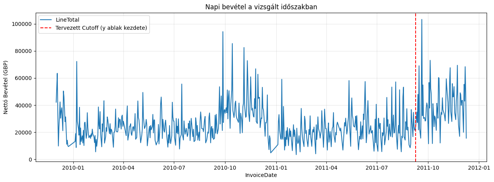

<a id="teteje"></a>
# 01 Adatelőkészítés: Data Preparation (tisztítás és transzformáció)
---
**Függőség:** `config.py` (Útvonalak definíciója)

---

**Bemenet:** `data/raw/online_retail_II.csv`  
**Kimenetek:** 
- `data/raw/online_retail_raw.parquet` (Nyers adat gyorsítótárazva)
- `data/processed/online_retail_cleaned.parquet` (Köztes tisztított állapot)
- `data/processed/online_retail_ready_for_rfm.parquet` **(Végső kimenet a következő fázishoz)**

---

## 0. Adatbetöltés és Parquet-konverzió

A nyers adathalmaz betöltése során elsődlegesen az automatizált megoldásra törekszünk. Mivel azonban a specifikus UCI API korlátokba ütközött, a kód egy robusztus ellenőrző logikát használ: ha a nyers adatok hiányoznak, pontos instrukciókat ad a manuális beszerzéshez, majd elvégzi a Parquet konverziót az optimális további feldolgozáshoz.

A `0.2` cella idempotens: ha a tisztított Parquet fájl már létezik, automatikusan kihagyja az ismételt letöltést és konverziót.


```python
# ============================================================
# 0.1 – Konfiguráció és könyvtárak betöltése
# ============================================================
import pandas as pd
import pyarrow as pa
import pyarrow.parquet as pq
from config import (
    PROJECT_ROOT, RAW_DIR, PROCESSED_DIR, MODELS_DIR,
    RAW_FILE, PARQUET_OUT, CLEANED_PARQUET, READY_FOR_RFM_PARQUET
)

# Mappastruktúra létrehozása
RAW_DIR.mkdir(parents=True, exist_ok=True)
PROCESSED_DIR.mkdir(parents=True, exist_ok=True)
MODELS_DIR.mkdir(parents=True, exist_ok=True)

print(f"PROJECT_ROOT:  {PROJECT_ROOT}")
print(f"RAW_FILE:      {RAW_FILE}")
print(f"PARQUET_OUT:   {PARQUET_OUT}\n")

# --- Klónozás utáni állapot ellenőrzése ---
if not PARQUET_OUT.exists() and not RAW_FILE.exists():
    error_msg = (
        "\n" + "="*80 + "\n"
        "HIÁNYZÓ ADATHALMAZ!\n"
        "A hivatalos UCI API nem támogatja ezt a specifikus adathalmazt, így manuális letöltés szükséges.\n\n"
        "Kérlek, kövesd az alábbi lépéseket a folytatáshoz:\n"
        "1. Töltsd le a zip fájlt a Kaggle-ről:\n"
        "   https://www.kaggle.com/datasets/mashlyn/online-retail-ii-uci/data\n"
        "2. Csomagold ki, és az 'online_retail_II.csv' fájlt helyezd el ide:\n"
        f"   {RAW_FILE}\n"
        "3. Futtasd újra ezt a cellát!\n"
        + "="*80 + "\n"
    )
    print(error_msg)
    raise FileNotFoundError("A nyers adathalmaz nem található. Kövesd a fenti utasításokat!")
else:
    print("Fájlrendszer ellenőrizve: a szükséges adatfájlok rendelkezésre állnak!")
```

    PROJECT_ROOT:  D:\Workspace\ecommerce-customer-segmentation
    RAW_FILE:      D:\Workspace\ecommerce-customer-segmentation\data\raw\online_retail_II.csv
    PARQUET_OUT:   D:\Workspace\ecommerce-customer-segmentation\data\raw\online_retail_raw.parquet
    
    Fájlrendszer ellenőrizve: a szükséges adatfájlok rendelkezésre állnak!
    


```python
# ============================================================
# 0.2 – Nyers CSV betöltése és Parquet-be konvertálása
# ============================================================

if PARQUET_OUT.exists():
    print(f"Parquet már létezik, kihagyjuk a konverziót: {PARQUET_OUT}")
else:
    dtype_map = {
        "Invoice":     "string",
        "StockCode":   "string",
        "Description": "string",
        "Quantity":    "float64",
        "Price":       "float64",
        "Customer ID": "float64",
        "Country":     "string",
    }
    parse_dates = ["InvoiceDate"]

    print(f"CSV fájl betöltése innen: {RAW_FILE} ... (ez eltarthat egy percig)")
    df_raw = pd.read_csv(
        RAW_FILE,
        dtype=dtype_map,
        parse_dates=parse_dates,
        encoding="utf-8",
    )
    
    print(f"Összesített sorok (nyers): {len(df_raw):,}")

    # Customer ID: float -> nullable Int64 (megőrzi a NaN-okat is)
    df_raw["Customer ID"] = df_raw["Customer ID"].astype("Int64")

    # Parquet mentés
    df_raw.to_parquet(PARQUET_OUT, compression="snappy", index=False)

    size_mb = PARQUET_OUT.stat().st_size / 1_048_576
    print(f"\nParquet mentve: {PARQUET_OUT}")
    print(f"Fájlméret:      {size_mb:.1f} MB")
    print(f"Sorok:          {len(df_raw):,} | Oszlopok: {df_raw.shape[1]}")
    print(f"\nSéma:\n{df_raw.dtypes}")
```

    Parquet már létezik, kihagyjuk a konverziót: D:\Workspace\ecommerce-customer-segmentation\data\raw\online_retail_raw.parquet
    

## 1. Adattisztítás

### 1.1. Első lépések

A Customer Lifetime Value (CLV) modellezés és az RFM szegmentáció alapfeltétele, hogy az adatokat vásárlói szinten tudjuk aggregálni. Ennek megfelelően az alábbi tisztítási lépéseket végezzük el:

- **Anonim tranzakciók eltávolítása:** A hiányzó `Customer ID`-val rendelkező sorok kötelezően eldobandók.
- **Azonosítók típuskonverziója:** A `Customer ID`-t numerikus formátumból (Int64) string (object) típusra alakítjuk, hogy elkerüljük az EDA során a fals statisztikákat, és megelőzzük a későbbi gépi tanulási modelleknél (K-means, XGBoost) az adatszivárgást (data leakage).
- **Érvénytelen értékek szűrése:** A 0 vagy negatív `Price` értékkel rendelkező sorok eltávolítása.
- **Duplikátumok szűrése:** Az azonos tartalmú, ismétlődő sorok törlése.
- **Adminisztratív és nem termék kódok eltávolítása:** A nyers adatokon végzett előzetes **SQLite-os adatfeltárás** során kiderült, hogy az adathalmazban jelentős számú, torzító hatású adminisztratív bejegyzés található (pl. `POST`, `M`, `BANK CHARGES`, `AMAZONFEE`). Ezek mellé soroljuk a `C2` (Carriage) kódot is, amely egy kiugróan magas árú, fix tengerentúli fuvardíjra utal. Mivel ezek nem kézzelfogható termékek (és gyakran extrém negatív korrekciós értékeket képviselnek), teljesen kiszűrjük őket, hogy ne torzítsák a termékalapú kosárelemzést és a CLV-t.
- **Fejlesztői teszt bejegyzések szűrése:** Szintén az SQLite-os lekérdezések buktatták le a rendszerben maradt teszt tranzakciókat (pl. `TEST001`, `TEST002` cikkszámok, vagy `test` leírások). Mivel ezek irreális árakkal és mennyiségekkel rontanák a statisztikákat, a `StockCode` és a `Description` oszlopok együttes vizsgálatával az összeset eldobjuk.

*Megjegyzés: A sztornó/visszaküldött tételeket ('C' prefix az Invoice oszlopban) ebben a fázisban szándékosan megtartjuk, mivel ezek a későbbiekben negatív feature-ként szolgálnak a vásárlói érték (CLV) számításánál.*


```python
# ============================================================
# 1.1 Adattisztítás
# ============================================================

print("Adattisztítás megkezdése...\n")

# 1.1.1. Nyers Parquet betöltése
df = pd.read_parquet(PARQUET_OUT)
eredeti_sorok_szama = len(df)
print(f"Kiinduló sorok száma: {eredeti_sorok_szama:,}")
print("-" * 50)

# 1.1.2. Hiányzó Customer ID-k eldobása
df = df.dropna(subset=["Customer ID"])
id_nelkuli_sorok = eredeti_sorok_szama - len(df)
print(f"✔️ Nincsenek anonim vásárlók. (Eldobva: {id_nelkuli_sorok:,} sor)")

# Opcionális, de ajánlott: Customer ID stringgé alakítása
df["Customer ID"] = df["Customer ID"].astype(str)
print("✔️ A Customer ID biztonságos string formátumban van.")

# 1.1.3. Érvénytelen árak szűrése (Price <= 0)
ervenytelen_ar_maszk = df["Price"] <= 0
ervenytelen_ar_sorok = ervenytelen_ar_maszk.sum()
df = df[~ervenytelen_ar_maszk]
print(f"✔️ Az érvénytelen (0 vagy negatív) árak eltűntek. (Eldobva: {ervenytelen_ar_sorok:,} sor)")

# --- Sztornók megtartása ---
print("✔️ A sztornók szándékosan megmaradnak a feature engineeringhez (Quantity <= 0 szándékosan nincs szűrve).")

# 1.1.4. Nem termék jellegű tranzakciók kiszűrése
nem_termek_maszk = (
    df["StockCode"].astype(str).str.replace(" ", "").str.isalpha() | 
    (df["StockCode"].astype(str).str.upper() == "C2")
)
nem_termek_sorok = nem_termek_maszk.sum()
df = df[~nem_termek_maszk]
print(f"✔️ A 'BANK CHARGES' jellegű és 'C2' fuvardíj kódok célzottan eldobásra kerültek. (Eldobva: {nem_termek_sorok:,} sor)")

# 1.1.5. Teszt bejegyzések eltávolítása
teszt_maszk = (
    df["Description"].astype(str).str.contains("TEST", case=False, na=False) |
    df["StockCode"].astype(str).str.contains("TEST", case=False, na=False)
)
teszt_sorok = teszt_maszk.sum()
df = df[~teszt_maszk]
print(f"✔️ A rejtett, üres leírású tesztkódok is fennakadtak a szűrőn. (Eldobva: {teszt_sorok:,} sor)")

# 1.1.6. Duplikátumok eldobása
duplikatum_maszk = df.duplicated()
duplikatum_sorok = duplikatum_maszk.sum()
df = df[~duplikatum_maszk]
print(f"✔️ A duplikátumok eltávolítva. (Eldobva: {duplikatum_sorok:,} sor)")

# 1.1.7. Tisztított adatok mentése checkpointként
df.to_parquet(CLEANED_PARQUET, compression="snappy", index=False)

vegleges_sorok_szama = len(df)
print("-" * 50)
print(f"Adattisztítás eredménye:")
print(f"Megmaradt tiszta sorok száma: {vegleges_sorok_szama:,} "
      f"(az eredeti {vegleges_sorok_szama/eredeti_sorok_szama*100:.1f}%-a)")
print(f"Tisztított adatok mentve: {CLEANED_PARQUET}")
```

    Adattisztítás megkezdése...
    
    Kiinduló sorok száma: 1,067,371
    --------------------------------------------------
    ✔️ Nincsenek anonim vásárlók. (Eldobva: 243,007 sor)
    ✔️ A Customer ID biztonságos string formátumban van.
    ✔️ Az érvénytelen (0 vagy negatív) árak eltűntek. (Eldobva: 71 sor)
    ✔️ A sztornók szándékosan megmaradnak a feature engineeringhez (Quantity <= 0 szándékosan nincs szűrve).
    ✔️ A 'BANK CHARGES' jellegű és 'C2' fuvardíj kódok célzottan eldobásra kerültek. (Eldobva: 3,709 sor)
    ✔️ A rejtett, üres leírású tesztkódok is fennakadtak a szűrőn. (Eldobva: 14 sor)
    ✔️ A duplikátumok eltávolítva. (Eldobva: 26,402 sor)
    --------------------------------------------------
    Adattisztítás eredménye:
    Megmaradt tiszta sorok száma: 794,168 (az eredeti 74.4%-a)
    Tisztított adatok mentve: D:\Workspace\ecommerce-customer-segmentation\data\processed\online_retail_cleaned.parquet
    

### 1.2. Adatszerkezet és típusok ellenőrzése
A tisztítási lépések befejeztével elengedhetetlen ellenőrizni az adathalmaz technikai állapotát. A `df.info()` kimenetével az alábbiakat validáljuk a Feature Engineering megkezdése előtt:
* **Nincsenek hiányzó értékek:** Minden oszlopban hiánytalan a `Non-Null Count` (az "anonim" vásárlásokat sikeresen kidobtuk).
* **Megfelelő adattípusok:** Az `InvoiceDate` helyesen `datetime` típusú, a `Customer ID` pedig konzisztens szöveges (string/object) formátumú.
* **Memóriahatékonyság:** A felesleges és hibás sorok eltávolításával optimalizáltuk a memóriahasználatot, ami a későbbi gépi tanulási modellek (K-means, XGBoost) illesztésénél kritikus lesz.


```python
# ============================================================
# 1.2 "QA" ellenőrzés 1/2
# ============================================================
# Azt validálja, hogy az anonimok és érvénytelen árak ki letek-e dobva, és a típusok helyesek-e
df.info()
```

    <class 'pandas.core.frame.DataFrame'>
    Index: 794168 entries, 0 to 1067369
    Data columns (total 8 columns):
     #   Column       Non-Null Count   Dtype         
    ---  ------       --------------   -----         
     0   Invoice      794168 non-null  string        
     1   StockCode    794168 non-null  string        
     2   Description  794168 non-null  string        
     3   Quantity     794168 non-null  float64       
     4   InvoiceDate  794168 non-null  datetime64[ns]
     5   Price        794168 non-null  float64       
     6   Customer ID  794168 non-null  object        
     7   Country      794168 non-null  string        
    dtypes: datetime64[ns](1), float64(2), object(1), string(4)
    memory usage: 54.5+ MB
    

### 1.3. Technikai outlierek és anomáliák szűrése (Feature Engineering előtt)

Mielőtt rátérnénk a vásárlói érték (RFM és CLV) kiszámítására, el kell távolítanunk a rendszerben maradt **technikai anomáliákat**. Fontos: itt még nem a statisztikai outliereket (pl. a kiugróan sokat költő VIP vevőket) kezeljük, hanem azokat a tranzakciókat, amelyek **torzítanák vagy logikailag ellehetetlenítenék** a vásárlói profilalkotást.

Ebben a lépésben az alábbi "zajokat" szűrjük:
1. **"Árva" visszaküldések és negatív élettartam-értékű (CLV) ügyfelek:** Előfordulnak olyan ügyfelek, akiknek a vizsgált időszakban több a sztornója, mint a vásárlása (tehát a nettó költésük $\le 0$). Ennek tipikus oka, hogy a tényleges vásárlás az adathalmaz kezdete (2009. dec. 1.) *előtt* történt. Mivel róluk nem tudunk valós vásárlói értéket (Monetary) számolni, az ilyen ügyfelek összes sorát kötelezően eldobjuk.
2. **Fizikailag lehetetlen tranzakciók (Extrém Quantity):** Az adatok előzetes vizsgálata kimutatta, hogy léteznek +/- 80 000 darabos tételek. Egy ajándéktárgy-nagykereskedésben (B2B) a pár ezer darabos rendelés még reális, de a 10 000 feletti kiugrások szinte kivétel nélkül azonnal sztornózott rendszerhibák vagy adminisztrációs tesztek. Ezeket a sorokat eltávolítjuk, hogy ne torzítsák a kosárméret-statisztikákat.


```python
# ============================================================
# 1.3 - Technikai outlierek, "árva" sztornók és hibák szűrése
# ============================================================
from config import Q_THRESHOLD

df = pd.read_parquet(CLEANED_PARQUET)
print("Technikai outlierek és anomáliák szűrése...")
eredeti_sorok = len(df)

# 1.4.1. Tranzakció nettó értékének (LineTotal) kiszámítása
df['LineTotal'] = df['Quantity'] * df['Price']

# 1.4.2. Manuális korrekciók ("Adjustment") szűrése a Description alapján
# A felfedező elemzés során találtunk "Adjustment by Peter..." jellegű sorokat
adjustment_mask = df['Description'].str.contains('ADJUSTMENT', case=False, na=False)
df = df[~adjustment_mask]

# 1.4.3. Ügyfélszintű aggregáció: mekkora az adott ügyfél teljes nettó költése az időszakban?
customer_revenue = df.groupby('Customer ID')['LineTotal'].sum().reset_index()

# Azonosítjuk azokat az ügyfeleket, akiknek a teljes egyenlege nulla vagy negatív
invalid_customers = customer_revenue[customer_revenue['LineTotal'] < 0]['Customer ID']
df = df[~df['Customer ID'].isin(invalid_customers)]

# 1.4.4. Extrém darabszámok (Quantity) szűrése (pl. +/- 80 ezer darabos rendszerhibák)
extreme_quantity_mask = df['Quantity'].abs() > Q_THRESHOLD
df = df[~extreme_quantity_mask]

vegleges_sorok = len(df)
print(f"✔️ Manuális korrekciók, szigorúan negatív egyenlegű ügyfelek (< 0) és >{Q_THRESHOLD} db-os anomáliák eltávolítva.")
print(f"Elemzésre (RFM) kész sorok száma: {vegleges_sorok:,} "
      f"(a kiinduló tisztított adathalmaz kb. {vegleges_sorok/eredeti_sorok*100:.1f}%-a megmaradt)\n")

# Tisztított, RFM-re kész adatok mentése memóriahatékony Parquet formátumban
df.to_parquet(READY_FOR_RFM_PARQUET, compression="snappy", index=False)
print(f"Adathalmaz mentve a következő fázishoz: {READY_FOR_RFM_PARQUET}")
```

    Technikai outlierek és anomáliák szűrése...
    ✔️ Manuális korrekciók, szigorúan negatív egyenlegű ügyfelek (< 0) és >10000 db-os anomáliák eltávolítva.
    Elemzésre (RFM) kész sorok száma: 793,900 (a kiinduló tisztított adathalmaz kb. 100.0%-a megmaradt)
    
    Adathalmaz mentve a következő fázishoz: D:\Workspace\ecommerce-customer-segmentation\data\processed\online_retail_ready_for_rfm.parquet
    

### 1.4 Statisztikai érvényesség és üzleti logika ellenőrzése
Míg a kezdeti EDA során a `describe()` a hibák felfedezését szolgálta, itt már **minőségbiztosítási (QA)** szerepe van. Az alábbi kimenet bizonyítja, hogy a tisztítási logikánk sikeres volt:
* **Érvényes árak:** A `Price` oszlop minimum értéke szigorúan **> 0** (nincsenek ingyenes vagy negatív árú, adminisztratív tételek).
* **Reális mennyiségek:** A `Quantity` oszlop extrém, rendszerhibából fakadó kilengései (pl. +/- 80 000 darab) eltűntek, a maximum és minimum értékek a beállított küszöbértéken belül maradtak.
* **Adatszivárgás megelőzése:** Nincsenek olyan anomáliák, amik a későbbi aggregált RFM metrikákat (pl. átlagos kosárérték) irreális irányba torzítanák.


```python
# ============================================================
# 1.4 "QA" ellenőrzés 2/2
# ============================================================
df.describe()
```


<div>
<style scoped>
    .dataframe tbody tr th:only-of-type {
        vertical-align: middle;
    }

    .dataframe tbody tr th {
        vertical-align: top;
    }

    .dataframe thead th {
        text-align: right;
    }
</style>
<table border="1" class="dataframe">
  <thead>
    <tr style="text-align: right;">
      <th></th>
      <th>Quantity</th>
      <th>InvoiceDate</th>
      <th>Price</th>
      <th>LineTotal</th>
    </tr>
  </thead>
  <tbody>
    <tr>
      <th>count</th>
      <td>793900.000000</td>
      <td>793900</td>
      <td>793900.000000</td>
      <td>793900.000000</td>
    </tr>
    <tr>
      <th>mean</th>
      <td>12.553191</td>
      <td>2011-01-02 14:58:41.339463168</td>
      <td>2.971550</td>
      <td>20.600271</td>
    </tr>
    <tr>
      <th>min</th>
      <td>-9360.000000</td>
      <td>2009-12-01 07:45:00</td>
      <td>0.030000</td>
      <td>-6539.400000</td>
    </tr>
    <tr>
      <th>25%</th>
      <td>2.000000</td>
      <td>2010-07-02 11:44:00</td>
      <td>1.250000</td>
      <td>4.350000</td>
    </tr>
    <tr>
      <th>50%</th>
      <td>5.000000</td>
      <td>2010-12-02 12:40:00</td>
      <td>1.950000</td>
      <td>11.700000</td>
    </tr>
    <tr>
      <th>75%</th>
      <td>12.000000</td>
      <td>2011-08-01 10:03:00</td>
      <td>3.750000</td>
      <td>19.500000</td>
    </tr>
    <tr>
      <th>max</th>
      <td>10000.000000</td>
      <td>2011-12-09 12:50:00</td>
      <td>649.500000</td>
      <td>38970.000000</td>
    </tr>
    <tr>
      <th>std</th>
      <td>70.885955</td>
      <td>NaN</td>
      <td>4.475521</td>
      <td>84.086346</td>
    </tr>
  </tbody>
</table>
</div>


### 1.5. Cutoff validáció
**Elegendő adat van-e a célablakban?**

Mielőtt a `config.py`-ban rögzített `CUTOFF_DATE` értékét véglegesnek tekintjük,
ellenőrizzük, hogy a vágási pont után marad-e elegendő tranzakció és ügyfél
a célváltozó (y) majdani legyártásához.

Az ábra a teljes időszak napi bevételét mutatja; a piros szaggatott vonal jelöli
a tervezett cutoff-ot. Ha utána az adatok sűrűsége és volumene elegendőnek tűnik,
a `CUTOFF_DATE` értéke végleges, a `03_churn_prediction.ipynb` notebook már ezt
az értéket veszi alapul.


```python
# ============================================================
# 1.5. Cutoff validáció
# ============================================================

import matplotlib.pyplot as plt
from config import CUTOFF_DATE

# Dinamikus dátum beolvasása a configból
cutoff_date = pd.to_datetime(CUTOFF_DATE)

# Nézzük meg a tranzakciók napi eloszlását
daily_revenue = df.groupby(df['InvoiceDate'].dt.date)['LineTotal'].sum()

plt.figure(figsize=(15, 5))
daily_revenue.plot(title="Napi bevétel a vizsgált időszakban", color="#1f77b4")
# Itt is a dinamikus változót használjuk
plt.axvline(cutoff_date, color='red', linestyle='--', label="Tervezett Cutoff (y ablak kezdete)")
plt.ylabel("Nettó Bevétel (GBP)")
plt.legend()
plt.grid(True, alpha=0.3)

# Mennyi adat (bevétel és tranzakció) esik a célablakba?
target_window = df[df['InvoiceDate'] >= cutoff_date]

print(f"A célablakba eső tranzakciósorok száma: {len(target_window):,}")
print(f"A célablakba eső nettó bevétel: £ {target_window['LineTotal'].sum():,.2f}")
print(f"Egyedi vásárlók a célablakban: {target_window['Customer ID'].nunique():,}")
```

    A célablakba eső tranzakciósorok száma: 162,563
    A célablakba eső nettó bevétel: £ 3,148,306.49
    Egyedi vásárlók a célablakban: 2,920
    


    

    


<div align="center">
  <br>
  <a href="#teteje">
    
  </a>
  <br>
</div>

*Az ugrás gomb nem minden környezetben működik!

# Dokumentáció frissítése README.md-ben és docs mappában
🚨 **Ctrl+S szükséges az alábbi cella futtatása előtt, mivel az nbconvert lemezről olvas!**


```python
# 03-as notebook docs generálása/frissítése
# ⚠️ Ctrl+S a cella futtatása előtt — az nbconvert lemezről olvas!
!python update_docs.py --01_data_preparation.ipynb
```

    Docs frissitese...
    ==================================================
    [03_churn_prediction.ipynb] Konvertalas Markdown-ra...
    [03_churn_prediction.ipynb] [OK] Kesz! (5 kep)
    
    [README] Elemzés főbb lépései táblázat frissítése...
    [README] Táblázat frissítve: 10 sor, 1 csere.
    
    ==================================================
    Kesz!
    
