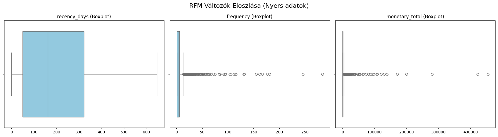
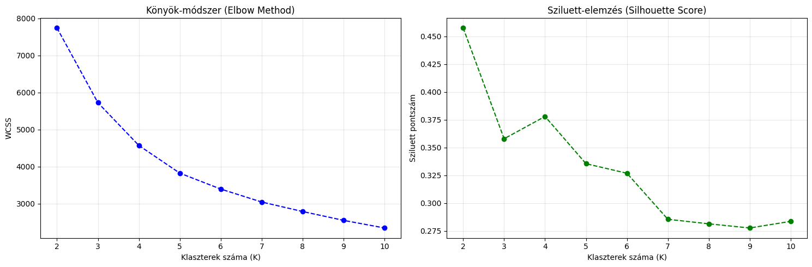
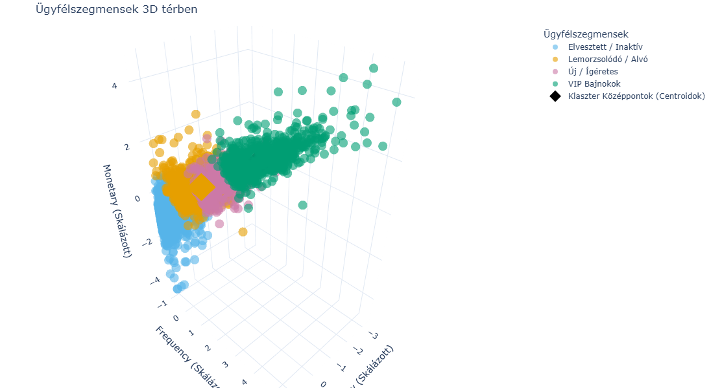
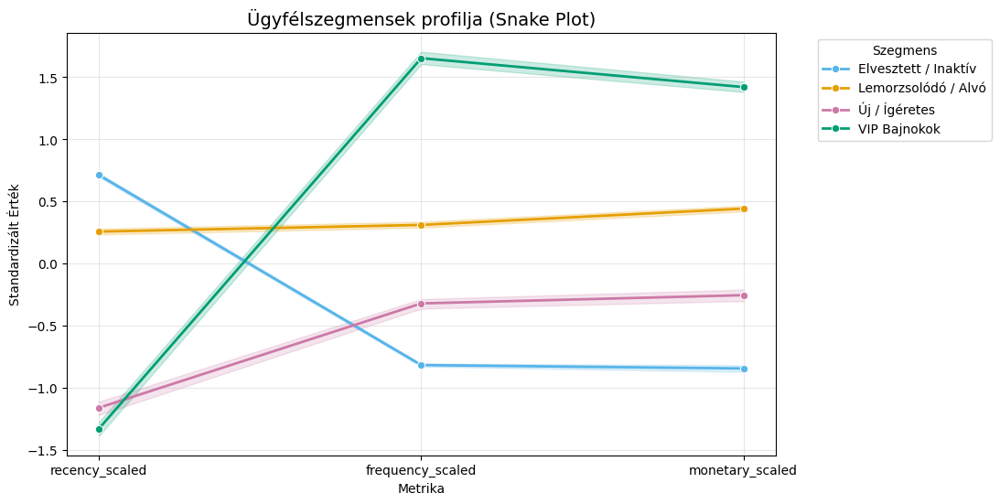

<a id="teteje"></a>
# 02 Ügyfélszegmentáció: Customer Segmentation (RFM & K-means)
---
**Függőség:** 
- `config.py` (Útvonalak definíciója és a `Q_THRESHOLD` paraméter az outlierek szűréséhez)
- `01_data_preparation.ipynb` (előtte kell futtatni!)

---

**Bemenet:** 
- `data/processed/online_retail_ready_for_rfm.parquet`

**Kimenetek:** 
- `data/processed/rfm_features.parquet` (Feature-engineering utáni állapot)
- `data/processed/customer_segments.parquet` (Végső klaszterezett ügyféladatok)
- `models/scaler_rfm.joblib` (StandardScaler objektum)
- `models/kmeans_rfm.joblib` (A tanított K-means modell)

*Az adatok előkészítése a `01_data_preparation.ipynb` notebookban történt.*

---


```python
# ============================================================
# Konfiguráció és könyvtárak betöltése
# ============================================================
import pandas as pd
import numpy as np
from config import (
    READY_FOR_RFM_PARQUET, RFM_FEATURES_PARQUET,
    MODELS_DIR, SCALER_PATH, CUTOFF_DATE
)

# Mappastruktúra biztosítása
MODELS_DIR.mkdir(parents=True, exist_ok=True)

# Előző notebook kimenetének betöltése
df = pd.read_parquet(READY_FOR_RFM_PARQUET)
print(f"Betöltve: {READY_FOR_RFM_PARQUET}")
print(f"Sorok: {len(df):,} | Oszlopok: {df.shape[1]}")
```

    Betöltve: D:\Workspace\ecommerce-customer-segmentation\data\processed\online_retail_ready_for_rfm.parquet
    Sorok: 793,900 | Oszlopok: 9
    

## 2. Feature Engineering és az adatszivárgás megelőzése

A klasszikus prediktív Customer Lifetime Value (CLV) modellezés legkritikusabb pontja az **adatszivárgás (data leakage) megelőzése**. Annak érdekében, hogy egy valós üzleti szituációt szimuláljunk (ahol a múltbeli adatokból próbáljuk megjósolni a jövőt), az adathalmazt egy időbeli vágási pont (Cutoff Date) mentén **két szigorúan elkülönülő ablakra bontjuk**:

1. **Megfigyelési ablak (X - Observation Window):** Az adathalmaz kezdete és a vágási pont közötti időszak. Kizárólag ezekből az adatokból számítjuk ki az ügyfelek RFM (Recency, Frequency, Monetary) és egyéb viselkedési mutatóit. A gépi tanulási modell csak ezt fogja látni.
2. **Célablak (y - Target Window):** A vágási ponttól az adathalmaz végéig tartó időszak (kb. az utolsó 90 nap). Itt számoljuk ki az ügyfelek tényleges értékét (a célváltozót), amit a modellnek majd prediktálnia kell.

*Kiválasztott vágási pont:* **2011. szeptember 9.** (Mivel az adathalmaz 2011. december 9-én ér véget, ez pontosan egy 90 napos (negyedéves) előrejelzési ablakot biztosít, ami iparági sztenderd a B2B/B2C szegmentációban).

### 2.1 - Időablakok (Time-Windows) felállítása és szétválasztása


```python
# ============================================================
# 2.1 - Időablakok (Time-Windows) felállítása és szétválasztása
# ============================================================

print("Időablakok szétválasztása az adatszivárgás elkerülése érdekében...")

# Vágási pont (Cutoff date) definiálása: pontosan 90 nappal az adathalmaz vége előtt
CUTOFF_DATE_TS = pd.to_datetime(CUTOFF_DATE)

# 2.1. Megfigyelési ablak (X feature-ök alapja)
df_obs = df[df['InvoiceDate'] < CUTOFF_DATE_TS].copy()

# 2.2. Célablak (y célváltozó alapja)
df_target = df[df['InvoiceDate'] >= CUTOFF_DATE_TS].copy()

print("-" * 50)
print(f"Teljes vizsgált időszak:  {df['InvoiceDate'].min().date()}  --->  {df['InvoiceDate'].max().date()}")
print(f"Vágási pont (Cutoff):     {CUTOFF_DATE_TS.date()}")
print("-" * 50)
print(f"Megfigyelési ablak (X):   {len(df_obs):,} sor")
print(f"Célablak (y):             {len(df_target):,} sor")

# 2.3 Ellenőrizzük, hogy hány olyan ügyfél van a megfigyelési ablakban, akit érdemes vizsgálni
valos_ugyfelek_szama = df_obs['Customer ID'].nunique()
print(f"\nModellezhető egyedi ügyfelek száma a megfigyelési ablakban: {valos_ugyfelek_szama:,}")
```

    Időablakok szétválasztása az adatszivárgás elkerülése érdekében...
    --------------------------------------------------
    Teljes vizsgált időszak:  2009-12-01  --->  2011-12-09
    Vágási pont (Cutoff):     2011-09-09
    --------------------------------------------------
    Megfigyelési ablak (X):   631,337 sor
    Célablak (y):             162,563 sor
    
    Modellezhető egyedi ügyfelek száma a megfigyelési ablakban: 5,250
    

### 2.2 Kiterjesztett RFM Feature Engineering (csak az X ablakon)

A megfigyelési ablak (`df_obs`) felhasználásával kiszámítjuk a vásárlók egyedi profilját leíró mutatókat. A hagyományos RFM modellt **kiterjesztjük a visszaküldési (return) metrikákkal**, mivel a magas sztornóarány kritikus indikátora a jövőbeli lemorzsolódásnak (churn) és a csökkenő élettartam-értéknek (CLV).

**Kiszámított Feature-ök:**
* `recency_days`: Utolsó vásárlás óta eltelt napok száma (a vágási ponttól visszaszámolva).
* `frequency`: Sikeres (pozitív) vásárlási tranzakciók (Invoice) száma.
* `monetary_total`: Nettó elköltött összeg (a visszaküldések értékével csökkentve).
* `monetary_avg`: Átlagos nettó kosárérték ($monetary\_total / frequency$).
* `return_count`: Visszaküldött (sztornó) rendelések száma.
* `return_ratio`: Visszaküldések aránya az összes aktivitáshoz képest.

*Kritikus ML Best Practice:* Minden aggregációt szigorúan a `df_obs` adathalmazon hajtunk végre, így a modell semmilyen információt nem kap a jövőbeli (vágási pont utáni) viselkedésről.


```python
# ============================================================
# 2.2 - Kiterjesztett RFM metrikák kiszámítása
# ============================================================

print("Ügyfélszintű RFM és Return feature-ök kiszámítása a megfigyelési ablakból...\n")

# 2.2.1. Pozitív tranzakciók (Vásárlások) szűrése a Recency és Frequency számításhoz
purchases = df_obs[df_obs['Quantity'] > 0]

rfm = purchases.groupby('Customer ID').agg(
    # Recency: Cutoff dátum - utolsó vásárlás dátuma
    recency_days=('InvoiceDate', lambda x: (CUTOFF_DATE_TS - x.max()).days),
    # Frequency: Egyedi számlák (Invoice-ok) száma
    frequency=('Invoice', 'nunique')
)

# 2.2.2. Monetary: Nettó költés (Vásárlások + Sztornók együttes összege az ablakban)
monetary = df_obs.groupby('Customer ID')['LineTotal'].sum().rename('monetary_total')
rfm = rfm.join(monetary)

# 2.2.3. Visszaküldések (Returns) azonosítása és számolása
returns = df_obs[df_obs['Quantity'] < 0]
return_counts = returns.groupby('Customer ID')['Invoice'].nunique().rename('return_count')

# Balra csatlakozás (Left join): akinek nincs visszaküldése, annál a NaN-t 0-ra cseréljük
rfm = rfm.join(return_counts).fillna({'return_count': 0})

# 2.2.4. Származtatott (Derived) mutatók kiszámítása
rfm['monetary_avg'] = rfm['monetary_total'] / rfm['frequency']
rfm['return_ratio'] = rfm['return_count'] / (rfm['frequency'] + rfm['return_count'])

# 2.2.5. QA: Extrém esetek szűrése (pl. aki a megfigyelési ablakban összességében mínuszban van)
# (Ez előfordulhat, ha valaki csak visszaküldött az X ablakban)
rfm = rfm[rfm['monetary_total'] > 0]

print("Feature Engineering sikeresen befejeződött.")
print(f"Létrejött RFM mátrix dimenziói: {rfm.shape[0]:,} ügyfél, {rfm.shape[1]} feature")
print("-" * 50)
display(rfm.head())
```

    Ügyfélszintű RFM és Return feature-ök kiszámítása a megfigyelési ablakból...
    
    Feature Engineering sikeresen befejeződött.
    Létrejött RFM mátrix dimenziói: 5,243 ügyfél, 6 feature
    --------------------------------------------------
    


<div>
<style scoped>
    .dataframe tbody tr th:only-of-type {
        vertical-align: middle;
    }

    .dataframe tbody tr th {
        vertical-align: top;
    }

    .dataframe thead th {
        text-align: right;
    }
</style>
<table border="1" class="dataframe">
  <thead>
    <tr style="text-align: right;">
      <th></th>
      <th>recency_days</th>
      <th>frequency</th>
      <th>monetary_total</th>
      <th>return_count</th>
      <th>monetary_avg</th>
      <th>return_ratio</th>
    </tr>
    <tr>
      <th>Customer ID</th>
      <th></th>
      <th></th>
      <th></th>
      <th></th>
      <th></th>
      <th></th>
    </tr>
  </thead>
  <tbody>
    <tr>
      <th>12346</th>
      <td>437</td>
      <td>2</td>
      <td>169.36</td>
      <td>0.0</td>
      <td>84.680</td>
      <td>0.000000</td>
    </tr>
    <tr>
      <th>12347</th>
      <td>37</td>
      <td>6</td>
      <td>3402.39</td>
      <td>0.0</td>
      <td>567.065</td>
      <td>0.000000</td>
    </tr>
    <tr>
      <th>12348</th>
      <td>156</td>
      <td>4</td>
      <td>1388.40</td>
      <td>0.0</td>
      <td>347.100</td>
      <td>0.000000</td>
    </tr>
    <tr>
      <th>12349</th>
      <td>315</td>
      <td>2</td>
      <td>2196.99</td>
      <td>1.0</td>
      <td>1098.495</td>
      <td>0.333333</td>
    </tr>
    <tr>
      <th>12350</th>
      <td>218</td>
      <td>1</td>
      <td>294.40</td>
      <td>0.0</td>
      <td>294.400</td>
      <td>0.000000</td>
    </tr>
  </tbody>
</table>
</div>


## 3. Statisztikai Outlier-kezelés és skálázás

A Feature Engineering során létrehozott RFM változók jellemzően erősen jobbra ferde (right-skewed) eloszlást mutatnak: a vásárlók nagy része kis értékben és ritkán vásárol, míg egy szűk réteg extrém magas frekvenciát és költést produkál.

Mivel a következő lépésben K-means klaszterezést alkalmazunk – amely az Euklideszi távolságokra épül, és így rendkívül érzékeny a szélsőértékekre és a léptékkülönbségekre –, elengedhetetlen a változók eloszlásának vizsgálata, normalizálása és skálázása az algoritmus betanítása előtt.

### 3.1 Az eloszlások vizuális diagnosztikája
Első lépésként megvizsgáljuk az alapvető RFM mutatók (Recency, Frequency, Monetary) eloszlását boxplot ábrák segítségével, hogy felmérjük a statisztikai outlierek mértékét.


```python
# ============================================================
# 3.1 - RFM változók eloszlásának vizsgálata
# ============================================================
import matplotlib.pyplot as plt
import seaborn as sns

print("RFM változók eloszlásának vizualizálása...")

# Csak az alap RFM feature-öket nézzük a diagnosztikához
features_to_plot = ['recency_days', 'frequency', 'monetary_total']

fig, axes = plt.subplots(1, 3, figsize=(18, 5))
fig.suptitle('RFM Változók Eloszlása (Nyers adatok)', fontsize=16)

for i, col in enumerate(features_to_plot):
    sns.boxplot(x=rfm[col], ax=axes[i], color='skyblue')
    axes[i].set_title(f'{col} (Boxplot)')
    axes[i].set_xlabel('')

plt.tight_layout()

plt.show()

# Gyors statisztika a ferdeségről (Skewness)
# Ha az érték > 1 vagy < -1, az eloszlás erősen ferde
print("\nVáltozók ferdesége (Skewness):")
display(rfm[features_to_plot].skew().to_frame(name='Skewness').round(2))
```

    RFM változók eloszlásának vizualizálása...
    


    

    


    
    Változók ferdesége (Skewness):
    


<div>
<style scoped>
    .dataframe tbody tr th:only-of-type {
        vertical-align: middle;
    }

    .dataframe tbody tr th {
        vertical-align: top;
    }

    .dataframe thead th {
        text-align: right;
    }
</style>
<table border="1" class="dataframe">
  <thead>
    <tr style="text-align: right;">
      <th></th>
      <th>Skewness</th>
    </tr>
  </thead>
  <tbody>
    <tr>
      <th>recency_days</th>
      <td>0.67</td>
    </tr>
    <tr>
      <th>frequency</th>
      <td>10.48</td>
    </tr>
    <tr>
      <th>monetary_total</th>
      <td>24.82</td>
    </tr>
  </tbody>
</table>
</div>


### 3.2 Log-transzformáció és standardizálás

Az extrém magas ferdeségi (Skewness) értékek miatt a K-means klaszterezés előtt az alábbi kétlépcsős adat-előkészítést hajtjuk végre:
1. **Log-transzformáció (`np.log1p`):** Megtartjuk a legértékesebb vásárlóinkat ("Bálnák"), de a logaritmikus skálázással "összenyomjuk" a kiugró értékeket, így az eloszlás közelebb kerül a normál eloszláshoz. A `log1p` (log(x+1)) használata azért biztonságos, mert kezeli a 0 értékeket is (pl. 0 napos recency).
2. **Standardizálás (`StandardScaler`):** Mivel a K-means Euklideszi távolságot számol, a változókat azonos dimenzióba (átlag = 0, szórás = 1) kell hozni. Ennek hiányában a nagyobb számosságú metrikák (pl. Monetary) elnyomnák a kisebbeket (pl. Frequency).

*Megjegyzés: A klaszterezéshez csak a hagyományos R, F, M változókat használjuk. A visszaküldési (return) metrikák később, az XGBoost modellnél kapnak főszerepet.*


```python
# ============================================================
# 3.2. - Log-transzformáció és Skálázás
# ============================================================
from sklearn.preprocessing import StandardScaler
import joblib

print("Log-transzformáció és standardizálás folyamatban...")

# Csak az R, F, M változókat klaszterezzük
rfm_features = ['recency_days', 'frequency', 'monetary_total']
rfm_cluster_data = rfm[rfm_features].copy()

# 3.2.1. Lépés: Log-transzformáció a ferdeség csökkentésére
rfm_log = np.log1p(rfm_cluster_data)

# Nézzük meg, mennyit javult a ferdeség (Skewness)
print("\nFerdeség (Skewness) a Log-transzformáció UTÁN:")
display(rfm_log.skew().to_frame(name='Skewness').round(4))

# 3.2.2. Lépés: Standardizálás
scaler = StandardScaler()
rfm_scaled_array = scaler.fit_transform(rfm_log)

# Visszaalakítjuk DataFrame-be, hogy megmaradjon a Customer ID index
rfm_scaled = pd.DataFrame(
    rfm_scaled_array, 
    index=rfm_log.index, 
    columns=rfm_features
)

# 3.2.3. Lépés: A Scaler objektum elmentése (Kritikus lépés a Streamlit miatt!)
joblib.dump(scaler, SCALER_PATH)

print("-" * 50)
print(f"✔️ StandardScaler sikeresen illesztve és mentve ide: {SCALER_PATH}")
print("A skálázott (K-means bemeneti) adatok első 5 sora:")
display(rfm_scaled.head())
```

    Log-transzformáció és standardizálás folyamatban...
    
    Ferdeség (Skewness) a Log-transzformáció UTÁN:
    


<div>
<style scoped>
    .dataframe tbody tr th:only-of-type {
        vertical-align: middle;
    }

    .dataframe tbody tr th {
        vertical-align: top;
    }

    .dataframe thead th {
        text-align: right;
    }
</style>
<table border="1" class="dataframe">
  <thead>
    <tr style="text-align: right;">
      <th></th>
      <th>Skewness</th>
    </tr>
  </thead>
  <tbody>
    <tr>
      <th>recency_days</th>
      <td>-1.1099</td>
    </tr>
    <tr>
      <th>frequency</th>
      <td>1.0572</td>
    </tr>
    <tr>
      <th>monetary_total</th>
      <td>0.1755</td>
    </tr>
  </tbody>
</table>
</div>


    --------------------------------------------------
    ✔️ StandardScaler sikeresen illesztve és mentve ide: D:\Workspace\ecommerce-customer-segmentation\models\scaler_rfm.joblib
    A skálázott (K-means bemeneti) adatok első 5 sora:
    


<div>
<style scoped>
    .dataframe tbody tr th:only-of-type {
        vertical-align: middle;
    }

    .dataframe tbody tr th {
        vertical-align: top;
    }

    .dataframe thead th {
        text-align: right;
    }
</style>
<table border="1" class="dataframe">
  <thead>
    <tr style="text-align: right;">
      <th></th>
      <th>recency_days</th>
      <th>frequency</th>
      <th>monetary_total</th>
    </tr>
    <tr>
      <th>Customer ID</th>
      <th></th>
      <th></th>
      <th></th>
    </tr>
  </thead>
  <tbody>
    <tr>
      <th>12346</th>
      <td>0.975667</td>
      <td>-0.502154</td>
      <td>-1.138855</td>
    </tr>
    <tr>
      <th>12347</th>
      <td>-0.759880</td>
      <td>0.578973</td>
      <td>1.043953</td>
    </tr>
    <tr>
      <th>12348</th>
      <td>0.247286</td>
      <td>0.149644</td>
      <td>0.390921</td>
    </tr>
    <tr>
      <th>12349</th>
      <td>0.743888</td>
      <td>-0.502154</td>
      <td>0.725252</td>
    </tr>
    <tr>
      <th>12350</th>
      <td>0.483573</td>
      <td>-1.019516</td>
      <td>-0.737650</td>
    </tr>
  </tbody>
</table>
</div>


```python
# ============================================================
# 3.3. - RFM feature mátrix mentése a következő notebookhoz
# ============================================================

# Az összes feature-t (nyers RFM + return metrikák + skálázott RFM) egyetlen táblában mentjük
rfm_export = rfm.copy()
rfm_export[['recency_scaled', 'frequency_scaled', 'monetary_scaled']] = rfm_scaled.values

rfm_export.to_parquet(RFM_FEATURES_PARQUET, compression="snappy")
print(f"✔️ RFM feature mátrix mentve: {RFM_FEATURES_PARQUET}")
print(f"   Dimenziók: {rfm_export.shape[0]:,} ügyfél, {rfm_export.shape[1]} oszlop")
```

    ✔️ RFM feature mátrix mentve: D:\Workspace\ecommerce-customer-segmentation\data\processed\rfm_features.parquet
       Dimenziók: 5,243 ügyfél, 9 oszlop
    

## 4. K-means Klaszterezés

### 4.1 Klaszterszám vizuális meghatározása
Ez a kód kiszámolja a WCSS-t (Könyök-módszerhez) és a Sziluett-pontszámot 2-től 10 klaszterig.


```python
# ============================================================
# 4.1 - Az optimális klaszterszám (K) meghatározása
# ============================================================
import pandas as pd
from sklearn.cluster import KMeans
from sklearn.metrics import silhouette_score
import matplotlib.pyplot as plt

# Beimportáljuk a szükséges útvonalakat a config.py-ból
from config import RFM_FEATURES_PARQUET

print("K-means futtatása 2-10 klaszterre az optimális K megtalálásához...\n")

# 1. Adatok betöltése
rfm_export = pd.read_parquet(RFM_FEATURES_PARQUET)

# 2. Csak a skálázott RFM oszlopokat vesszük ki a klaszterezéshez
scaled_columns = ['recency_scaled', 'frequency_scaled', 'monetary_scaled']
rfm_scaled = rfm_export[scaled_columns]

wcss = []
silhouette_scores = []
k_range = list(range(2, 11))

for k in k_range:
    kmeans = KMeans(n_clusters=k, random_state=42, n_init=10)
    kmeans.fit(rfm_scaled)
    
    # Könyök módszerhez (Within-Cluster Sum of Square)
    wcss.append(kmeans.inertia_)
    
    # Sziluett pontszámhoz
    labels = kmeans.labels_
    silhouette_scores.append(silhouette_score(rfm_scaled, labels))

# Eredmények vizualizálása
fig, axes = plt.subplots(1, 2, figsize=(15, 5))

# Könyök-módszer ábra
axes[0].plot(k_range, wcss, marker='o', linestyle='--', color='b')
axes[0].set_title('Könyök-módszer (Elbow Method)')
axes[0].set_xlabel('Klaszterek száma (K)')
axes[0].set_ylabel('WCSS')
axes[0].grid(True, alpha=0.3)

# Sziluett-elemzés ábra
axes[1].plot(k_range, silhouette_scores, marker='o', linestyle='--', color='g')
axes[1].set_title('Sziluett-elemzés (Silhouette Score)')
axes[1].set_xlabel('Klaszterek száma (K)')
axes[1].set_ylabel('Sziluett pontszám')
axes[1].grid(True, alpha=0.3)

plt.tight_layout()

plt.show()

# ============================================================
# Automatikus kiértékelés és indoklás
# ============================================================
# Megkeressük a legmagasabb Sziluett-pontszámhoz tartozó K értéket
best_score = max(silhouette_scores)
best_index = silhouette_scores.index(best_score)
optimal_k = k_range[best_index]

print(f"Az optimális klaszterszám: K = {optimal_k}")
print(f"Maximális Sziluett-pontszám: {best_score:.4f}\n")
```

    K-means futtatása 2-10 klaszterre az optimális K megtalálásához...
    
    


    

    


    Az optimális klaszterszám: K = 2
    Maximális Sziluett-pontszám: 0.4576
    
    

### 4.2 Klaszterszám üzleti szempontból

A fenti automatikus kiértékelés alapján az algoritmus a **K=2** értéket javasolta, mivel a Sziluett-pontszám ott éri el az abszolút maximumot. Bár statisztikailag ez adja a legélesebb (leginkább elkülönülő) határvonalat az adathalmazban, az adattudományi projektekben a tiszta matematikát mindig össze kell hangolni az üzleti céllal.

**Miért vetjük el a K=2-t?**
Egy webáruház vagy nagykereskedés számára két ügyfélszegmens (vélhetően "sokat költők" és "keveset költők") túlságosan homogén. Nem ad elég finom felbontást ahhoz, hogy személyre szabott marketingstratégiát építsünk rá (pl. nem tudjuk megkülönböztetni a lemorzsolódó VIP ügyfeleket a friss, de ígéretes vásárlóktól).

**Kompromisszum: K=4**
Ha vizuálisan megvizsgáljuk az ábrákat, azt látjuk, hogy a statisztikának van egy másodlagos optimuma is:
1. **Sziluett-elemzés:** K=3-nál visszaesik a pontszám, de **K=4-nél egy enyhe „visszakapaszkodás”, lokális maximum (púp)** rajzolódik ki, ami azt jelzi, hogy itt ismét egy természetes, jól elkülönülő csoportosulást találtunk.
2. **Könyök-módszer:** A WCSS hibagörbe esése a K=4 és K=5 környékén kezd el kisimulni (itt található a valódi "könyök").
3. **Domain Knowledge (Iparági sztenderd):** A 4 szegmens tökéletesen megfeleltethető a klasszikus RFM kategóriáknak (pl. 1. VIP/Bajnokok, 2. Lemorzsolódó/Alvó, 3. Új/Ígéretes, 4. Elvesztett/Inaktív).

Fentiek alapján: **felülbíráljuk a kód K=2-es javaslatát, és a végleges modellt K=4 szegmensre tanítjuk be, hiszen 2 szegmens üzletileg használhatatlan lenne ráadásul a K=4 mindkét diagramon matematikailag igazolhatóan elfogadható másodlagos optimumnak.**

### 4.3 Klaszterszám matematikai indoklása


```python
# ============================================================
# K-means Automata Kiértékelő Ciklus (K=2-től 10-ig)
# ============================================================
from sklearn.cluster import KMeans
from sklearn.metrics import silhouette_score, davies_bouldin_score
import pandas as pd

print("Klaszterszámok értékelése K=2-től K=10-ig...\n")

results = []
k_range = range(2, 11)

for k in k_range:
    # Modell tanítása
    kmeans_temp = KMeans(n_clusters=k, random_state=42, n_init=10)
    labels = kmeans_temp.fit_predict(rfm_scaled)
    
    # 1. STATISZTIKAI METRIKÁK
    # Silhouette: Magasabb a jobb (-1 és 1 között)
    sil_score = silhouette_score(rfm_scaled, labels)
    # Davies-Bouldin: Alacsonyabb a jobb (Mennyire tömörek és elkülönültek a klaszterek)
    db_score = davies_bouldin_score(rfm_scaled, labels)
    
    # 2. ÜZLETI METRIKÁK
    # Ideiglenes DataFrame a nyers RFM adatokkal
    temp_df = rfm_export.copy()
    temp_df['temp_cluster'] = labels
    
    # A legkisebb klaszter mérete (százalékban) - Ne legyen pl. 0.1%-os "törpe" klaszter
    cluster_sizes_pct = temp_df['temp_cluster'].value_counts(normalize=True) * 100
    min_cluster_size = cluster_sizes_pct.min()
    
    # Melyik klaszternek van a legnagyobb átlagos visszaküldési (return) aránya?
    # Ez segít megtalálni azokat a K értékeket, amik jól izolálják a problémás bálnákat
    max_return_ratio = temp_df.groupby('temp_cluster')['return_ratio'].mean().max()
    
    # Eredmények mentése
    results.append({
        'K (Klaszterszám)': k,
        'Silhouette Score (↑)': round(sil_score, 4),
        'Davies-Bouldin (↓)': round(db_score, 4),
        'Legkisebb klaszter (%)': round(min_cluster_size, 2),
        'Max Return Ratio egy klaszteren belül': round(max_return_ratio, 3)
    })

# Eredmények megjelenítése egy gyönyörű táblázatban
evaluation_df = pd.DataFrame(results)

# Formázás a könnyebb olvashatóságért (A legnagyobb Sziluett és legkisebb DB kiemelése nem kötelező, de segít a szemnek)
display(evaluation_df)
```

    Klaszterszámok értékelése K=2-től K=10-ig...
    
    


<div>
<style scoped>
    .dataframe tbody tr th:only-of-type {
        vertical-align: middle;
    }

    .dataframe tbody tr th {
        vertical-align: top;
    }

    .dataframe thead th {
        text-align: right;
    }
</style>
<table border="1" class="dataframe">
  <thead>
    <tr style="text-align: right;">
      <th></th>
      <th>K (Klaszterszám)</th>
      <th>Silhouette Score (↑)</th>
      <th>Davies-Bouldin (↓)</th>
      <th>Legkisebb klaszter (%)</th>
      <th>Max Return Ratio egy klaszteren belül</th>
    </tr>
  </thead>
  <tbody>
    <tr>
      <th>0</th>
      <td>2</td>
      <td>0.4576</td>
      <td>0.8615</td>
      <td>34.29</td>
      <td>0.151</td>
    </tr>
    <tr>
      <th>1</th>
      <td>3</td>
      <td>0.3579</td>
      <td>1.0017</td>
      <td>17.99</td>
      <td>0.157</td>
    </tr>
    <tr>
      <th>2</th>
      <td>4</td>
      <td>0.3779</td>
      <td>0.9254</td>
      <td>12.59</td>
      <td>0.159</td>
    </tr>
    <tr>
      <th>3</th>
      <td>5</td>
      <td>0.3354</td>
      <td>0.9596</td>
      <td>9.59</td>
      <td>0.160</td>
    </tr>
    <tr>
      <th>4</th>
      <td>6</td>
      <td>0.3268</td>
      <td>0.9644</td>
      <td>6.79</td>
      <td>0.168</td>
    </tr>
    <tr>
      <th>5</th>
      <td>7</td>
      <td>0.2854</td>
      <td>1.0000</td>
      <td>5.49</td>
      <td>0.166</td>
    </tr>
    <tr>
      <th>6</th>
      <td>8</td>
      <td>0.2813</td>
      <td>1.0458</td>
      <td>4.50</td>
      <td>0.169</td>
    </tr>
    <tr>
      <th>7</th>
      <td>9</td>
      <td>0.2776</td>
      <td>1.0153</td>
      <td>2.56</td>
      <td>0.166</td>
    </tr>
    <tr>
      <th>8</th>
      <td>10</td>
      <td>0.2836</td>
      <td>0.9870</td>
      <td>2.27</td>
      <td>0.167</td>
    </tr>
  </tbody>
</table>
</div>


Silhouette Score (minél magasabb, annál jobb): A **K=4** kiemelkedik a mezőnyből a 0.3779-es értékével. Utána rohamos csökkenés kezdődik (a K=5 már csak 0.3354).

Davies-Bouldin Index (minél alacsonyabb, annál jobb): A K=4 itt is az abszolút legjobb 0.9254-gyel. Ez azt jelenti, hogy 4 klaszter esetén a csoportok a leginkább tömörek és a legjobban elkülönülnek egymástól (a többi K értékhez képest).

A K=2-t korábban elvetettem, mivel nem szegmentál eléggé bár az itt is látszik, hogy a Silhouette Score-ja és a Davies-Bouldin Index-e is jobb, mint K=4-nek.

### 4.4 K-means modellillesztés 4 klaszterrel


```python
# ============================================================
# A végleges K-means modell illesztése és mentése
# ============================================================
import joblib

OPTIMAL_K = 4  # A fenti ábrák és az üzleti logika alapján választva

print(f"Végleges K-means modell betanítása K={OPTIMAL_K} értékkel...")
kmeans_final = KMeans(n_clusters=OPTIMAL_K, random_state=42, n_init=10)
kmeans_final.fit(rfm_scaled)

# Klaszter címkék hozzáadása az eredeti export adathalmazhoz
rfm_export['cluster'] = kmeans_final.labels_

# Modell mentése a produkciós pipeline-hoz (Streamlit/API)
KMEANS_PATH = MODELS_DIR / "kmeans_rfm.joblib"
joblib.dump(kmeans_final, KMEANS_PATH)

print(f"✔️ K-means modell mentve ide: {KMEANS_PATH}")

# ============================================================
# DINAMIKUS klasztercímkézés (nem beégetett indexek alapján!)
# ============================================================
# A K-Means klaszterközéppontjainak sorszáma stochasztikus:
# újrafuttatáskor megváltozhat, melyik szám melyik szegmensre esik.
# Ezért az üzleti neveket a klaszterek aggregált RFM-átlagai alapján
# rendeljük hozzá – így az újrafuttatás nem okoz felcímkézési hibát.

cluster_profile_raw = rfm_export.groupby('cluster')[
    ['recency_days', 'frequency', 'monetary_total', 'return_ratio']
].mean()

# Rangsor-szemantika:
#   VIP Bajnokok         → legmagasabb monetary_total ÉS frequency (összesített rangsor)
#   Elvesztett / Inaktív → legmagasabb recency_days (legtávolabb vásárolt)
#   Új / Ígéretes        → a maradék klaszterek közül a legalacsonyabb frequency
#                          (NEM recency alapján! A VIP és Új/Ígéretes recency-je
#                          közel azonos lehet, a frequency-ben van az igazi különbség:
#                          VIP ~19 vásárlás vs Új/Ígéretes ~3 vásárlás)
#   Lemorzsolódó / Alvó  → egyetlen maradék klaszter

rank_monetary  = cluster_profile_raw['monetary_total'].rank(ascending=False)
rank_frequency = cluster_profile_raw['frequency'].rank(ascending=False)
rank_recency   = cluster_profile_raw['recency_days'].rank(ascending=True)   # kisebb = frissebb

# VIP: legjobb monetary + frequency összesített rangsor
vip_idx      = (rank_monetary + rank_frequency).idxmin()

# Elvesztett: legtávolabbi recency (legnagyobb recency_days)
lost_idx     = cluster_profile_raw['recency_days'].idxmax()

# Új/Ígéretes: a maradék klaszterek közül a legalacsonyabb frequency-jű
# (A recency alapú elkülönítés törékeny, mert az Új/Ígéretes és VIP Bajnokok
# recency-je szinte azonos lehet — az igazi különbség a frequency-ben van:
# VIP ~19 vásárlás vs Új/Ígéretes ~3 vásárlás)
remaining    = [c for c in cluster_profile_raw.index if c not in [vip_idx, lost_idx]]
new_idx      = cluster_profile_raw.loc[remaining, 'frequency'].idxmin()

# Lemorzsolódó/Alvó: egyetlen maradék
sleep_idx    = [c for c in remaining if c != new_idx][0]

segment_map = {
    vip_idx:   'VIP Bajnokok',
    lost_idx:  'Elvesztett / Inaktív',
    new_idx:   'Új / Ígéretes',
    sleep_idx: 'Lemorzsolódó / Alvó',
}

print("\n✅ Dinamikusan levezetett segment_map (újrafuttatás-biztos):")
for k, v in sorted(segment_map.items()):
    print(f"   Klaszter {k} → {v}")

# Ügyfelek eloszlása a klaszterekben
cluster_counts = rfm_export['cluster'].value_counts().sort_index()
print("\nÜgyfelek száma klaszterenként:")
display(cluster_counts.to_frame('Ügyfélszám'))

```

    Végleges K-means modell betanítása K=4 értékkel...
    ✔️ K-means modell mentve ide: D:\Workspace\ecommerce-customer-segmentation\models\kmeans_rfm.joblib
    
    ✅ Dinamikusan levezetett segment_map (újrafuttatás-biztos):
       Klaszter 0 → Lemorzsolódó / Alvó
       Klaszter 1 → Elvesztett / Inaktív
       Klaszter 2 → VIP Bajnokok
       Klaszter 3 → Új / Ígéretes
    
    Ügyfelek száma klaszterenként:
    


<div>
<style scoped>
    .dataframe tbody tr th:only-of-type {
        vertical-align: middle;
    }

    .dataframe tbody tr th {
        vertical-align: top;
    }

    .dataframe thead th {
        text-align: right;
    }
</style>
<table border="1" class="dataframe">
  <thead>
    <tr style="text-align: right;">
      <th></th>
      <th>Ügyfélszám</th>
    </tr>
    <tr>
      <th>cluster</th>
      <th></th>
    </tr>
  </thead>
  <tbody>
    <tr>
      <th>0</th>
      <td>1624</td>
    </tr>
    <tr>
      <th>1</th>
      <td>2098</td>
    </tr>
    <tr>
      <th>2</th>
      <td>861</td>
    </tr>
    <tr>
      <th>3</th>
      <td>660</td>
    </tr>
  </tbody>
</table>
</div>


### 4.5 Klaszterek 3D térbeli vizualizációja
A szegmensek térbeli elhelyezkedésének megértéséhez interaktív 3D ábrát (Plotly) használunk. A dimenziókat a skálázott RFM mutatók adják, míg a fekete gyémántok a K-means algoritmus által meghatározott klaszterközéppontokat (centroidokat) jelölik.


```python
# ============================================================
# 4.3 - Klaszterek 3D térbeli vizualizációja centroidokkal (Interaktív Plotly)
# ============================================================
import plotly.express as px
import plotly.graph_objects as go
import pandas as pd

print("Klaszterek és centroidok interaktív 3D vizualizálása...")

# segment_map a 4.2 cellában dinamikusan lett meghatározva (nem beégetett indexek).
# Fix színhozzárendelés a szegmensekhez (ez garantálja a szinkront a többi ábrával)
segment_color_map = {
    'Lemorzsolódó / Alvó': '#E69F00',
    'Elvesztett / Inaktív': '#56B4E9',
    'VIP Bajnokok': '#009E73',
    'Új / Ígéretes': '#CC79A7'
}

# Létrehozunk egy ideiglenes DataFrame-et a Plotly számára
df_viz = rfm_scaled.copy()
df_viz['Segment'] = kmeans_final.labels_
df_viz['Segment'] = df_viz['Segment'].map(segment_map)

# 1. Az adatpontok ábrázolása (scatter 3d)
fig = px.scatter_3d(
    df_viz, 
    x='recency_scaled', 
    y='frequency_scaled', 
    z='monetary_scaled',
    color='Segment',
    opacity=0.6,
    title='Ügyfélszegmensek 3D térben',
    labels={
        'recency_scaled': 'Recency (Skálázott)',
        'frequency_scaled': 'Frequency (Skálázott)',
        'monetary_scaled': 'Monetary (Skálázott)'
    },
    color_discrete_map=segment_color_map  # <-- Itt használjuk a fix színszótárat
)

fig.update_traces(
    marker=dict(line=dict(width=0))
)

# 2. A Centroidok látványos hozzáadása
centroids = kmeans_final.cluster_centers_

# A centroidok trace-ét a pontok UTÁN adjuk hozzá, ami Plotly esetében 
# segíti, hogy a többi réteg felett ("legmagasabb Z-order") jelenjen meg.
fig.add_trace(go.Scatter3d(
    x=centroids[:, 0],
    y=centroids[:, 1],
    z=centroids[:, 2],
    mode='markers',
    marker=dict(
        size=16,
        color='#000000',          
        symbol='diamond',         
        opacity=1.0,              
        line=dict(width=2, color='#FFFFFF') 
    ),
    name='Klaszter Középpontok (Centroidok)'
))

# Sablon és layout beállítások
fig.update_layout(
    margin=dict(l=0, r=0, b=0, t=40), 
    legend_title_text='Ügyfélszegmensek',
    template='plotly_white',
    width=800,
    height=600
)

fig.show()
```

    Klaszterek és centroidok interaktív 3D vizualizálása...
    


    

    


## 5. Kiterjesztett EDA

A "Snake Plot" (kígyó ábra) a marketing analitika klasszikus eszköze a klaszterek profilozására. Ez megmutatja, hogy az egyes csoportok az átlagtól milyen irányba (pozitív/negatív) és milyen mértékben térnek el a standardizált RFM skálán.

A Snake Plot és az alatta generált aggregált táblázat alapján egyértelműen azonosíthatók az egyes csoportok üzleti karakterisztikái. Ez alapján adtuk meg a klaszterek beszédes neveit (pl. a magas Frequency és Monetary, de alacsony Recency értékkel rendelkező csoport egyértelműen a "VIP Bajnokok" szegmense).

### 5.1 Klaszterek vizualizálása Snake Plot-tal


```python
# ============================================================
# 5. Kiterjesztett EDA: Klaszterek vizualizálása (Snake Plot)
# ============================================================
import seaborn as sns
import matplotlib.pyplot as plt

print("Klaszterek profilozása Snake Plot segítségével...")

rfm_scaled_viz = rfm_scaled.copy()
# Beszédes nevek beemelése
rfm_scaled_viz['Segment'] = pd.Series(kmeans_final.labels_, index=rfm_scaled.index).map(segment_map)

rfm_features_list = ['recency_scaled', 'frequency_scaled', 'monetary_scaled']
rfm_melted = pd.melt(
    rfm_scaled_viz.reset_index(),
    id_vars=['Customer ID', 'Segment'],
    value_vars=rfm_features_list,
    var_name='Metrika',
    value_name='Standardizált Érték'
)

plt.figure(figsize=(10, 6))
# A hue a 'Segment' oszlopot használja, a palette pedig a korábban definiált fix színszótárat
sns.lineplot(
    x='Metrika', 
    y='Standardizált Érték', 
    hue='Segment', 
    data=rfm_melted, 
    palette=segment_color_map,  # <-- Itt hivatkozunk ugyanarra a színszótárra
    marker='o', 
    linewidth=2
)
plt.title('Ügyfélszegmensek profilja (Snake Plot)', fontsize=14)
plt.legend(title='Szegmens', bbox_to_anchor=(1.05, 1), loc='upper left')
plt.grid(True, alpha=0.3)

plt.show()

# Címkézzük fel az eredeti adatokat is!
rfm_export['Segment'] = rfm_export['cluster'].map(segment_map)

cluster_profile = rfm_export.groupby('Segment')[['recency_days', 'frequency', 'monetary_total', 'return_ratio']].mean().round(4)
print("\nKlaszterek átlagos jellemzői (Nyers adatok alapján):")
display(cluster_profile)
```

    Klaszterek profilozása Snake Plot segítségével...
    


    

    


    
    Klaszterek átlagos jellemzői (Nyers adatok alapján):
    


<div>
<style scoped>
    .dataframe tbody tr th:only-of-type {
        vertical-align: middle;
    }

    .dataframe tbody tr th {
        vertical-align: top;
    }

    .dataframe thead th {
        text-align: right;
    }
</style>
<table border="1" class="dataframe">
  <thead>
    <tr style="text-align: right;">
      <th></th>
      <th>recency_days</th>
      <th>frequency</th>
      <th>monetary_total</th>
      <th>return_ratio</th>
    </tr>
    <tr>
      <th>Segment</th>
      <th></th>
      <th></th>
      <th></th>
      <th></th>
    </tr>
  </thead>
  <tbody>
    <tr>
      <th>Elvesztett / Inaktív</th>
      <td>340.3966</td>
      <td>1.4147</td>
      <td>330.1844</td>
      <td>0.0804</td>
    </tr>
    <tr>
      <th>Lemorzsolódó / Alvó</th>
      <td>194.8479</td>
      <td>5.1305</td>
      <td>1888.4651</td>
      <td>0.1429</td>
    </tr>
    <tr>
      <th>VIP Bajnokok</th>
      <td>30.2671</td>
      <td>19.5447</td>
      <td>10391.0522</td>
      <td>0.1586</td>
    </tr>
    <tr>
      <th>Új / Ígéretes</th>
      <td>30.3576</td>
      <td>2.7621</td>
      <td>757.5323</td>
      <td>0.0884</td>
    </tr>
  </tbody>
</table>
</div>


<div class="alert alert-success">
<b>✅Üzleti felismerés (insight)</b> A táblázatból jól látszik, hogy a legmagasabb visszaküldési aránnyal (cca. 16%) a VIP Bajnokok rendelkeznek. Ez tipikus e-kereskedelmi viselkedés: a leglojálisabb és legtöbbet költő vásárlók használják a legbátrabban a visszaküldési politikát. Ezt a mutatót a következő notebookban a lemorzsolódás (churn) előrejelzésénél fontos feature-ként fogjuk kezelni.
</div>

### 5.2 Szegmentált adatok mentése az XGBoost számára
Az utolsó lépés ebben a notebookban, hogy a most létrehozott cluster oszlopot (és a kiterjesztett RFM változókat, mint a return_ratio) kimentsük, ami majd bemenetként szolgál a 03-as notebookba.


```python
# ============================================================
# 5.2 - Szegmentált adatok mentése az XGBoost számára
# ============================================================
from config import PROCESSED_DIR

CUSTOMER_SEGMENTS_PARQUET = PROCESSED_DIR / "customer_segments.parquet"

# Kimentjük az R,F,M és az új 'Segment' oszlopokat is
rfm_export.to_parquet(CUSTOMER_SEGMENTS_PARQUET, compression="snappy")
print(f"✔️ Klaszter címkékkel gazdagított adathalmaz mentve: {CUSTOMER_SEGMENTS_PARQUET}")
print(f"   Dimenziók: {rfm_export.shape[0]:,} ügyfél, {rfm_export.shape[1]} oszlop")
```

    ✔️ Klaszter címkékkel gazdagított adathalmaz mentve: D:\Workspace\ecommerce-customer-segmentation\data\processed\customer_segments.parquet
       Dimenziók: 5,243 ügyfél, 11 oszlop
    

<div align="center">
  <br>
  <a href="#teteje">
    
  </a>
  <br>
</div>

*Az ugrás gomb nem minden környezetben működik!

# Dokumentáció frissítése README.md-ben és docs mappában
🚨 **Figyelmeztetés:** <kbd>Ctrl</kbd> + <kbd>S</kbd> / <kbd>Cmd ⌘</kbd> + <kbd>S</kbd> szükséges az alábbi cella futtatása előtt!  
(Az nbconvert a fájl utolsó elmentett állapotát olvassa a lemezről, nem az aktuális memóriaképet.)


```python
# 03-as notebook docs generálása/frissítése
!python update_docs.py --notebook 02_customer_segmentation.ipynb
```

    Docs frissitese...
    ==================================================
    [02_customer_segmentation.ipynb] Konvertalas Markdown-ra...
    [02_customer_segmentation.ipynb] [OK] Kesz! (0 kep)
    
    [README] Elemzés főbb lépései táblázat frissítése...
    [README] Táblázat frissítve: 15 sor, 1 csere.
    
    ==================================================
    Kesz!
    
