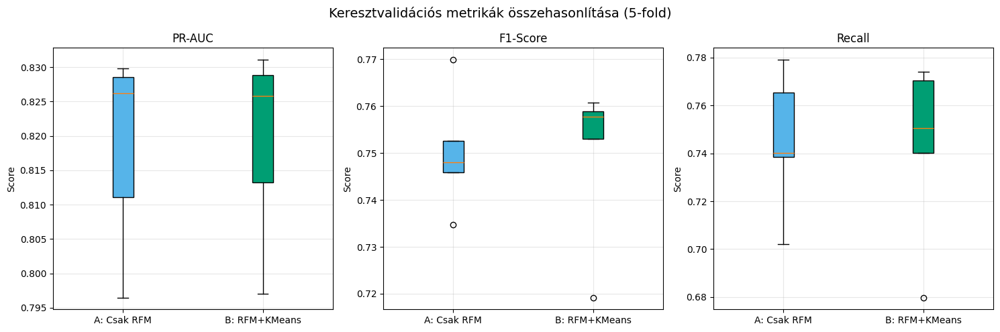
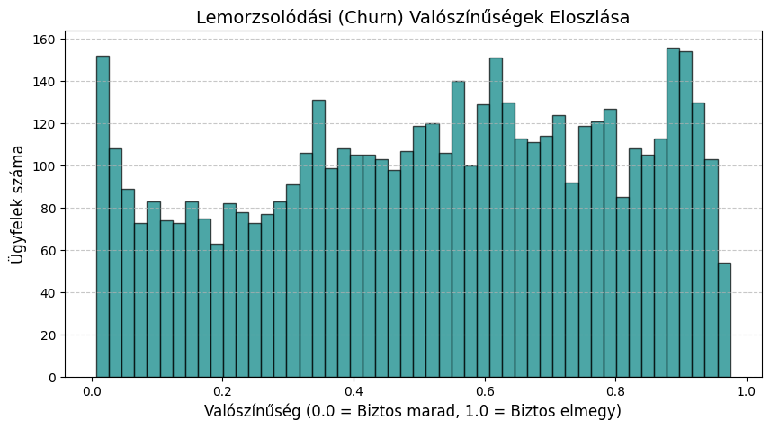
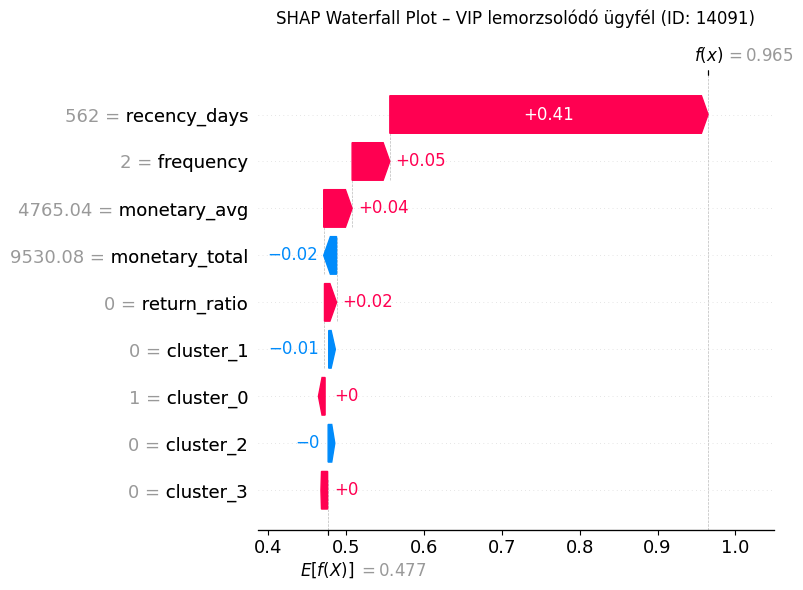

<a id="teteje"></a>
# 03 Prediktív Modellezés: Churn Prediction (XGBoost)
---
**Függőség:** `config.py` (Útvonalak definíciója és a `CUTOFF_DATE` paraméter az időablak felosztásához)

---

**Bemenet:** 
- `data/processed/online_retail_ready_for_rfm.parquet` (A 01-es notebook kimenete nyers idősoros tranzakciókkal)

**Kimenetek:** 
- `models/xgboost_churn.joblib` (A tanított prediktív modell)
- `data/processed/churn_predictions.parquet` (Ügyfél-szintű churn valószínűségek és akciótervek)

---

Ebben a fázisban a gépi tanulás felügyelt részére térünk át. A célunk, hogy a `config.py`-ban rögzített `CUTOFF_DATE` mentén az idősort két részre vágva:
1. A **megfigyelési ablakból** (`< CUTOFF_DATE`) futásidőben számítjuk ki az RFM feature-öket (X), ezzel garantálva az adatszivárgás-mentességet.
2. A **célablakból** (`>= CUTOFF_DATE`) keletkező bináris `churn` változót (y) jósoljuk.

**Miért NEM a 02-es notebook `customer_segments.parquet` fájlját olvassuk be?**  
Mert az már egy aggregált, előre klaszterezett snapshot. Ha abból próbálnánk célváltozót képezni, az RFM értékekben már benne lenne a jövő (*time-travel leakage*). A megoldás: a tisztított tranzakciós adatokat (`READY_FOR_RFM_PARQUET`) töltjük be, és a cutoff-ot itt, futásidőben alkalmazzuk.

---
## 6. Adatbetöltés, Time-Split és Célváltozó (Churn) kialakítása


```python
# ============================================================
# 6.1 – Importok és konfiguráció
# ============================================================
import warnings
warnings.filterwarnings('ignore')

import numpy as np
import pandas as pd
import matplotlib.pyplot as plt
import seaborn as sns
import joblib

from sklearn.pipeline import Pipeline, FeatureUnion
from sklearn.preprocessing import StandardScaler, OneHotEncoder, FunctionTransformer
from sklearn.cluster import KMeans
from sklearn.model_selection import StratifiedKFold, cross_validate
from sklearn.base import BaseEstimator, TransformerMixin
from sklearn.metrics import (
    average_precision_score, f1_score, recall_score,
    precision_recall_curve, make_scorer
)
from xgboost import XGBClassifier
import shap

from config import (
    READY_FOR_RFM_PARQUET, CUSTOMER_SEGMENTS_PARQUET,
    MODELS_DIR, CUTOFF_DATE
)

# Reprodukálhatóság
RANDOM_STATE = 42
np.random.seed(RANDOM_STATE)

print(f"Cutoff dátum (config.py-ból): {CUTOFF_DATE}")
print(f"Adatforrás: {READY_FOR_RFM_PARQUET}")
```

    Cutoff dátum (config.py-ból): 2011-09-09
    Adatforrás: D:\Workspace\ecommerce-customer-segmentation\data\processed\online_retail_ready_for_rfm.parquet
    


```python
# ============================================================
# 6.2 – Adatbetöltés és Time-Split
# ============================================================
# KRITIKUS: A READY_FOR_RFM_PARQUET-t töltjük be (nyers tranzakciók),
# NEM a customer_segments.parquet-t! Így tudjuk a cutoff-ot futásidőben
# alkalmazni, és elkerüljük a time-travel data leakage-t.

df = pd.read_parquet(READY_FOR_RFM_PARQUET)
CUTOFF_DATE_TS = pd.to_datetime(CUTOFF_DATE)

# Idővonal kettévágása
df_obs    = df[df['InvoiceDate'] <  CUTOFF_DATE_TS].copy()  # X ablak (feature-ök alapja)
df_target = df[df['InvoiceDate'] >= CUTOFF_DATE_TS].copy()  # y ablak (célváltozó alapja)

print("=" * 60)
print(f"Teljes időszak:        {df['InvoiceDate'].min().date()}  →  {df['InvoiceDate'].max().date()}")
print(f"Cutoff dátum:          {CUTOFF_DATE_TS.date()}")
print("-" * 60)
print(f"Megfigyelési ablak (X): {len(df_obs):,} sor  |  {df_obs['Customer ID'].nunique():,} egyedi ügyfél")
print(f"Célablak (y):           {len(df_target):,} sor  |  {df_target['Customer ID'].nunique():,} egyedi ügyfél")
print("=" * 60)
```

    ============================================================
    Teljes időszak:        2009-12-01  →  2011-12-09
    Cutoff dátum:          2011-09-09
    ------------------------------------------------------------
    Megfigyelési ablak (X): 631,337 sor  |  5,250 egyedi ügyfél
    Célablak (y):           162,563 sor  |  2,920 egyedi ügyfél
    ============================================================
    


```python
# ============================================================
# 6.3 – RFM + kiterjesztett feature-ök kiszámítása (CSAK az X ablakból)
# ============================================================
# Az összes számítás SZIGORÚAN a df_obs-on történik.
# A df_target adatait NEM látja a feature engineering.

purchases = df_obs[df_obs['Quantity'] > 0]
returns   = df_obs[df_obs['Quantity'] < 0]

# RFM alap
rfm = purchases.groupby('Customer ID').agg(
    recency_days  = ('InvoiceDate', lambda x: (CUTOFF_DATE_TS - x.max()).days),
    frequency     = ('Invoice', 'nunique')
)

# Monetary (nettó, sztornókkal együtt)
monetary = df_obs.groupby('Customer ID')['LineTotal'].sum().rename('monetary_total')
rfm = rfm.join(monetary)

# Return metrikák
return_counts = returns.groupby('Customer ID')['Invoice'].nunique().rename('return_count')
rfm = rfm.join(return_counts).fillna({'return_count': 0})

# Visszaküldési arány
rfm['monetary_avg']  = rfm['monetary_total'] / rfm['frequency']
rfm['return_ratio']  = rfm['return_count'] / (rfm['frequency'] + rfm['return_count'])

# Csak azokat tartjuk, akik az X ablakban pozitív nettó értékkel bírnak
rfm = rfm[rfm['monetary_total'] > 0]

print(f"Kiszámított RFM mátrix: {rfm.shape[0]:,} ügyfél × {rfm.shape[1]} feature")
display(rfm.describe().round(2))
```

    Kiszámított RFM mátrix: 5,243 ügyfél × 6 feature
    


<div>
<style scoped>
    .dataframe tbody tr th:only-of-type {
        vertical-align: middle;
    }

    .dataframe tbody tr th {
        vertical-align: top;
    }

    .dataframe thead th {
        text-align: right;
    }
</style>
<table border="1" class="dataframe">
  <thead>
    <tr style="text-align: right;">
      <th></th>
      <th>recency_days</th>
      <th>frequency</th>
      <th>monetary_total</th>
      <th>return_count</th>
      <th>monetary_avg</th>
      <th>return_ratio</th>
    </tr>
  </thead>
  <tbody>
    <tr>
      <th>count</th>
      <td>5243.00</td>
      <td>5243.00</td>
      <td>5243.00</td>
      <td>5243.00</td>
      <td>5243.00</td>
      <td>5243.00</td>
    </tr>
    <tr>
      <th>mean</th>
      <td>205.36</td>
      <td>5.71</td>
      <td>2518.84</td>
      <td>1.17</td>
      <td>355.00</td>
      <td>0.11</td>
    </tr>
    <tr>
      <th>std</th>
      <td>173.79</td>
      <td>11.21</td>
      <td>11811.34</td>
      <td>3.04</td>
      <td>489.94</td>
      <td>0.17</td>
    </tr>
    <tr>
      <th>min</th>
      <td>0.00</td>
      <td>1.00</td>
      <td>0.00</td>
      <td>0.00</td>
      <td>0.00</td>
      <td>0.00</td>
    </tr>
    <tr>
      <th>25%</th>
      <td>49.00</td>
      <td>1.00</td>
      <td>310.84</td>
      <td>0.00</td>
      <td>170.23</td>
      <td>0.00</td>
    </tr>
    <tr>
      <th>50%</th>
      <td>162.00</td>
      <td>3.00</td>
      <td>761.46</td>
      <td>0.00</td>
      <td>268.55</td>
      <td>0.00</td>
    </tr>
    <tr>
      <th>75%</th>
      <td>323.00</td>
      <td>6.00</td>
      <td>2008.94</td>
      <td>1.00</td>
      <td>399.14</td>
      <td>0.20</td>
    </tr>
    <tr>
      <th>max</th>
      <td>646.00</td>
      <td>284.00</td>
      <td>454202.09</td>
      <td>70.00</td>
      <td>13206.50</td>
      <td>0.80</td>
    </tr>
  </tbody>
</table>
</div>


```python
# ============================================================
# 6.4 – Churn célváltozó (y) kialakítása
# ============================================================
# Churn = 1: a vásárló NEM tranzaktált a célablakban (eltűnt)
# Churn = 0: a vásárló legalább egyszer tranzaktált a célablakban (aktív maradt)
#
# FONTOS: Csak azokat az ügyfeleket tartjuk meg, akik az X ablakban IS léteznek
# (left join az rfm index-re).

# Az y ablakban aktív ügyfelek halmaza
active_in_target = set(df_target['Customer ID'].unique())

# Churn flag: aki NINCS az aktív halmazban → churned
rfm['churn'] = rfm.index.map(lambda cid: 0 if cid in active_in_target else 1)

churn_counts = rfm['churn'].value_counts()
churn_rate   = rfm['churn'].mean() * 100

print("Churn eloszlás:")
print(f"  Churn = 0 (aktív marad):  {churn_counts[0]:,} ügyfél")
print(f"  Churn = 1 (lemorzsolódik): {churn_counts[1]:,} ügyfél")
print(f"  Churn arány: {churn_rate:.1f}%")

if churn_rate > 20:
    if churn_rate > 35:
        print("\n⚠️  Az osztályok imbalanced-ek → PR-AUC, F1 és Recall metrikákra fókuszálunk (nem Accuracy-ra).")
    else:
        print(f"\nℹ️  Churn arány {churn_rate:.1f}% – az osztályok közel kiegyensúlyozottak (nem súlyos imbalance),"
              " de PR-AUC és F1 így is informatívabb metrika, mint az Accuracy.")
```

    Churn eloszlás:
      Churn = 0 (aktív marad):  2,321 ügyfél
      Churn = 1 (lemorzsolódik): 2,922 ügyfél
      Churn arány: 55.7%
    
    ⚠️  Az osztályok imbalanced-ek → PR-AUC, F1 és Recall metrikákra fókuszálunk (nem Accuracy-ra).
    


```python
# ============================================================
# 6.5 – Feature mátrix (X) és célváltozó (y) elkülönítése
# ============================================================
FEATURE_COLS = ['recency_days', 'frequency', 'monetary_total', 'monetary_avg', 'return_ratio']

X = rfm[FEATURE_COLS].copy()
y = rfm['churn'].copy()

print(f"X shape: {X.shape}")
print(f"y shape: {y.shape}")
print(f"\nFeature-ök: {FEATURE_COLS}")
display(X.head())
```

    X shape: (5243, 5)
    y shape: (5243,)
    
    Feature-ök: ['recency_days', 'frequency', 'monetary_total', 'monetary_avg', 'return_ratio']
    


<div>
<style scoped>
    .dataframe tbody tr th:only-of-type {
        vertical-align: middle;
    }

    .dataframe tbody tr th {
        vertical-align: top;
    }

    .dataframe thead th {
        text-align: right;
    }
</style>
<table border="1" class="dataframe">
  <thead>
    <tr style="text-align: right;">
      <th></th>
      <th>recency_days</th>
      <th>frequency</th>
      <th>monetary_total</th>
      <th>monetary_avg</th>
      <th>return_ratio</th>
    </tr>
    <tr>
      <th>Customer ID</th>
      <th></th>
      <th></th>
      <th></th>
      <th></th>
      <th></th>
    </tr>
  </thead>
  <tbody>
    <tr>
      <th>12346</th>
      <td>437</td>
      <td>2</td>
      <td>169.36</td>
      <td>84.680</td>
      <td>0.000000</td>
    </tr>
    <tr>
      <th>12347</th>
      <td>37</td>
      <td>6</td>
      <td>3402.39</td>
      <td>567.065</td>
      <td>0.000000</td>
    </tr>
    <tr>
      <th>12348</th>
      <td>156</td>
      <td>4</td>
      <td>1388.40</td>
      <td>347.100</td>
      <td>0.000000</td>
    </tr>
    <tr>
      <th>12349</th>
      <td>315</td>
      <td>2</td>
      <td>2196.99</td>
      <td>1098.495</td>
      <td>0.333333</td>
    </tr>
    <tr>
      <th>12350</th>
      <td>218</td>
      <td>1</td>
      <td>294.40</td>
      <td>294.400</td>
      <td>0.000000</td>
    </tr>
  </tbody>
</table>
</div>


---
## 7. A/B Modellezés: Pipeline-ok felépítése

### Az adatszivárgás-mentes K-Means Pipeline logikája

A Modell B-ben a K-Means klaszterező **nem előre futtatott**, hanem a scikit-learn `Pipeline` belső lépéseként kerül be. Ez garantálja, hogy a keresztvalidáció során a K-Means **minden foldban kizárólag a tréningadatokon** tanul - a validációs halmazon csak `predict` (`transform`) fut.

**OHE - one hot encoding**

A pipeline felépítése:
```
X (RFM) ──▶ StandardScaler ──┬──▶ KMeans (4 klaszter) ──▶ Klasztercímke (OHE) ──┐
                              │                                                    ├──▶ XGBClassifier
                              └──▶ Skálázott RFM (passthrough) ────────────────────┘
```

A `FeatureUnion` kombinálja a két ágat egyetlen feature mátrixszá.


```python
# ============================================================
# 7.1 – Egyedi Transformer: KMeans → OHE (Pipeline-kompatibilis)
# ============================================================

class KMeansFeaturizer(BaseEstimator, TransformerMixin):
    """
    Scikit-learn kompatibilis transformer, amely:
    1. KMeans-t illeszt a bemeneti adatokra (CSAK fit-kor),
    2. Klasztercímkéket rendel az adatpontokhoz,
    3. A klasztercímkéket One-Hot Encodes formátumba alakítja.

    Pipeline-ban használva garantálja az adatszivárgás-mentességet:
    a KMeans minden CV-foldban csak a tréningadatokon tanul.
    """
    def __init__(self, n_clusters=4, random_state=42):
        self.n_clusters   = n_clusters
        self.random_state = random_state

    def fit(self, X, y=None):
        self.kmeans_ = KMeans(
            n_clusters=self.n_clusters,
            random_state=self.random_state,
            n_init=10
        )
        self.kmeans_.fit(X)
        self.ohe_ = OneHotEncoder(sparse_output=False, handle_unknown='ignore')
        labels = self.kmeans_.labels_.reshape(-1, 1)
        self.ohe_.fit(labels)
        return self

    def transform(self, X, y=None):
        labels = self.kmeans_.predict(X).reshape(-1, 1)
        return self.ohe_.transform(labels)

    def get_feature_names_out(self, input_features=None):
        return np.array([f'cluster_{i}' for i in range(self.n_clusters)])


print("✔️ KMeansFeaturizer transformer definiálva.")
print("   Ez a transformer garantálja, hogy a K-Means CSAK a tréningadatokon tanul,")
print("   és a CV során nem szivárog át információ a validációs foldokba.")
```

    ✔️ KMeansFeaturizer transformer definiálva.
       Ez a transformer garantálja, hogy a K-Means CSAK a tréningadatokon tanul,
       és a CV során nem szivárog át információ a validációs foldokba.
    


```python
# ============================================================
# 7.2 – Modell A: Csak RFM Pipeline
# ============================================================

xgb_params = dict(
    n_estimators    = 300,
    max_depth       = 4,
    learning_rate   = 0.05,
    subsample       = 0.8,
    colsample_bytree= 0.8,
    min_child_weight= 5,
    scale_pos_weight= (y == 0).sum() / (y == 1).sum(),  # Imbalance kezelés
    base_score      = 0.5,          # Fix: XGBoost ≥2.0 + SHAP kompatibilitás
    eval_metric     = 'aucpr',
    random_state    = RANDOM_STATE,
    n_jobs          = -1,
)

"""
# Beégetett (gyors / hangolt) hiperparaméterekkel, fentit ki kell kommentezni a használatához:
xgb_params = {
    'n_estimators': 105,
    'max_depth': 3,
    'learning_rate': 0.015433043380607947,
    'subsample': 0.6977412621858619,
    'colsample_bytree': 0.872719737092165,
    'min_child_weight': 5,
    'gamma': 0.005328907538812302,
    'reg_alpha': 3.149466445496976,
    'reg_lambda': 3.08615384985409,
    # Ezek az alapbeállítások maradnak (A SHAP ÉS AZ IMBALANCE MIATT FONTOS!):
    'scale_pos_weight': (y == 0).sum() / (y == 1).sum(),
    'base_score': 0.5,
    'eval_metric': 'aucpr', 
    'random_state': RANDOM_STATE,
    'n_jobs': -1
}
"""

pipeline_a = Pipeline([
    ('clf', XGBClassifier(**xgb_params))
])

print("✔️ Modell A Pipeline definiálva:")
print("   XGBClassifier (skálázás nélkül – fa-alapú modellnél felesleges)")
print(f"   scale_pos_weight = {xgb_params['scale_pos_weight']:.2f}  (osztályegyensúly-korrekció)")
```

    ✔️ Modell A Pipeline definiálva:
       XGBClassifier (skálázás nélkül – fa-alapú modellnél felesleges)
       scale_pos_weight = 0.79  (osztályegyensúly-korrekció)
    


```python
# ============================================================
# 7.3 – Modell B: RFM + K-Means Pipeline (FeatureUnion)
# ============================================================
# A FeatureUnion két párhuzamos ágat futtat egyszerre:
#   - 'rfm_raw': az eredeti (nyers) 5 RFM feature az XGBoost-nak
#                (fa-alapú modellnek nem kell skálázás)
#   - 'cluster_ohe': CSAK a 3 alap RFM feature (recency, frequency, monetary_total)
#                    kerül ide → log1p → StandardScaler → KMeansFeaturizer
#
# KRITIKUS: A K-Means KIZÁRÓLAG a 3 eredeti R, F, M változón tanul,
# ezért az itt képzett klaszterek megfelelnek a 02-es notebookban
# definiált üzleti profiloknak (VIP Bajnokok, Lemorzsolódó, stb.).
# Az XGBoost azonban továbbra is megkapja mind az 5 feature-t a 'rfm_raw' ágon.

# Az oszlopindexek az X DataFrame-ben (FEATURE_COLS sorrendje alapján):
#   0: recency_days | 1: frequency | 2: monetary_total | 3: monetary_avg | 4: return_ratio
RFM_INDICES = [0, 1, 2]   # recency_days, frequency, monetary_total

from sklearn.compose import ColumnTransformer

feature_union = FeatureUnion([
    ('rfm_raw', Pipeline([
        ('passthrough', FunctionTransformer()),   # identity transzformáció (lambda helyett: pickle-kompatibilis)
    ])),
    ('cluster_ohe', Pipeline([
        # 1. Oszlopszelektor: CSAK az R, F, M változókat adjuk a K-Means-nek
        ('rfm_selector', ColumnTransformer(
            [('select_rfm', 'passthrough', RFM_INDICES)],
            remainder='drop'
        )),
        ('log1p',      FunctionTransformer(np.log1p)),        # 2. log-transzformáció (ferdeség csökkentése)
        ('scaler',     StandardScaler()),                     # 3. standardizálás (K-Means igényli)
        ('featurizer', KMeansFeaturizer(n_clusters=4, random_state=RANDOM_STATE)),
    ])),
])

pipeline_b = Pipeline([
    ('features', feature_union),
    ('clf',      XGBClassifier(**xgb_params))
])

print("✔️ Modell B Pipeline definiálva:")
print("   FeatureUnion[")
print("     'rfm_raw':     Passthrough (5 feature, skálázás nélkül) → XGBoost")
print("     'cluster_ohe': ColumnTransformer[R,F,M] → log1p → StandardScaler")
print("                    → KMeansFeaturizer(K=4) → 4 OHE feature")
print("   ] → XGBClassifier")
print("   Összesen: 9 input feature az XGBoost-nak (5 nyers + 4 klaszter-OHE)")
print()
print("   ✅ A K-Means CSAK a 3 alap RFM változót (R, F, M) látja – összhangban")
print("      a 02-es notebook üzleti szegmenseivel (VIP Bajnokok stb.).")

```

    ✔️ Modell B Pipeline definiálva:
       FeatureUnion[
         'rfm_raw':     Passthrough (5 feature, skálázás nélkül) → XGBoost
         'cluster_ohe': ColumnTransformer[R,F,M] → log1p → StandardScaler
                        → KMeansFeaturizer(K=4) → 4 OHE feature
       ] → XGBClassifier
       Összesen: 9 input feature az XGBoost-nak (5 nyers + 4 klaszter-OHE)
    
       ✅ A K-Means CSAK a 3 alap RFM változót (R, F, M) látja – összhangban
          a 02-es notebook üzleti szegmenseivel (VIP Bajnokok stb.).
    

---
## 8. Keresztvalidáció és modellek összehasonlítása

Az imbalanced osztályeloszlás miatt **PR-AUC** (Precision-Recall AUC) a fő metrika - ez sokkal informatívabb, mint az ROC-AUC, ha az egyik osztály ritkább. Mellette F1-score és Recall is szerepel a teljes kép kedvéért.

### 8.1 Keresztvalidáció mindkét modellre


```python
# ============================================================
# 8.1 – Keresztvalidáció mindkét modellre
# ============================================================

cv = StratifiedKFold(n_splits=5, shuffle=True, random_state=RANDOM_STATE)

scoring = {
    'pr_auc':  make_scorer(average_precision_score, response_method='predict_proba'),
    'f1':      make_scorer(f1_score,  zero_division=0),
    'recall':  make_scorer(recall_score, zero_division=0),
}

print("Modell A keresztvalidáció futtatása (5-fold StratifiedKFold)...")
cv_results_a = cross_validate(pipeline_a, X, y, cv=cv, scoring=scoring, n_jobs=-1)
print("✔️ Modell A kész.")

print("Modell B keresztvalidáció futtatása (5-fold StratifiedKFold)...")
cv_results_b = cross_validate(pipeline_b, X, y, cv=cv, scoring=scoring, n_jobs=-1)
print("✔️ Modell B kész.")
```

    Modell A keresztvalidáció futtatása (5-fold StratifiedKFold)...
    ✔️ Modell A kész.
    Modell B keresztvalidáció futtatása (5-fold StratifiedKFold)...
    ✔️ Modell B kész.
    

### 8.2 Eredmények összehasonlítása


```python
# ============================================================
# 8.2 – Eredmények összehasonlítása
# ============================================================

def cv_summary(results, name):
    return {
        'Modell': name,
        'PR-AUC (átlag)':  results['test_pr_auc'].mean().round(4),
        'PR-AUC (szórás)': results['test_pr_auc'].std().round(4),
        'F1 (átlag)':      results['test_f1'].mean().round(4),
        'F1 (szórás)':     results['test_f1'].std().round(4),
        'Recall (átlag)':  results['test_recall'].mean().round(4),
        'Recall (szórás)': results['test_recall'].std().round(4),
    }

comparison_df = pd.DataFrame([
    cv_summary(cv_results_a, 'A: Csak RFM'),
    cv_summary(cv_results_b, 'B: RFM + K-Means OHE'),
])

print("\nKeresztvalidációs eredmények összehasonlítása:")
display(comparison_df.set_index('Modell'))

# A nyertes modell automatikus kiválasztása PR-AUC alapján
best_pr_auc_a = cv_results_a['test_pr_auc'].mean()
best_pr_auc_b = cv_results_b['test_pr_auc'].mean()

if best_pr_auc_b > best_pr_auc_a:
    winner_pipeline = pipeline_b
    winner_name     = 'B: RFM + K-Means OHE'
    print(f"\n🏆 Nyertes modell: {winner_name} (PR-AUC: {best_pr_auc_b:.4f} vs {best_pr_auc_a:.4f})")
else:
    winner_pipeline = pipeline_a
    winner_name     = 'A: Csak RFM'
    print(f"\n🏆 Nyertes modell: {winner_name} (PR-AUC: {best_pr_auc_a:.4f} vs {best_pr_auc_b:.4f})")
```

    
    Keresztvalidációs eredmények összehasonlítása:
    


<div>
<style scoped>
    .dataframe tbody tr th:only-of-type {
        vertical-align: middle;
    }

    .dataframe tbody tr th {
        vertical-align: top;
    }

    .dataframe thead th {
        text-align: right;
    }
</style>
<table border="1" class="dataframe">
  <thead>
    <tr style="text-align: right;">
      <th></th>
      <th>PR-AUC (átlag)</th>
      <th>PR-AUC (szórás)</th>
      <th>F1 (átlag)</th>
      <th>F1 (szórás)</th>
      <th>Recall (átlag)</th>
      <th>Recall (szórás)</th>
    </tr>
    <tr>
      <th>Modell</th>
      <th></th>
      <th></th>
      <th></th>
      <th></th>
      <th></th>
      <th></th>
    </tr>
  </thead>
  <tbody>
    <tr>
      <th>A: Csak RFM</th>
      <td>0.8184</td>
      <td>0.0129</td>
      <td>0.7502</td>
      <td>0.0114</td>
      <td>0.745</td>
      <td>0.0264</td>
    </tr>
    <tr>
      <th>B: RFM + K-Means OHE</th>
      <td>0.8192</td>
      <td>0.0127</td>
      <td>0.7499</td>
      <td>0.0156</td>
      <td>0.743</td>
      <td>0.0340</td>
    </tr>
  </tbody>
</table>
</div>


    
    🏆 Nyertes modell: B: RFM + K-Means OHE (PR-AUC: 0.8192 vs 0.8184)
    

### 8.3 CV eredmények vizualizálása


```python
# ============================================================
# 8.3 CV eredmények vizualizálása
# ============================================================

metrics = ['test_pr_auc', 'test_f1', 'test_recall']
metric_labels = ['PR-AUC', 'F1-Score', 'Recall']

fig, axes = plt.subplots(1, 3, figsize=(15, 5))
fig.suptitle('Keresztvalidációs metrikák összehasonlítása (5-fold)', fontsize=14)

for ax, metric, label in zip(axes, metrics, metric_labels):
    data = [cv_results_a[metric], cv_results_b[metric]]
    bp = ax.boxplot(data, labels=['A: Csak RFM', 'B: RFM+KMeans'], patch_artist=True)
    bp['boxes'][0].set_facecolor('#56B4E9')
    bp['boxes'][1].set_facecolor('#009E73')
    ax.set_title(label)
    ax.set_ylabel('Score')
    ax.grid(True, alpha=0.3)

plt.tight_layout()

plt.show()
```


    

    


**A boxplot értelmezése:**

Minden doboz egy modell 5-fold keresztvalidációs eredményeinek eloszlását mutatja:
- A **doboz közepe (narancssárga vonal)** a medián score — ez a legreprezentatívabb egyedi szám.
- A **doboz szélessége (IQR)** az eredmények stabilitását jelzi: minél keskenyebb, annál konzisztensebben teljesít a modell különböző adatrészleteken.
- A **bajusz (whisker)** a min/max értékeket mutatja, a **körök** kiugró (outlier) foldokat jelölnek.

**Mit látunk itt?**

- **PR-AUC:** A két modell dobozai szinte teljesen fedik egymást (~0.810–0.830). A B modell mediánja minimálisan magasabb, de a különbség elhanyagolható.
- **F1-Score:** Az A modell mediánja (~0.750) és a B modellé (~0.758) közel azonos, a dobozok IQR-ja is hasonló — a K-Means klasztercímkék nem adnak érdemi F1-javulást.
- **Recall:** Szintén szoros verseny (~0.745 vs ~0.752). A B modell whisker-je valamivel hosszabb, ami nagyobb variabilitást jelez.

> **Következtetés:** Egyik metrikában sem mutatkozik szignifikáns különbség — a boxplotok átfedő IQR-dobozai azt jelzik, hogy a két modell teljesítménye statisztikailag nem különböztethető meg megbízhatóan. A K-Means klasztercímkék hozzáadása nem hoz érdemi előnyt, mert az XGBoost fa-alapú struktúrája önállóan is képes feltárni ezeket a mintázatokat az RFM feature-ökből.

### 8.4 A nyertes modell betanítása a TELJES adathalmazon


```python
# ============================================================
# 8.4 A nyertes modell betanítása a TELJES adathalmazon
# ============================================================
print(f"A nyertes modell ({winner_name}) betanítása az összes adaton...")
winner_pipeline.fit(X, y)
print("✔️ Betanítás kész.")

# Gyors szanity-check: tréning metrikák (tájékoztató jellegűek, nem CV!)
y_pred_proba = winner_pipeline.predict_proba(X)[:, 1]
y_pred       = winner_pipeline.predict(X)

print(f"\nTréning PR-AUC (overfitting indikátor): {average_precision_score(y, y_pred_proba):.4f}")
print(f"Tréning F1:                              {f1_score(y, y_pred, zero_division=0):.4f}")
print(f"Tréning Recall:                          {recall_score(y, y_pred, zero_division=0):.4f}")
print("\n⚠️ A tréning metrikák mindig optimistábban néznek ki, mint a CV eredmények - ez normális.")
```

    A nyertes modell (B: RFM + K-Means OHE) betanítása az összes adaton...
    ✔️ Betanítás kész.
    
    Tréning PR-AUC (overfitting indikátor): 0.8820
    Tréning F1:                              0.7939
    Tréning Recall:                          0.7875
    
    ⚠️ A tréning metrikák mindig optimistábban néznek ki, mint a CV eredmények - ez normális.
    

---
### 8.5 Hiperparaméter-hangolás `RandomizedSearchCV` segítségével

Az alábbi cella futtatható, de **nem kötelező** a notebook többi részéhez - az eredmény automatikusan felülírja a `winner_pipeline`-t, ha a keresés jobb paramétert talál.

> **Futtatási idő:** ~5–15 perc CPU-n (100 iteráció × 3-fold CV). Gyorsításhoz csökkentsd `n_iter`-t (pl. 20-ra) vagy a `cv` foldok számát.

**Miért `RandomizedSearchCV` és nem `GridSearchCV`?**  
A keresési tér nagy (~10k kombináció), és a randomizált keresés általában közel azonos eredményt ad töredéknyi idő alatt, *Bergstra & Bengio (2012)* empirikusan igazolta.

#### Miért pont 100 iterációt használtam a kereséshez?

A `RandomizedSearchCV` beállításánál az `n_iter = 100` egy tudatosan választott "arany középút" az időráfordítás és a modell pontossága között.

* **A csökkenő hozadék elve:** A véletlenszerű hiperparaméter-keresésnél az első ~50-100 próbálkozás hozza a leglátványosabb ugrást a modell teljesítményében. 100 iteráció felett a görbe ellaposodik: további több száz modell betanítása (és a gép órákig tartó terhelése) már csak a negyedik tizedesjegyben hozna javulást, ami üzleti szempontból irreleváns.
* **Erőforrás-kímélés:** Mivel 3-szoros keresztvalidációt (`cv=3`) használunk, a 100 iteráció valójában 300 modellillesztést jelent a háttérben, ami egy lokális gépen még pont kényelmesen lefut.

*Megjegyzés: Gyors prototipizáláshoz vagy kódteszteléshez az értéket érdemes 20-ra csökkenteni.*

> **🚀 További fejlesztési lehetőség (Next Steps):**
> Ha a jövőben a cél a modell pontosságának további maximalizálása anélkül, hogy a futási idő drasztikusan megnőne, a `RandomizedSearchCV` (véletlenszerű keresés) helyett érdemes **Bayesi optimalizációra** (Bayesian Optimization) váltani.
> 
> Az iparágban standardnak számító **Optuna** könyvtár használatával a modell "intelligensen" keres: ahelyett, hogy vaktában próbálkozna, tanul a korábbi iterációk eredményeiből, és célzottan a legígéretesebb paraméter-tartományokat vizsgálja. Így töredék annyi lépésből képes egy még pontosabb, globális optimumot megtalálni.


```python
# ============================================================
# 8.5 Hiperparaméter-hangolás RandomizedSearchCV-vel
# ============================================================
# OPCIONÁLIS CELLA – a notebook többi része a 8.4-ben betanított
# winner_pipeline-t használja, de ez a cella felülírja, ha jobb
# paramétert talál.
#
# A keresési tér az XGBClassifier paramétereire vonatkozik;
# a Pipeline-ban 'clf__' előtaggal hivatkozunk rájuk.
# ============================================================

from sklearn.model_selection import RandomizedSearchCV
import scipy.stats as stats

# --- Keresési tér ---
param_dist = {
    'clf__n_estimators':     stats.randint(100, 600),
    'clf__max_depth':        stats.randint(3, 8),
    'clf__learning_rate':    stats.loguniform(0.01, 0.3),
    'clf__subsample':        stats.uniform(0.6, 0.4),        # 0.6 – 1.0
    'clf__colsample_bytree': stats.uniform(0.5, 0.5),        # 0.5 – 1.0
    'clf__min_child_weight': stats.randint(1, 15),
    'clf__gamma':            stats.loguniform(1e-4, 1.0),
    'clf__reg_alpha':        stats.loguniform(1e-4, 10.0),
    'clf__reg_lambda':       stats.loguniform(0.5, 10.0),
}

# A keresés a winner_pipeline klónjára fut (az eredeti nem változik addig)
import copy
search_pipeline = copy.deepcopy(winner_pipeline)

cv_search = StratifiedKFold(n_splits=3, shuffle=True, random_state=RANDOM_STATE)

rscv = RandomizedSearchCV(
    estimator   = search_pipeline,
    param_distributions = param_dist,
    n_iter      = 100,          # ← csökkentsd 20-ra gyors teszthez, 100 már bőven optimális, csökkenő hozadék elve miatt több felesleges ezzel a módszerrel
    scoring     = 'average_precision',   # PR-AUC (Precision-Recall Area Under Curve) maximalizálása
    cv          = cv_search,
    n_jobs      = -1,
    random_state= RANDOM_STATE,
    verbose     = 1,
    refit       = True,
)

print("RandomizedSearchCV futtatása (ez eltarthat néhány percig)...")
rscv.fit(X, y)

print(f"\n✔️ Keresés kész.")
print(f"   Legjobb CV PR-AUC: {rscv.best_score_:.4f}")
print(f"   Legjobb paraméterek:")
for k, v in rscv.best_params_.items():
    print(f"     {k}: {v}")

# --- Összehasonlítás az eredeti winner_pipeline-nal ---
original_pr_auc = (
    cv_results_b['test_pr_auc'].mean()
    if winner_name.startswith('B') else
    cv_results_a['test_pr_auc'].mean()
)

print(f"\n  Eredeti winner PR-AUC (5-fold): {original_pr_auc:.4f}")
print(f"  RSCV legjobb PR-AUC  (3-fold):  {rscv.best_score_:.4f}")
print("  ⚠️  Különböző fold-szám miatt a számok nem közvetlenül összehasonlíthatók.")

# Feltételes felülírás: csak akkor cseréljük a winner_pipeline-t,
# ha az RSCV best score jobb, mint az eredeti CV átlag.
# (Az RSCV 3-fold, az eredeti CV 5-fold volt — eltérő fold-szám
# miatt nem közvetlenül összehasonlítható, de ha az RSCV 100
# iteráció után sem éri el az eredeti szintet, a hangolás
# valószínűleg nem hozott érdemi javulást.)
if rscv.best_score_ > original_pr_auc:
    winner_pipeline = rscv.best_estimator_
    winner_name    += ' (RSCV hangolt)'
    print('\n✔️ winner_pipeline frissítve a hangolt modellre (RSCV jobb volt az eredetinél).')
    print('\n💡 A winner_pipeline felülírásra került az RSCV legjobb modelljével.')
    print('   Ha az eredeti modellt szeretnéd megtartani, kommentezd ki a feltételt.')
else:
    print(f'\n💡 Az RSCV nem javított az eredeti modellen (RSCV: {rscv.best_score_:.4f} vs eredeti: {original_pr_auc:.4f}).')
    print('   A winner_pipeline változatlan marad. (Eltérő fold-szám miatt ez várható lehet.)')

```

    RandomizedSearchCV futtatása (ez eltarthat néhány percig)...
    Fitting 3 folds for each of 100 candidates, totalling 300 fits
    
    ✔️ Keresés kész.
       Legjobb CV PR-AUC: 0.8166
       Legjobb paraméterek:
         clf__colsample_bytree: 0.872719737092165
         clf__gamma: 0.005328907538812302
         clf__learning_rate: 0.015433043380607947
         clf__max_depth: 3
         clf__min_child_weight: 5
         clf__n_estimators: 105
         clf__reg_alpha: 3.149466445496976
         clf__reg_lambda: 3.08615384985409
         clf__subsample: 0.6977412621858619
    
      Eredeti winner PR-AUC (5-fold): 0.8192
      RSCV legjobb PR-AUC  (3-fold):  0.8166
      ⚠️  Különböző fold-szám miatt a számok nem közvetlenül összehasonlíthatók.
    
    💡 Az RSCV nem javított az eredeti modellen (RSCV: 0.8166 vs eredeti: 0.8192).
       A winner_pipeline változatlan marad. (Eltérő fold-szám miatt ez várható lehet.)
    

---
## 9. Modell magyarázata SHAP segítségével

A SHAP (SHapley Additive exPlanations) értékek megmutatják, hogy az egyes feature-ök mennyivel "tolják" a modell kimenetét az átlagtól el - pozitív irányban (churn felé) vagy negatív irányban (megtartás felé).

### 9.1 SHAP adatok előkészítése


```python
# ============================================================
# 9.1 – SHAP adatok előkészítése
# ============================================================
# XGBoost 3.x + SHAP: a TreeExplainer base_score kompatibilitási hibája
# miatt shap.Explainer-t használunk (kernel/permutation alapú, nem tree-path).
# Lassabb, de XGBoost verziótól független, stabil megoldás.
#
# FONTOS: predict_proba-t adunk az Explainer-nek (NEM predict-et).
# A .predict() bináris, kerekített értékeket ad vissza (0/1), ami
# "lépcsős" függvényt hoz létre – a SHAP értékek ezért torzak és
# darabosak lennének, nem tükröznék a modell valós belső dinamikát.
# A predict_proba folytonos [0,1] valószínűségeket ad → pontos SHAP.
# A pozitív osztályra (Churn=1) vonatkozó SHAP szeletet [:, :, 1]-el
# nyerjük ki az ábrázoláshoz.

# XGBoost modell kinyerése a pipeline-ból
xgb_model = winner_pipeline.named_steps['clf']

# Transzformált feature mátrix és feature nevek meghatározása
# A winner_name string helyett a pipeline tényleges struktúrájából következtetünk,
# mert az RSCV hangolás után a winner_name suffixet kap és a string-egyezés megbízhatatlan.
#   - Modell A: csak 'clf' lépés → nincs 'features' kulcs → X változatlan (5 feature)
#   - Modell B: 'features' + 'clf' lépések → FeatureUnion transzformálja X-et (9 feature)
if 'features' in winner_pipeline.named_steps:
    # B modellnél a 'features' lépés (FeatureUnion) elvégzi a transzformációt
    feature_step  = winner_pipeline.named_steps['features']
    X_transformed = feature_step.transform(X)
    # Ágak sorrendje: rfm_raw (5 nyers feature) → cluster_ohe (4 OHE feature)
    cluster_names             = [f'cluster_{i}' for i in range(4)]
    feature_names_transformed = FEATURE_COLS + cluster_names
else:
    # A modellnél nincs preprocessing lépés – az XGBoost a nyers X-et kapja (5 feature)
    X_transformed             = X.values
    feature_names_transformed = FEATURE_COLS

# Sanity check: a transzformált mátrix feature-száma egyezzen a modell elvárásával
assert X_transformed.shape[1] == xgb_model.n_features_in_, (
    f"Feature-szám eltérés: X_transformed={X_transformed.shape[1]}, "
    f"modell vár={xgb_model.n_features_in_}. "
    f"Ellenőrizd, hogy a winner_pipeline 'features' lépése helyesen van-e detektálva."
)
print(f"✔️ Pipeline struktúra detektálva: {'B (FeatureUnion)' if 'features' in winner_pipeline.named_steps else 'A (csak RFM)'}")
print(f"   X_transformed shape: {X_transformed.shape}")

# SHAP Explainer – predict_proba-val (folytonos valószínűség, nem bináris kimenet)
explainer   = shap.Explainer(xgb_model.predict_proba, X_transformed)
shap_values = explainer(X_transformed)

# A pozitív osztály (Churn = 1) SHAP értékeinek kinyerése
# shap_values alakja: (n_samples, n_features, n_classes) → [:, :, 1] = Churn=1
shap_values_churn1 = shap_values[:, :, 1]

print(f"✔️ SHAP értékek kiszámítva: {shap_values.values.shape}")
print(f"   Churn=1 szelet alakja:   {shap_values_churn1.values.shape}")
print(f"Feature nevek: {feature_names_transformed}")

```

    ✔️ Pipeline struktúra detektálva: B (FeatureUnion)
       X_transformed shape: (5243, 9)
    

    ExactExplainer explainer: 5244it [01:59, 43.86it/s]                                                                    
    

    ✔️ SHAP értékek kiszámítva: (5243, 9, 2)
       Churn=1 szelet alakja:   (5243, 9)
    Feature nevek: ['recency_days', 'frequency', 'monetary_total', 'monetary_avg', 'return_ratio', 'cluster_0', 'cluster_1', 'cluster_2', 'cluster_3']
    

### 9.2 Churn valószínűségek eloszlása

Mielőtt a SHAP-magyarázatokba merülnénk, érdemes megvizsgálni a modell
**nyers kimenetének eloszlását** – vagyis azt, hogy a valószínűségi becslések
hogyan oszlanak meg az ügyfelek között.

Ez két okból fontos:
- **Kalibráció ellenőrzése:** Egy jól kalibrált modell eloszlása nem torlódik
  a 0 vagy 1 szélek köré – a valószínűségek "hitelesen" tükrözik a tényleges
  kockázatot. Ha a grafikon egy üres „U" betűt formáz (csak a széleken vannak
  oszlopok), a modell túltanult, és nem alkalmas üzleti döntéshozásra.
- **Threshold-választás előkészítése:** A 10.1-es cellában egy döntési küszöböt
  (`CHURN_THRESHOLD`) alkalmazunk. Az eloszlás ismerete segít megérteni, hogy
  ez a küszöb az ügyfelek mekkora hányadát érinti.

**A leíró statisztika értelmezése (`describe()`):**
- `mean`: a teljes ügyfélbázis átlagos churn-hajlama – ha ez 50% felett van, figyelmeztető jel a cégvezetésnek
- `std`: ha túl alacsony, a modell túl óvatos; ha túl magas, túl szélsőséges
- `min/max`: nem szabad pontosan 0.0 vagy 1.0 értékeket látni – az XGBoost normál esetben a szélső értékeket is árnyaltan kezeli

**A "szürke zóna" üzleti jelentősége:**
A 0.3–0.7 közötti sávban lévő ügyfelek azok, akiknek döntése még billeg.
Marketing szempontból **ők az igazi célpontok**: egy jól irányzott kampánnyal
vagy kuponnal az ő megtartásuk még reálisan befolyásolható.


```python
# ============================================================
# 9.2 – Churn valószínűségek eloszlása (memóriából)
# ============================================================

plt.figure(figsize=(10, 5))
plt.hist(y_pred_proba, bins=50, color='teal', edgecolor='black', alpha=0.7)
plt.title('Lemorzsolódási (Churn) Valószínűségek Eloszlása', fontsize=14)
plt.xlabel('Valószínűség (0.0 = Biztos marad, 1.0 = Biztos elmegy)', fontsize=12)
plt.ylabel('Ügyfelek száma', fontsize=12)
plt.grid(axis='y', linestyle='--', alpha=0.7)
plt.show()

print("\n--- Valószínűségek statisztikája ---")
proba_stats = pd.Series(y_pred_proba).describe()
print(proba_stats)

mean_churn = proba_stats['mean']
if mean_churn > 0.5:
    print(f"\n⚠️  Figyelem: az átlagos churn-valószínűség {mean_churn:.1%} – "
          f"a bázis több mint fele lemorzsolódás felé hajlik!")
else:
    print(f"\n✅ Átlagos churn-valószínűség: {mean_churn:.1%}")
```


    

    


    
    --- Valószínűségek statisztikája ---
    count    5243.000000
    mean        0.519442
    std         0.274335
    min         0.007397
    25%         0.307905
    50%         0.542737
    75%         0.753874
    max         0.974866
    dtype: float64
    
    ⚠️  Figyelem: az átlagos churn-valószínűség 51.9% – a bázis több mint fele lemorzsolódás felé hajlik!
    

### 9.3 SHAP Summary Plot (Globális feature fontosság)

**Hogyan olvassuk le a grafikont?**
* **Vízszintes tengely (SHAP érték):** Mennyivel tolja el a modellt a döntésben. A **0-tól jobbra** lévő pontok *növelik a lemorzsolódás (churn) esélyét*, a **balra** lévők pedig *hűségre* utalnak (az ügyfél marad).
* **Színek:** A változó eredeti értéke. A **piros** magas, a **kék** alacsony értéket jelent az adott ügyfélnél.

**⚠️ A "Józan ész" teszt (Sanity Check):**
Ezzel ellenőrizzük, hogy a modell tényleg a ***lemorzsolódást jósolja-e, és nem fordítva a hűséget***:
1. **Recency:** A piros pöttyöknek (régen vásárolt) a **jobb** oldalon kell lenniük.
2. **Frequency & Monetary:** A piros pöttyöknek (gyakran/sokat költ) a **bal** oldalon kell lenniük.
*Ha a színek és irányok pont fordítva állnak, a modell hibásan működik (hűséget jósol churn helyett), ami a bináris célváltozó (y) fordított kódolására utal!*


```python
# ============================================================
# 9.3 – SHAP Summary Plot (Globális feature fontosság)
# ============================================================
print("SHAP Summary Plot generálása...")

fig, ax = plt.subplots(figsize=(10, 6))
shap.summary_plot(
    shap_values_churn1.values,       # Churn=1 osztály SHAP értékei
    X_transformed,
    feature_names=feature_names_transformed,
    show=False,
    plot_size=None
)
plt.title('SHAP Summary Plot – Globális Feature Fontosság (Churn előrejelzés)', pad=20)
plt.tight_layout()

plt.show()

print("\n📊 Értelmezés:")
print("  • Magasabb recency → nagyobb churn valószínűség (logikus: aki rég vásárolt, lemorzsolódik)")
print("  • Alacsony frequency → nagyobb churn kockázat")
print("  • Magas monetary → alacsonyabb churn (a VIP-ek lojálisabbak)")

```

    SHAP Summary Plot generálása...
    


    
.png)
    


    
    📊 Értelmezés:
      • Magasabb recency → nagyobb churn valószínűség (logikus: aki rég vásárolt, lemorzsolódik)
      • Alacsony frequency → nagyobb churn kockázat
      • Magas monetary → alacsonyabb churn (a VIP-ek lojálisabbak)
    

### 9.4 SHAP Waterfall Plot: Egy VIP, lemorzsolódó ügyfél magyarázata


```python
# ============================================================
# 9.4 – SHAP Waterfall Plot: Egy VIP, lemorzsolódó ügyfél magyarázata
# ============================================================
rfm_with_pred = rfm.copy()
rfm_with_pred['churn_proba'] = y_pred_proba

monetary_75pct = rfm['monetary_total'].quantile(0.75)
vip_churned    = rfm_with_pred[
    (rfm_with_pred['monetary_total'] > monetary_75pct) &
    (rfm_with_pred['churn'] == 1)
]
if len(vip_churned) == 0:
    selected_idx = rfm_with_pred['churn_proba'].idxmax()
    print("⚠️ Nincs VIP lemorzsolódó – a legmagasabb churn valószínűségű ügyfelet elemzem.")
else:
    selected_idx = vip_churned['churn_proba'].idxmax()
    print(f"Elemzett VIP lemorzsolódó ügyfél: {selected_idx}")

idx_pos = rfm.index.get_loc(selected_idx)
selected_profile = rfm_with_pred.loc[selected_idx, FEATURE_COLS + ['churn', 'churn_proba']]
print("\nAz elemzett ügyfél profilja:")
display(selected_profile.to_frame().T)

# --- FIX: feature nevek beinjektálása ---
# shap.Explainer(predict_proba, ...) esetén a feature_names None marad,
# ezért kézzel adjuk meg a feature_names_transformed-ból
shap_exp_named = shap.Explanation(
    values        = shap_values_churn1.values,
    base_values   = shap_values_churn1.base_values,
    data          = shap_values_churn1.data,
    feature_names = feature_names_transformed   # pl. ['recency_days', 'frequency', ...]
)

fig, ax = plt.subplots(figsize=(10, 5))
shap.plots.waterfall(
    shap_exp_named[idx_pos],
    max_display=10,
    show=False
)

plt.title(f'SHAP Waterfall Plot – VIP lemorzsolódó ügyfél (ID: {selected_idx})', pad=15)

plt.tight_layout()

plt.show()
```

    Elemzett VIP lemorzsolódó ügyfél: 14091
    
    Az elemzett ügyfél profilja:
    


<div>
<style scoped>
    .dataframe tbody tr th:only-of-type {
        vertical-align: middle;
    }

    .dataframe tbody tr th {
        vertical-align: top;
    }

    .dataframe thead th {
        text-align: right;
    }
</style>
<table border="1" class="dataframe">
  <thead>
    <tr style="text-align: right;">
      <th></th>
      <th>recency_days</th>
      <th>frequency</th>
      <th>monetary_total</th>
      <th>monetary_avg</th>
      <th>return_ratio</th>
      <th>churn</th>
      <th>churn_proba</th>
    </tr>
  </thead>
  <tbody>
    <tr>
      <th>14091</th>
      <td>562.0</td>
      <td>2.0</td>
      <td>9530.08</td>
      <td>4765.04</td>
      <td>0.0</td>
      <td>1.0</td>
      <td>0.964923</td>
    </tr>
  </tbody>
</table>
</div>


    

    


---
## 10. Üzleti kiértékelés és Akciótervek

A modell önmagában nem elegendő - az előrejelzéseket üzleti akciótervre kell lefordítani. Az alábbi szegmentáció a churn valószínűség és a monetary érték kombinációján alapul.

### 10.1 Prioritizált akciólista generálása + szegmenscímkék becsatolása a 02-es notebookból


```python
# ============================================================
# 10.1 – Prioritizált akciólista generálása
#         + szegmenscímkék becsatolása a 02-es notebookból
# ============================================================

CHURN_THRESHOLD = 0.5  # Módosítható: ha Recall fontosabb, csökkentsd (pl. 0.3)

result_df = rfm[FEATURE_COLS].copy()
result_df['churn_proba']   = y_pred_proba
result_df['churn_pred']    = (y_pred_proba >= CHURN_THRESHOLD).astype(int)
result_df['actual_churn']  = y.values

# --- Szegmenscímkék betöltése a 02-es notebookból ---
# A customer_segments.parquet a KMeans alapú, üzleti nevű szegmenseket tartalmazza
# (pl. 'VIP Bajnokok', 'Lemorzsolódó / Alvó' stb.)
try:
    seg_df = pd.read_parquet(CUSTOMER_SEGMENTS_PARQUET)
    # Csak a szegmenscímkét tartjuk meg, Customer ID indexre joinolva
    if 'segment_label' in seg_df.columns:
        seg_col = 'segment_label'
    elif 'Szegmens' in seg_df.columns:
        seg_col = 'Szegmens'
    else:
        # Első string-típusú oszlopot vesszük szegmensnévnek
        seg_col = seg_df.select_dtypes(include='object').columns[0]
    
    seg_labels = seg_df[[seg_col]].rename(columns={seg_col: 'rfm_segment'})
    result_df = result_df.join(seg_labels, how='left')
    result_df['rfm_segment'] = result_df['rfm_segment'].fillna('Ismeretlen')
    print(f"✔️ Szegmenscímkék becsatolva ({seg_col!r} oszlopból)")
    print(f"   Egyedi szegmensek: {sorted(result_df['rfm_segment'].unique())}")
except FileNotFoundError:
    print("⚠️  customer_segments.parquet nem található – futtasd előbb a 02-es notebookot.")
    print("    Az akciótábla szegmenscímkék nélkül fog készülni.")
    result_df['rfm_segment'] = 'N/A'

# Üzleti szegmens meghatározása (churn valószínűség + értékesség + RFM-szegmens)
monetary_median = result_df['monetary_total'].median()

def assign_action(row):
    high_value  = row['monetary_total'] > monetary_median
    high_churn  = row['churn_proba']    > CHURN_THRESHOLD
    if high_value and high_churn:
        return '🚨 VIP Veszélyben – Azonnali Retenció'
    elif high_value and not high_churn:
        return '💎 VIP Stabil – Lojalitás Program'
    elif not high_value and high_churn:
        return '⚠️  Alacsony Értékű, Lemorzsolódó – Win-Back'
    else:
        return '✅ Alacsony Értékű, Stabil – Standard Kommunikáció'

result_df['action'] = result_df.apply(assign_action, axis=1)

action_summary = result_df['action'].value_counts().reset_index()
action_summary.columns = ['Akció kategória', 'Ügyfelek száma']
action_summary['Arány (%)'] = (action_summary['Ügyfelek száma'] / len(result_df) * 100).round(1)

print("\nÜzleti akció-szegmensek összefoglalása:")
display(action_summary)

# Kereszttábla: RFM-szegmens × Churn-kockázat
print("\nRFM-szegmens × Churn-kockázat kereszttábla:")
cross_tab = pd.crosstab(
    result_df['rfm_segment'],
    result_df['action'],
    margins=True,
    margins_name='Összesen'
)
display(cross_tab)

```

    ✔️ Szegmenscímkék becsatolva ('Segment' oszlopból)
       Egyedi szegmensek: ['Elvesztett / Inaktív', 'Lemorzsolódó / Alvó', 'VIP Bajnokok', 'Új / Ígéretes']
    
    Üzleti akció-szegmensek összefoglalása:
    


<div>
<style scoped>
    .dataframe tbody tr th:only-of-type {
        vertical-align: middle;
    }

    .dataframe tbody tr th {
        vertical-align: top;
    }

    .dataframe thead th {
        text-align: right;
    }
</style>
<table border="1" class="dataframe">
  <thead>
    <tr style="text-align: right;">
      <th></th>
      <th>Akció kategória</th>
      <th>Ügyfelek száma</th>
      <th>Arány (%)</th>
    </tr>
  </thead>
  <tbody>
    <tr>
      <th>0</th>
      <td>⚠️  Alacsony Értékű, Lemorzsolódó – Win-Back</td>
      <td>2146</td>
      <td>40.9</td>
    </tr>
    <tr>
      <th>1</th>
      <td>💎 VIP Stabil – Lojalitás Program</td>
      <td>1891</td>
      <td>36.1</td>
    </tr>
    <tr>
      <th>2</th>
      <td>🚨 VIP Veszélyben – Azonnali Retenció</td>
      <td>729</td>
      <td>13.9</td>
    </tr>
    <tr>
      <th>3</th>
      <td>✅ Alacsony Értékű, Stabil – Standard Kommunikáció</td>
      <td>477</td>
      <td>9.1</td>
    </tr>
  </tbody>
</table>
</div>


    
    RFM-szegmens × Churn-kockázat kereszttábla:
    


<div>
<style scoped>
    .dataframe tbody tr th:only-of-type {
        vertical-align: middle;
    }

    .dataframe tbody tr th {
        vertical-align: top;
    }

    .dataframe thead th {
        text-align: right;
    }
</style>
<table border="1" class="dataframe">
  <thead>
    <tr style="text-align: right;">
      <th>action</th>
      <th>⚠️  Alacsony Értékű, Lemorzsolódó – Win-Back</th>
      <th>✅ Alacsony Értékű, Stabil – Standard Kommunikáció</th>
      <th>💎 VIP Stabil – Lojalitás Program</th>
      <th>🚨 VIP Veszélyben – Azonnali Retenció</th>
      <th>Összesen</th>
    </tr>
    <tr>
      <th>rfm_segment</th>
      <th></th>
      <th></th>
      <th></th>
      <th></th>
      <th></th>
    </tr>
  </thead>
  <tbody>
    <tr>
      <th>Elvesztett / Inaktív</th>
      <td>1933</td>
      <td>54</td>
      <td>4</td>
      <td>107</td>
      <td>2098</td>
    </tr>
    <tr>
      <th>Lemorzsolódó / Alvó</th>
      <td>150</td>
      <td>75</td>
      <td>816</td>
      <td>583</td>
      <td>1624</td>
    </tr>
    <tr>
      <th>VIP Bajnokok</th>
      <td>0</td>
      <td>0</td>
      <td>840</td>
      <td>21</td>
      <td>861</td>
    </tr>
    <tr>
      <th>Új / Ígéretes</th>
      <td>63</td>
      <td>348</td>
      <td>231</td>
      <td>18</td>
      <td>660</td>
    </tr>
    <tr>
      <th>Összesen</th>
      <td>2146</td>
      <td>477</td>
      <td>1891</td>
      <td>729</td>
      <td>5243</td>
    </tr>
  </tbody>
</table>
</div>


### 10.2 VIP Veszélyben lista (TOP 20 legértékesebb, leginkább lemorzsolódó ügyfél)


```python
# ============================================================
# 10.2 – VIP Veszélyben lista (TOP 20 legértékesebb, leginkább lemorzsolódó ügyfél)
# ============================================================

vip_at_risk = result_df[
    result_df['action'] == '🚨 VIP Veszélyben – Azonnali Retenció'
].sort_values('churn_proba', ascending=False)

print(f"VIP Veszélyben ügyfelek száma: {len(vip_at_risk):,}")
print(f"\nTop 20 legmagasabb kockázatú VIP ügyfél (azonnali intézkedés javasolt):")
display(
    vip_at_risk[['monetary_total', 'frequency', 'recency_days', 'churn_proba']]
    .head(20)
    .style.format({
        'monetary_total': '£{:,.0f}',
        'churn_proba':    '{:.2%}',
        'recency_days':   '{:.0f} nap'
    })
    .background_gradient(subset=['churn_proba'], cmap='Reds')
)

print("\n💡 Javasolt akciók a VIP Veszélyben szegmensre:")
print("   1. Személyes account manager megkeresés (ha B2B ügyfél)")
print("   2. Exkluzív visszatérési kupon (pl. 15-20% kedvezmény)")
print("   3. Win-back email sorozat (3 üzenet, 2 hetes intervallummal)")
print("   4. NPS felmérés küldése (proaktív panaszkezelés)")
```

    VIP Veszélyben ügyfelek száma: 729
    
    Top 20 legmagasabb kockázatú VIP ügyfél (azonnali intézkedés javasolt):
    


<style type="text/css">
#T_58f2e_row0_col3 {
  background-color: #67000d;
  color: #f1f1f1;
}
#T_58f2e_row1_col3, #T_58f2e_row2_col3 {
  background-color: #9a0c14;
  color: #f1f1f1;
}
#T_58f2e_row3_col3 {
  background-color: #b01217;
  color: #f1f1f1;
}
#T_58f2e_row4_col3 {
  background-color: #c9181d;
  color: #f1f1f1;
}
#T_58f2e_row5_col3 {
  background-color: #d32020;
  color: #f1f1f1;
}
#T_58f2e_row6_col3 {
  background-color: #d82422;
  color: #f1f1f1;
}
#T_58f2e_row7_col3 {
  background-color: #f14432;
  color: #f1f1f1;
}
#T_58f2e_row8_col3 {
  background-color: #f5533b;
  color: #f1f1f1;
}
#T_58f2e_row9_col3 {
  background-color: #fb6c4c;
  color: #f1f1f1;
}
#T_58f2e_row10_col3 {
  background-color: #fb7050;
  color: #f1f1f1;
}
#T_58f2e_row11_col3 {
  background-color: #fc8f6f;
  color: #000000;
}
#T_58f2e_row12_col3 {
  background-color: #fc9474;
  color: #000000;
}
#T_58f2e_row13_col3 {
  background-color: #fca486;
  color: #000000;
}
#T_58f2e_row14_col3 {
  background-color: #fdd0bc;
  color: #000000;
}
#T_58f2e_row15_col3 {
  background-color: #fdd2bf;
  color: #000000;
}
#T_58f2e_row16_col3 {
  background-color: #fedccd;
  color: #000000;
}
#T_58f2e_row17_col3 {
  background-color: #fee4d8;
  color: #000000;
}
#T_58f2e_row18_col3 {
  background-color: #ffede5;
  color: #000000;
}
#T_58f2e_row19_col3 {
  background-color: #fff5f0;
  color: #000000;
}
</style>
<table id="T_58f2e">
  <thead>
    <tr>
      <th class="blank level0" >&nbsp;</th>
      <th id="T_58f2e_level0_col0" class="col_heading level0 col0" >monetary_total</th>
      <th id="T_58f2e_level0_col1" class="col_heading level0 col1" >frequency</th>
      <th id="T_58f2e_level0_col2" class="col_heading level0 col2" >recency_days</th>
      <th id="T_58f2e_level0_col3" class="col_heading level0 col3" >churn_proba</th>
    </tr>
    <tr>
      <th class="index_name level0" >Customer ID</th>
      <th class="blank col0" >&nbsp;</th>
      <th class="blank col1" >&nbsp;</th>
      <th class="blank col2" >&nbsp;</th>
      <th class="blank col3" >&nbsp;</th>
    </tr>
  </thead>
  <tbody>
    <tr>
      <th id="T_58f2e_level0_row0" class="row_heading level0 row0" >12396</th>
      <td id="T_58f2e_row0_col0" class="data row0 col0" >£931</td>
      <td id="T_58f2e_row0_col1" class="data row0 col1" >1</td>
      <td id="T_58f2e_row0_col2" class="data row0 col2" >582 nap</td>
      <td id="T_58f2e_row0_col3" class="data row0 col3" >96.88%</td>
    </tr>
    <tr>
      <th id="T_58f2e_level0_row1" class="row_heading level0 row1" >14091</th>
      <td id="T_58f2e_row1_col0" class="data row1 col0" >£9,530</td>
      <td id="T_58f2e_row1_col1" class="data row1 col1" >2</td>
      <td id="T_58f2e_row1_col2" class="data row1 col2" >562 nap</td>
      <td id="T_58f2e_row1_col3" class="data row1 col3" >96.49%</td>
    </tr>
    <tr>
      <th id="T_58f2e_level0_row2" class="row_heading level0 row2" >13204</th>
      <td id="T_58f2e_row2_col0" class="data row2 col0" >£967</td>
      <td id="T_58f2e_row2_col1" class="data row2 col1" >1</td>
      <td id="T_58f2e_row2_col2" class="data row2 col2" >639 nap</td>
      <td id="T_58f2e_row2_col3" class="data row2 col3" >96.48%</td>
    </tr>
    <tr>
      <th id="T_58f2e_level0_row3" class="row_heading level0 row3" >17305</th>
      <td id="T_58f2e_row3_col0" class="data row3 col0" >£2,135</td>
      <td id="T_58f2e_row3_col1" class="data row3 col1" >1</td>
      <td id="T_58f2e_row3_col2" class="data row3 col2" >556 nap</td>
      <td id="T_58f2e_row3_col3" class="data row3 col3" >96.27%</td>
    </tr>
    <tr>
      <th id="T_58f2e_level0_row4" class="row_heading level0 row4" >14969</th>
      <td id="T_58f2e_row4_col0" class="data row4 col0" >£906</td>
      <td id="T_58f2e_row4_col1" class="data row4 col1" >1</td>
      <td id="T_58f2e_row4_col2" class="data row4 col2" >611 nap</td>
      <td id="T_58f2e_row4_col3" class="data row4 col3" >95.96%</td>
    </tr>
    <tr>
      <th id="T_58f2e_level0_row5" class="row_heading level0 row5" >16118</th>
      <td id="T_58f2e_row5_col0" class="data row5 col0" >£4,255</td>
      <td id="T_58f2e_row5_col1" class="data row5 col1" >1</td>
      <td id="T_58f2e_row5_col2" class="data row5 col2" >560 nap</td>
      <td id="T_58f2e_row5_col3" class="data row5 col3" >95.83%</td>
    </tr>
    <tr>
      <th id="T_58f2e_level0_row6" class="row_heading level0 row6" >12368</th>
      <td id="T_58f2e_row6_col0" class="data row6 col0" >£918</td>
      <td id="T_58f2e_row6_col1" class="data row6 col1" >1</td>
      <td id="T_58f2e_row6_col2" class="data row6 col2" >536 nap</td>
      <td id="T_58f2e_row6_col3" class="data row6 col3" >95.78%</td>
    </tr>
    <tr>
      <th id="T_58f2e_level0_row7" class="row_heading level0 row7" >15823</th>
      <td id="T_58f2e_row7_col0" class="data row7 col0" >£3,048</td>
      <td id="T_58f2e_row7_col1" class="data row7 col1" >2</td>
      <td id="T_58f2e_row7_col2" class="data row7 col2" >637 nap</td>
      <td id="T_58f2e_row7_col3" class="data row7 col3" >95.38%</td>
    </tr>
    <tr>
      <th id="T_58f2e_level0_row8" class="row_heading level0 row8" >15015</th>
      <td id="T_58f2e_row8_col0" class="data row8 col0" >£2,255</td>
      <td id="T_58f2e_row8_col1" class="data row8 col1" >13</td>
      <td id="T_58f2e_row8_col2" class="data row8 col2" >409 nap</td>
      <td id="T_58f2e_row8_col3" class="data row8 col3" >95.24%</td>
    </tr>
    <tr>
      <th id="T_58f2e_level0_row9" class="row_heading level0 row9" >12482</th>
      <td id="T_58f2e_row9_col0" class="data row9 col0" >£21,942</td>
      <td id="T_58f2e_row9_col1" class="data row9 col1" >27</td>
      <td id="T_58f2e_row9_col2" class="data row9 col2" >484 nap</td>
      <td id="T_58f2e_row9_col3" class="data row9 col3" >94.98%</td>
    </tr>
    <tr>
      <th id="T_58f2e_level0_row10" class="row_heading level0 row10" >15633</th>
      <td id="T_58f2e_row10_col0" class="data row10 col0" >£4,157</td>
      <td id="T_58f2e_row10_col1" class="data row10 col1" >13</td>
      <td id="T_58f2e_row10_col2" class="data row10 col2" >417 nap</td>
      <td id="T_58f2e_row10_col3" class="data row10 col3" >94.94%</td>
    </tr>
    <tr>
      <th id="T_58f2e_level0_row11" class="row_heading level0 row11" >12533</th>
      <td id="T_58f2e_row11_col0" class="data row11 col0" >£1,006</td>
      <td id="T_58f2e_row11_col1" class="data row11 col1" >2</td>
      <td id="T_58f2e_row11_col2" class="data row11 col2" >535 nap</td>
      <td id="T_58f2e_row11_col3" class="data row11 col3" >94.58%</td>
    </tr>
    <tr>
      <th id="T_58f2e_level0_row12" class="row_heading level0 row12" >16749</th>
      <td id="T_58f2e_row12_col0" class="data row12 col0" >£4,158</td>
      <td id="T_58f2e_row12_col1" class="data row12 col1" >2</td>
      <td id="T_58f2e_row12_col2" class="data row12 col2" >499 nap</td>
      <td id="T_58f2e_row12_col3" class="data row12 col3" >94.52%</td>
    </tr>
    <tr>
      <th id="T_58f2e_level0_row13" class="row_heading level0 row13" >14063</th>
      <td id="T_58f2e_row13_col0" class="data row13 col0" >£9,472</td>
      <td id="T_58f2e_row13_col1" class="data row13 col1" >7</td>
      <td id="T_58f2e_row13_col2" class="data row13 col2" >594 nap</td>
      <td id="T_58f2e_row13_col3" class="data row13 col3" >94.35%</td>
    </tr>
    <tr>
      <th id="T_58f2e_level0_row14" class="row_heading level0 row14" >14831</th>
      <td id="T_58f2e_row14_col0" class="data row14 col0" >£1,624</td>
      <td id="T_58f2e_row14_col1" class="data row14 col1" >3</td>
      <td id="T_58f2e_row14_col2" class="data row14 col2" >588 nap</td>
      <td id="T_58f2e_row14_col3" class="data row14 col3" >93.81%</td>
    </tr>
    <tr>
      <th id="T_58f2e_level0_row15" class="row_heading level0 row15" >17039</th>
      <td id="T_58f2e_row15_col0" class="data row15 col0" >£1,955</td>
      <td id="T_58f2e_row15_col1" class="data row15 col1" >1</td>
      <td id="T_58f2e_row15_col2" class="data row15 col2" >512 nap</td>
      <td id="T_58f2e_row15_col3" class="data row15 col3" >93.79%</td>
    </tr>
    <tr>
      <th id="T_58f2e_level0_row16" class="row_heading level0 row16" >17539</th>
      <td id="T_58f2e_row16_col0" class="data row16 col0" >£997</td>
      <td id="T_58f2e_row16_col1" class="data row16 col1" >3</td>
      <td id="T_58f2e_row16_col2" class="data row16 col2" >536 nap</td>
      <td id="T_58f2e_row16_col3" class="data row16 col3" >93.65%</td>
    </tr>
    <tr>
      <th id="T_58f2e_level0_row17" class="row_heading level0 row17" >16736</th>
      <td id="T_58f2e_row17_col0" class="data row17 col0" >£2,905</td>
      <td id="T_58f2e_row17_col1" class="data row17 col1" >5</td>
      <td id="T_58f2e_row17_col2" class="data row17 col2" >413 nap</td>
      <td id="T_58f2e_row17_col3" class="data row17 col3" >93.53%</td>
    </tr>
    <tr>
      <th id="T_58f2e_level0_row18" class="row_heading level0 row18" >15413</th>
      <td id="T_58f2e_row18_col0" class="data row18 col0" >£6,799</td>
      <td id="T_58f2e_row18_col1" class="data row18 col1" >5</td>
      <td id="T_58f2e_row18_col2" class="data row18 col2" >599 nap</td>
      <td id="T_58f2e_row18_col3" class="data row18 col3" >93.32%</td>
    </tr>
    <tr>
      <th id="T_58f2e_level0_row19" class="row_heading level0 row19" >12439</th>
      <td id="T_58f2e_row19_col0" class="data row19 col0" >£1,089</td>
      <td id="T_58f2e_row19_col1" class="data row19 col1" >2</td>
      <td id="T_58f2e_row19_col2" class="data row19 col2" >590 nap</td>
      <td id="T_58f2e_row19_col3" class="data row19 col3" >93.14%</td>
    </tr>
  </tbody>
</table>


    
    💡 Javasolt akciók a VIP Veszélyben szegmensre:
       1. Személyes account manager megkeresés (ha B2B ügyfél)
       2. Exkluzív visszatérési kupon (pl. 15-20% kedvezmény)
       3. Win-back email sorozat (3 üzenet, 2 hetes intervallummal)
       4. NPS felmérés küldése (proaktív panaszkezelés)
    

### 10.3 – Döntési küszöb (Threshold) optimalizálása a Precision-Recall görbe alapján

A klasszifikációs modellek (mint a használt XGBoost) alapértelmezetten valószínűségeket adnak vissza (0.0 és 1.0 között), amiket egy **döntési küszöb (threshold)** – tipikusan $0.5$ – mentén alakítunk bináris predikcióvá (0 = marad, 1 = lemorzsolódik). Lemorzsolódás (churn) előrejelzésénél azonban a 0.5-ös küszöb szinte sosem optimális az osztályok kiegyensúlyozatlansága miatt.

Ebben a lépésben a **Precision-Recall (PR) görbét** vizsgáljuk meg, hogy megtaláljuk az adathalmazunkhoz illő ideális küszöbértéket:
* **Precision (Pontosság):** Ha a modell azt mondja egy ügyfélre, hogy lemorzsolódik, az milyen arányban igaz a valóságban? (Cél: a **fals pozitívok** minimalizálása).
* **Recall (Lefedettség):** Az összes *ténylegesen* lemorzsolódó ügyfél hány százalékát sikerült a modellnek elcsípnie? (Cél: a **fals negatívok** minimalizálása).

A lenti kód automatikusan megkeresi azt a thresholdot, amely maximalizálja az **F1-score**-t. Az F1-score a Precision és a Recall harmonikus átlaga ($F_1 = 2 \cdot \frac{\text{Precision} \cdot \text{Recall}}{\text{Precision} + \text{Recall}}$), így egyfajta matematikai "arany középutat" jelent.

> 💡 **Üzleti mérlegelés (Trade-off):** > Nem kell feltétlenül a matematikai optimumot


```python
# ============================================================
# 10.3 – Precision-Recall görbe (Threshold optimalizáláshoz)
# ============================================================

precision, recall, thresholds = precision_recall_curve(y, y_pred_proba)

# F1 maximalizáló threshold
f1_scores  = 2 * precision[:-1] * recall[:-1] / (precision[:-1] + recall[:-1] + 1e-10)
best_thresh_idx = f1_scores.argmax()
best_threshold  = thresholds[best_thresh_idx]

fig, ax = plt.subplots(figsize=(9, 6))
ax.plot(recall, precision, color='#009E73', linewidth=2, label='PR Görbe')
ax.axvline(recall[best_thresh_idx], color='red', linestyle='--', alpha=0.7)
ax.axhline(precision[best_thresh_idx], color='red', linestyle='--', alpha=0.7,
           label=f'Optimális Threshold = {best_threshold:.2f}\n(max F1 @ P={precision[best_thresh_idx]:.2f}, R={recall[best_thresh_idx]:.2f})')
ax.set_xlabel('Recall (Lefedettség)')
ax.set_ylabel('Precision (Pontosság)')
ax.set_title('Precision-Recall Görbe – Churn Előrejelzés')
ax.legend(loc='lower left')
ax.grid(True, alpha=0.3)

plt.tight_layout()

print(f"\n🎯 F1-t maximalizáló threshold: {best_threshold:.3f}")
print(f"   Ha az üzleti cél a RECALL maximalizálása (nem akarunk egyetlen lemorzsolódót sem kihagyni),")
print(f"   érdemes a threshold-ot lejjebb venni (pl. 0.3-ra).")

plt.show()
```

    
    🎯 F1-t maximalizáló threshold: 0.348
       Ha az üzleti cél a RECALL maximalizálása (nem akarunk egyetlen lemorzsolódót sem kihagyni),
       érdemes a threshold-ot lejjebb venni (pl. 0.3-ra).
    


    
_optimalizálása_a_Precision-Recall_görbe_alapján.png)
    


---
## 11. Export - A modell és az előrejelzések mentése


```python
# ============================================================
# 11.1 – Modell mentése (Pipeline-nal együtt!)
# ============================================================
import pickle
import types
from sklearn.preprocessing import FunctionTransformer

def _patch_lambda_transformers(pipeline):
    """
    A memóriában lévő pipeline-ban kicseréli a lambda-alapú FunctionTransformer-eket
    pickle-kompatibilis FunctionTransformer()-re (identity).
    Ez akkor szükséges, ha a pipeline egy régebbi cellafutásból örökölt lambda-t tartalmaz
    (pl. az RSCV best_estimator_ egy lambda-s pipeline_b klónjából tanult).
    """
    for name, step in pipeline.steps:
        if hasattr(step, "transformer_list"):  # FeatureUnion
            for _, sub_pipe in step.transformer_list:
                if hasattr(sub_pipe, "steps"):
                    for sub_name, sub_step in sub_pipe.steps:
                        if (
                            isinstance(sub_step, FunctionTransformer)
                            and isinstance(getattr(sub_step, "func", None), types.LambdaType)
                        ):
                            print(f"   ⚠️  Lambda detektálva: '{sub_name}' lépésben → kicserélve identity-re")
                            sub_step.func = None  # FunctionTransformer(func=None) == identity
    return pipeline

MODEL_PATH = MODELS_DIR / "xgboost_churn.joblib"

# Pickle-kompatibilitás ellenőrzés és automatikus javítás
try:
    pickle.dumps(winner_pipeline)
    print("✔️ Pickle-kompatibilitás OK – közvetlen mentés.")
except Exception:
    print("⚠️  Lambda FunctionTransformer detektálva – automatikus javítás...")
    winner_pipeline = _patch_lambda_transformers(winner_pipeline)

joblib.dump(winner_pipeline, MODEL_PATH)
print(f"✔️ Nyertes Pipeline mentve: {MODEL_PATH}")
print(f"   Modell: {winner_name}")
print(f"   Fájlméret: {MODEL_PATH.stat().st_size / 1024:.1f} KB")
```

    ✔️ Pickle-kompatibilitás OK – közvetlen mentés.
    ✔️ Nyertes Pipeline mentve: D:\Workspace\ecommerce-customer-segmentation\models\xgboost_churn.joblib
       Modell: B: RFM + K-Means OHE
       Fájlméret: 451.1 KB
    


```python
# ============================================================
# 11.2 – Előrejelzések mentése (Streamlit / BI dashboard számára)
# ============================================================
from config import PROCESSED_DIR

PREDICTIONS_PATH = PROCESSED_DIR / "churn_predictions.parquet"

export_df = result_df.copy()
export_df.to_parquet(PREDICTIONS_PATH, compression='snappy')

print(f"✔️ Előrejelzések mentve: {PREDICTIONS_PATH}")
print(f"   Dimenziók: {export_df.shape[0]:,} ügyfél × {export_df.shape[1]} oszlop")
print(f"\nOszlopok: {list(export_df.columns)}")

print("\n" + "="*60)
print("03_churn_prediction.ipynb – KÉSZ")
print("="*60)
print(f"  Modell:                  {winner_name}")

# --- JAVÍTOTT RÉSZ: Dinamikus PR-AUC kiválasztás ---
if "(RSCV hangolt)" in winner_name:
    final_pr_auc = rscv.best_score_
else:
    final_pr_auc = cv_results_a['test_pr_auc'].mean() if winner_name.startswith('A') else cv_results_b['test_pr_auc'].mean()

print(f"  CV PR-AUC (átlag):       {final_pr_auc:.4f}")
# ---------------------------------------------------

print(f"  Modell mentve:           {MODEL_PATH}")
print(f"  Előrejelzések mentve:    {PREDICTIONS_PATH}")
print("="*60)
```

    ✔️ Előrejelzések mentve: D:\Workspace\ecommerce-customer-segmentation\data\processed\churn_predictions.parquet
       Dimenziók: 5,243 ügyfél × 10 oszlop
    
    Oszlopok: ['recency_days', 'frequency', 'monetary_total', 'monetary_avg', 'return_ratio', 'churn_proba', 'churn_pred', 'actual_churn', 'rfm_segment', 'action']
    
    ============================================================
    03_churn_prediction.ipynb – KÉSZ
    ============================================================
      Modell:                  B: RFM + K-Means OHE
      CV PR-AUC (átlag):       0.8192
      Modell mentve:           D:\Workspace\ecommerce-customer-segmentation\models\xgboost_churn.joblib
      Előrejelzések mentve:    D:\Workspace\ecommerce-customer-segmentation\data\processed\churn_predictions.parquet
    ============================================================
    

<div align="center">
  <br>
  <a href="#teteje">
    
  </a>
  <br>
</div>

*Az ugrás gomb nem minden környezetben működik!


```python
# 03-as notebook docs generálása/frissítése argumentum megadásával
!python update_docs.py --notebook 03_churn_prediction.ipynb
```

    Docs frissitese...
    ==================================================
    [03_churn_prediction.ipynb] Konvertalas Markdown-ra...
    [03_churn_prediction.ipynb] [OK] Kesz! (5 kep)
    
    ==================================================
    Kesz!
    
