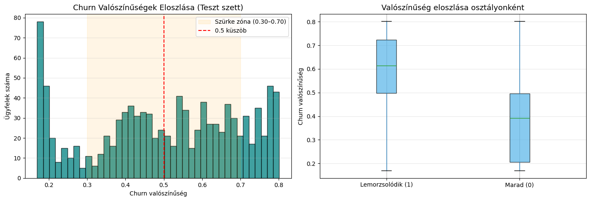
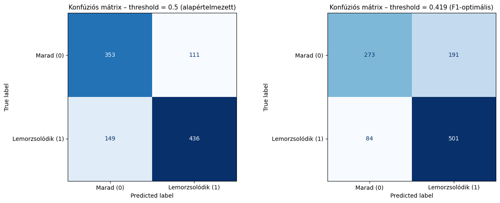
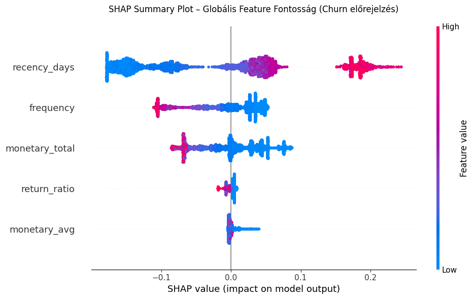
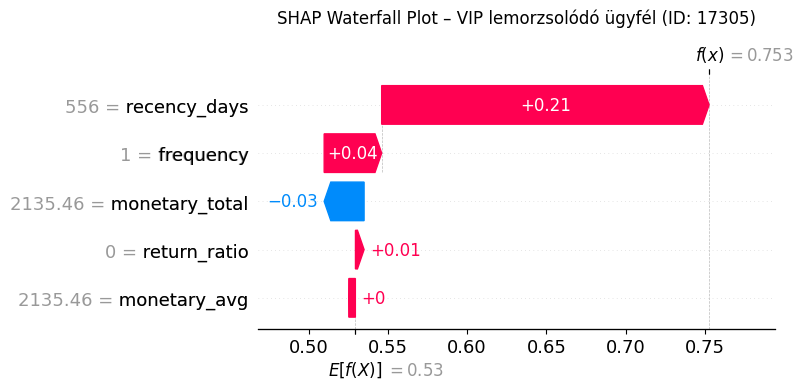
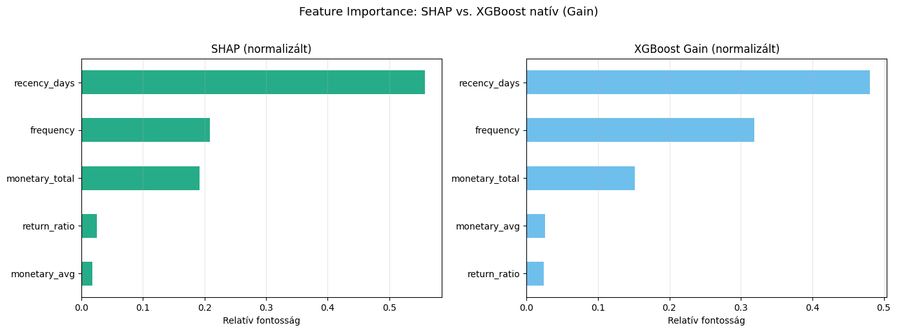

<a id="teteje"></a>
# 04 Modell Kiértékelés: Kalibráció, SHAP, Threshold & Üzleti Akciótervek
---
**Függőség:** `config.py` · `03_churn_prediction.ipynb` (előtte kell lefuttatni)

--- 

**Bemenetek:**
- `models/xgboost_churn.joblib` (a 03-as notebook végső, teljes adathalmazon betanított modellje)
- `data/processed/test_set.parquet` (holdout teszt szett – 03-as notebook 10.2-es cellája)
- `data/processed/online_retail_ready_for_rfm.parquet` (nyers tranzakciók – 01-es notebook kimenete)
- `data/processed/customer_segments.parquet` (RFM-szegmens címkék – 02-es notebook kimenete)

**Kimenetek:**
- `data/processed/churn_predictions.parquet` (teljes ügyfélbázis előrejelzések + akciók – Streamlit/BI dashboard bemenete)

---

> **📋 Notebook határok:**
> Ez a notebook a modellezési pipeline **kiértékelési és üzleti alkalmazási** fázisát fedi le.
> A modellépítés (`feature engineering → holdout split → CV → modellválasztás → export`) a `03_churn_prediction.ipynb` notebookban történt.

---

---

> ### ⚠️ Módszertani tanulság: a kiértékelési adatszivárgás csapdája
>
> Ez a notebook azért különül el a modellépítéstől, mert a **holdout teszt szett szerepe nem ér véget az overfitting-ellenőrzésnél**.
>
> Egy korábbi megközelítésben a SHAP-elemzés, a Precision-Recall görbe és az üzleti akciólista mind az összes tréningadaton (`X`, `y`) futottak – azon az adathalmazon, amelyen a modell tanult. Ez **kiértékelési adatszivárgást** okoz, és mérhető torzítást eredményez:
>
> | Metrika | Tréningadaton számolva *(hibás)* | Holdout teszten számolva *(helyes)* |
> |---|---|---|
> | Optimális threshold | 0.35 | 0.419 |
> | Legkockázatosabb ügyfél churn-valószínűsége | ~97% | ~75% |
> | PR görbe alakja | Szinte tökéletes ív | Reális, enyhén egyenetlen |
>
> **Miért torzít a tréningadaton való kiértékelés?**
> A modell a tréningadatot „látta" – az osztályhatárokat, a feature-eloszlásokat, a valószínűségbecsléseket mind erre optimalizálta. Ha ugyanezen az adaton mérjük a thresholdot vagy nézzük a SHAP értékeket, a modell saját emlékeit értékeljük, nem a valódi általánosítási képességét. Ez különösen veszélyes üzleti döntéshozatalnál: egy 97%-os churn-valószínűség alapján a marketing csapat azonnal drága retenciós kampányt indít – miközben a valódi, torzítatlan becslés csak 75%.
>
> **A helyes megközelítés (ezt követi ez a notebook):**
> Minden kiértékelési lépés – kalibráció, threshold-optimalizálás, konfúziós mátrix, SHAP-elemzés – a holdout teszt szett 1 049 ügyfelén fut, akiket a modell a teljes pipeline során soha nem látott.

---

A modell önmagában nem elegendő – három kérdést kell megválaszolni mielőtt üzleti döntésre használjuk:
1. **Megbízhatók-e a valószínűségek?** → Kalibrációs ellenőrzés
2. **Melyik feature-ök hajtják a modellt, és összhangban van-e ez az üzleti logikával?** → SHAP elemzés + feature importance konzisztencia-ellenőrzés
3. **Melyik döntési küszöbnél a legjobb az üzleti érték?** → Threshold optimalizálás, visszacsatolva az exportba

## 10. Modell betöltése és adatok előkészítése

Ez a notebook teljesen önállóan futtatható: nem szükséges a 03-as notebook memóriájában lévő változók – minden a lemezről töltődik be.

### 10.1 Importok és konfiguráció

A `shap` csomag szükséges: `pip install shap`.
A `CalibrationDisplay` sklearn ≥ 1.1 verziótól érhető el.


```python
# ============================================================
# 10.1 – Importok és konfiguráció
# ============================================================
import warnings
warnings.filterwarnings('ignore', category=FutureWarning, module='sklearn')
warnings.filterwarnings('ignore', category=FutureWarning, module='xgboost')
# A NumPy globális RNG FutureWarning-ot dob, ha np.random.seed() után
# SHAP belső numpy random hívásokat végez – üzenetmintára szűrünk:
warnings.filterwarnings(
    'ignore',
    message='.*NumPy global RNG.*',
    category=FutureWarning
)

import numpy as np
import pandas as pd
import matplotlib.pyplot as plt
import seaborn as sns
import joblib
import shap

from sklearn.calibration import CalibrationDisplay, CalibratedClassifierCV
from sklearn.metrics import (
    average_precision_score, f1_score, recall_score, precision_score,
    precision_recall_curve, brier_score_loss, classification_report,
    confusion_matrix, ConfusionMatrixDisplay
)

from config import (
    READY_FOR_RFM_PARQUET, CUSTOMER_SEGMENTS_PARQUET,
    XGB_MODEL_PATH, PROCESSED_DIR, CUTOFF_DATE, CHURN_PREDICTIONS_PARQUET
)

RANDOM_STATE  = 42
FEATURE_COLS  = ['recency_days', 'frequency', 'monetary_total', 'monetary_avg', 'return_ratio']
np.random.seed(RANDOM_STATE)

print(f"Cutoff dátum (config.py-ból): {CUTOFF_DATE}")
print(f"Modell: {XGB_MODEL_PATH}")
```

    Cutoff dátum (config.py-ból): 2011-09-09
    Modell: D:\Workspace\ecommerce-customer-segmentation\models\xgboost_churn.joblib
    

### 10.2 A mentett modell betöltése

A `xgboost_churn.joblib` a 03-as notebook `10.1` cellájában lett elmentve: a teljes `X`, `y` adathalmazon
betanított végleges pipeline. Importálás után detektáljuk a pipeline típusát (A: csak RFM, B: RFM+KMeans),
mert ez meghatározza a feature neveket és a SHAP elemzés lépéseit.


```python
# ============================================================
# 10.2 – Modell betöltése és pipeline típus detektálása
# ============================================================
model = joblib.load(XGB_MODEL_PATH)

# Pipeline típus: 'features' kulcs jelenléte → B modell (FeatureUnion)
if 'features' in model.named_steps:
    PIPELINE_TYPE  = 'B (RFM + K-Means OHE)'
    cluster_names  = [f'cluster_{i}' for i in range(4)]
    FEATURE_NAMES  = FEATURE_COLS + cluster_names
else:
    PIPELINE_TYPE  = 'A (csak RFM)'
    FEATURE_NAMES  = FEATURE_COLS

xgb_clf = model.named_steps['clf']   # az XGBClassifier objektum

print(f"✔️ Modell betöltve: {XGB_MODEL_PATH}")
print(f"   Fájlméret:     {XGB_MODEL_PATH.stat().st_size / 1024:.1f} KB")
print(f"   Pipeline típus: {PIPELINE_TYPE}")
print(f"   Feature-ök ({len(FEATURE_NAMES)} db): {FEATURE_NAMES}")
```

    ✔️ Modell betöltve: D:\Workspace\ecommerce-customer-segmentation\models\xgboost_churn.joblib
       Fájlméret:     120.2 KB
       Pipeline típus: A (csak RFM)
       Feature-ök (5 db): ['recency_days', 'frequency', 'monetary_total', 'monetary_avg', 'return_ratio']
    

### 10.3 Holdout teszt szett betöltése

A 03-as notebook `10.2` cellája mentette el a `test_set.parquet`-et.
Ez az a 20%-os holdout szett, amelyet a teljes modellezési folyamat során senki sem látott –
kizárólag erre a kiértékelési notebookra vártuk. Kalibrálás, threshold-optimalizálás és
az összes torzítatlan metrika ebből a szettből számolódik.


```python
# ============================================================
# 10.3 – Holdout teszt szett betöltése
# ============================================================
TEST_SET_PATH = PROCESSED_DIR / "test_set.parquet"
test_df = pd.read_parquet(TEST_SET_PATH)

X_test = test_df[FEATURE_COLS]
y_test = test_df['churn']

y_test_proba = model.predict_proba(X_test)[:, 1]
y_test_pred  = (y_test_proba >= 0.5).astype(int)   # ideiglenes 0.5-ös küszöb

print(f"✔️ Holdout teszt szett betöltve: {TEST_SET_PATH}")
print(f"   {X_test.shape[0]:,} ügyfél × {X_test.shape[1]} feature")
print(f"   Churn arány: {y_test.mean()*100:.1f}%")
print(f"   Teszt PR-AUC: {average_precision_score(y_test, y_test_proba):.4f}")
```

    ✔️ Holdout teszt szett betöltve: D:\Workspace\ecommerce-customer-segmentation\data\processed\test_set.parquet
       1,049 ügyfél × 5 feature
       Churn arány: 55.8%
       Teszt PR-AUC: 0.8322
    

### 10.4 Teljes ügyfélbázis rekonstrukciója

A 03-as notebook az eredeti RFM-számítás (6.2–6.5) memóriaváltozóit nem menti el parquetbe,
ezért itt futásidőben rekonstruáljuk – ugyanolyan logikával, ugyanabból a forrásból.
Ez szükséges ahhoz, hogy az összes 5 243 ügyfélre predikciót és SHAP-magyarázatot generáljunk,
nem csak a teszt szett 1 049 ügyfelére.


```python
# ============================================================
# 10.4 – Teljes X rekonstrukciója (azonos logika, mint 03 / 6.2–6.5)
# ============================================================
df = pd.read_parquet(READY_FOR_RFM_PARQUET)
CUTOFF_DATE_TS = pd.to_datetime(CUTOFF_DATE)

df_obs    = df[df['InvoiceDate'] <  CUTOFF_DATE_TS].copy()
df_target = df[df['InvoiceDate'] >= CUTOFF_DATE_TS].copy()

purchases = df_obs[df_obs['Quantity'] > 0]
returns   = df_obs[df_obs['Quantity'] < 0]

rfm = purchases.groupby('Customer ID').agg(
    recency_days=('InvoiceDate', lambda x: (CUTOFF_DATE_TS - x.max()).days),
    frequency   =('Invoice', 'nunique')
)
monetary = df_obs.groupby('Customer ID')['LineTotal'].sum().rename('monetary_total')
rfm = rfm.join(monetary)
return_counts = returns.groupby('Customer ID')['Invoice'].nunique().rename('return_count')
rfm = rfm.join(return_counts).fillna({'return_count': 0})
rfm['monetary_avg'] = rfm['monetary_total'] / rfm['frequency']
rfm['return_ratio'] = rfm['return_count'] / (rfm['frequency'] + rfm['return_count'])
rfm = rfm[rfm['monetary_total'] > 0]

active_in_target   = set(df_target['Customer ID'].unique())
rfm['churn']       = rfm.index.map(lambda cid: 0 if cid in active_in_target else 1)

X_all = rfm[FEATURE_COLS].copy()
y_all = rfm['churn'].copy()

# Predikció az összes ügyfelre (a végleges, teljes adathalmazon tanított modellel)
y_all_proba = model.predict_proba(X_all)[:, 1]

print(f"✔️ Teljes ügyfélbázis rekonstruálva: {X_all.shape[0]:,} ügyfél")
print(f"   Átlagos churn valószínűség: {y_all_proba.mean():.3f}")
print(f"   Churn arány (tényleges):    {y_all.mean():.3f}")
```

    ✔️ Teljes ügyfélbázis rekonstruálva: 5,243 ügyfél
       Átlagos churn valószínűség: 0.511
       Churn arány (tényleges):    0.557
    

## 11. Modell kiértékelése

Ez a fejezet három egymásra épülő kérdésre válaszol:
1. **Churn valószínűségek eloszlása** – mit lát a modell az ügyfélbázisból?
2. **Kalibrációs ellenőrzés** – a modell 60%-ot mond, de tényleg 60% a valódi arány?
3. **Threshold optimalizálás** – melyik küszöbnél a legjobb az üzleti érték?

### 11.1 Churn valószínűségek eloszlása

Az eloszlás megmutatja, hogy a modell mennyire „határozottan" osztályoz.
- **Egészséges jel:** A valószínűségek szétterülnek a [0, 1] intervallumon.
- **Aggasztó jel (U-alak):** Ha a pontok a 0 és 1 szélek köré torlódnak,
  a modell „extrém" és kalibrálatlan – nem alkalmas árnyalt üzleti döntésre.

A **0.3–0.7 közötti „szürke zóna"** a legértékesebb szegmens: ezek az ügyfelek
még megnyerhetők – egy jól irányzott kampánnyal az ő döntésük befolyásolható.


```python
# ============================================================
# 11.1 – Churn valószínűségek eloszlása (teszt szett)
# ============================================================
fig, axes = plt.subplots(1, 2, figsize=(14, 5))

# Bal: hisztogram
axes[0].hist(y_test_proba, bins=40, color='teal', edgecolor='black', alpha=0.75)
axes[0].axvspan(0.3, 0.7, alpha=0.1, color='orange', label='Szürke zóna (0.30–0.70)')
axes[0].axvline(0.5, color='red', linestyle='--', linewidth=1.5, label='0.5 küszöb')
axes[0].set_title('Churn Valószínűségek Eloszlása (Teszt szett)', fontsize=13)
axes[0].set_xlabel('Churn valószínűség')
axes[0].set_ylabel('Ügyfelek száma')
axes[0].legend()
axes[0].grid(axis='y', alpha=0.3)

# Jobb: boxplot churn=0 vs churn=1
proba_by_class = pd.DataFrame({'proba': y_test_proba, 'actual': y_test})
proba_by_class['Tényleges osztály'] = proba_by_class['actual'].map({0: 'Marad (0)', 1: 'Lemorzsolódik (1)'})
proba_by_class.boxplot(column='proba', by='Tényleges osztály', ax=axes[1],
                       patch_artist=True, boxprops=dict(facecolor='#56B4E9', alpha=0.7))
axes[1].set_title('Valószínűség eloszlása osztályonként', fontsize=13)
axes[1].set_xlabel('')
axes[1].set_ylabel('Churn valószínűség')
plt.suptitle('')
axes[1].grid(axis='y', alpha=0.3)

plt.tight_layout()
plt.show()

print("\n--- Valószínűségek statisztikája (teszt szett) ---")
stats = pd.Series(y_test_proba).describe()
print(stats)

grey_zone_pct = ((y_test_proba >= 0.3) & (y_test_proba <= 0.7)).mean() * 100
print(f"\n🎯 Szürke zónában lévő ügyfelek aránya: {grey_zone_pct:.1f}%")
print("   (Ezek azok, akiknek megtartásán érdemes dolgozni)")
```


    

    


    
    --- Valószínűségek statisztikája (teszt szett) ---
    count    1049.000000
    mean        0.503159
    std         0.193466
    min         0.169567
    25%         0.372515
    50%         0.519501
    75%         0.670641
    max         0.801264
    dtype: float64
    
    🎯 Szürke zónában lévő ügyfelek aránya: 61.2%
       (Ezek azok, akiknek megtartásán érdemes dolgozni)
    

### 11.2 Kalibrációs ellenőrzés (Reliability Diagram)

**Mit jelent a kalibráció?**
Egy modell jól kalibrált, ha a kimondott valószínűség tényleg a valóságot tükrözi:
ha 100 ügyfelre 70%-ot mond, közülük tényleg ~70-nek kell lemorzsolódnia.

**Miért fontos ez?**
Az `assign_action` üzleti logikánk az ügyfélnek mondott `"57%-os valószínűséggel megy el"`
üzenetén múlik. Ha a modell szisztematikusan alul- vagy túlbecsül, a marketing csapat
rossz számokat kap döntési alapként.

**Hogyan olvassuk a diagramot?**
- **Tökéletes kalibráció:** A pontok az átló mentén fekszenek.
- **Átló fölé:** A modell pesszimistább a valóságnál (a mondott arány > tényleges arány).
- **Átló alatt:** A modell optimistább (mondott < tényleges).

**Brier-score:** 0 = tökéletes, 0.25 = véletlen találgatás. Alacsonyabb jobb.


```python
# ============================================================
# 11.2 – Kalibrációs ellenőrzés (Reliability Diagram)
# ============================================================
fig, ax = plt.subplots(figsize=(8, 6))

CalibrationDisplay.from_predictions(
    y_test, y_test_proba,
    n_bins    = 10,
    ax        = ax,
    color     = '#009E73',
    name      = 'XGBoost (kalibrálás nélkül)',
    strategy  = 'quantile'   # egyenletes minta per bin
)

ax.set_title('Kalibrációs Diagram (Reliability Diagram) – Teszt szett', fontsize=13)
ax.grid(True, alpha=0.3)
plt.tight_layout()
plt.show()

brier = brier_score_loss(y_test, y_test_proba)
print(f"📊 Kalibrációs mutatók (teszt szett):")
print(f"   Brier-score: {brier:.4f}  (0 = tökéletes, 0.25 = véletlen)")

# Automatikus diagnózis
if brier < 0.15:
    print(f"   ✅ Kiváló kalibráció – a valószínűségek üzleti döntéshez megbízhatóak.")
elif brier < 0.20:
    print(f"   ⚠️  Elfogadható kalibráció – kisebb torzítás, de üzleti célra használható.")
else:
    print(f"   🚨 Gyenge kalibráció – fontold meg a CalibratedClassifierCV alkalmazását!")
    print(f"      (lásd: sklearn.calibration.CalibratedClassifierCV, method='isotonic')")
```


    
.png)
    


    📊 Kalibrációs mutatók (teszt szett):
       Brier-score: 0.1824  (0 = tökéletes, 0.25 = véletlen)
       ⚠️  Elfogadható kalibráció – kisebb torzítás, de üzleti célra használható.
    

### 11.3 Threshold optimalizálás (Precision-Recall görbe)

A modell valószínűségeket ad vissza – ezeket egy **döntési küszöb (threshold)** mentén
alakítjuk bináris predikcióvá. Az alapértelmezett 0.5 szinte sosem optimális.

**F1-maximalizáló threshold:** matematikai egyensúly a Precision és Recall között.
**Üzleti szempontból:** churn esetén a **hamis negatív** (kihagyott lemorzsolódó) általában
drágább, mint a **hamis pozitív** (feleslegesen kapott kupon) → érdemes a küszöböt
az F1-optimumnál lejjebb venni, ha a Recall maximalizálása a cél.

> 📌 **Ez a threshold kerül vissza az exportba** – a `result_df` és a `churn_predictions.parquet`
> már ezzel a küszöbértékkel számol, nem a hardcoded 0.5-del.


```python
# ============================================================
# 11.3 – Threshold optimalizálás (PR görbe alapján)
# ============================================================
precision_vals, recall_vals, thresholds = precision_recall_curve(y_test, y_test_proba)

# F1-t maximalizáló threshold
f1_scores       = (2 * precision_vals[:-1] * recall_vals[:-1]
                   / (precision_vals[:-1] + recall_vals[:-1] + 1e-10))
best_idx        = f1_scores.argmax()
BEST_THRESHOLD  = thresholds[best_idx]
best_precision  = precision_vals[best_idx]
best_recall     = recall_vals[best_idx]
best_f1         = f1_scores[best_idx]

fig, ax = plt.subplots(figsize=(9, 6))

ax.plot(recall_vals, precision_vals, color='#009E73', linewidth=2, label='PR Görbe')
ax.fill_between(recall_vals, precision_vals, alpha=0.08, color='#009E73')

ax.axvline(best_recall,    color='#D55E00', linestyle='--', alpha=0.8)
ax.axhline(best_precision, color='#D55E00', linestyle='--', alpha=0.8,
           label=(f'Optimális threshold = {BEST_THRESHOLD:.3f}\n'
                  f'  Precision = {best_precision:.3f}  |  Recall = {best_recall:.3f}\n'
                  f'  F1-score  = {best_f1:.3f}'))

ax.scatter([best_recall], [best_precision], color='#D55E00', zorder=5, s=100)
ax.set_xlabel('Recall (Lefedettség)')
ax.set_ylabel('Precision (Pontosság)')
ax.set_title('Precision-Recall Görbe – Churn Előrejelzés (Teszt szett)', fontsize=13)
ax.legend(loc='lower left', fontsize=10)
ax.grid(True, alpha=0.3)
plt.tight_layout()
plt.show()

# Összehasonlítás: 0.5 vs optimális threshold
y_pred_05   = (y_test_proba >= 0.50).astype(int)
y_pred_opt  = (y_test_proba >= BEST_THRESHOLD).astype(int)

comparison = pd.DataFrame({
    'Metrika':   ['Precision', 'Recall', 'F1-score'],
    '0.5 küszöb': [
        precision_score(y_test, y_pred_05, zero_division=0),
        recall_score(y_test, y_pred_05),
        f1_score(y_test, y_pred_05, zero_division=0),
    ],
    f'Optimális ({BEST_THRESHOLD:.3f})': [
        precision_score(y_test, y_pred_opt, zero_division=0),
        recall_score(y_test, y_pred_opt),
        f1_score(y_test, y_pred_opt, zero_division=0),
    ],
}).set_index('Metrika').round(4)

print(f"\n🎯 F1-t maximalizáló threshold: {BEST_THRESHOLD:.3f}")
print("\nÖsszehasonlítás (teszt szett):")
display(comparison)
print(f"\n→ Ez a threshold fog érvényesülni az exportált churn_predictions.parquet-ben!")
```


    
.png)
    


    
    🎯 F1-t maximalizáló threshold: 0.419
    
    Összehasonlítás (teszt szett):
    


<div>
<style scoped>
    .dataframe tbody tr th:only-of-type {
        vertical-align: middle;
    }

    .dataframe tbody tr th {
        vertical-align: top;
    }

    .dataframe thead th {
        text-align: right;
    }
</style>
<table border="1" class="dataframe">
  <thead>
    <tr style="text-align: right;">
      <th></th>
      <th>0.5 küszöb</th>
      <th>Optimális (0.419)</th>
    </tr>
    <tr>
      <th>Metrika</th>
      <th></th>
      <th></th>
    </tr>
  </thead>
  <tbody>
    <tr>
      <th>Precision</th>
      <td>0.7971</td>
      <td>0.7240</td>
    </tr>
    <tr>
      <th>Recall</th>
      <td>0.7453</td>
      <td>0.8564</td>
    </tr>
    <tr>
      <th>F1-score</th>
      <td>0.7703</td>
      <td>0.7847</td>
    </tr>
  </tbody>
</table>
</div>


    
    → Ez a threshold fog érvényesülni az exportált churn_predictions.parquet-ben!
    

### 11.4 Konfúziós mátrix az optimális küszöbön

A konfúziós mátrix megmutatja, hogy a modell mikor téved és hogyan:
- **Hamis negatív (FN):** Lemorzsolódót nem detektált → elveszett ügyfél (**drága hiba**)
- **Hamis pozitív (FP):** Maradót churnnek jósolt → felesleges kupon (**olcsó hiba**)

Az optimális threshold csökkenti az FN-t a FP rovására – ez az üzleti preferencia.


```python
# ============================================================
# 11.4 – Konfúziós mátrix az optimális küszöbön
# ============================================================
fig, axes = plt.subplots(1, 2, figsize=(13, 5))

for ax, thresh, title in zip(
    axes,
    [0.5, BEST_THRESHOLD],
    ['0.5 (alapértelmezett)', f'{BEST_THRESHOLD:.3f} (F1-optimális)']
):
    y_pred_t = (y_test_proba >= thresh).astype(int)
    cm = confusion_matrix(y_test, y_pred_t)
    disp = ConfusionMatrixDisplay(cm, display_labels=['Marad (0)', 'Lemorzsolódik (1)'])
    disp.plot(ax=ax, colorbar=False, cmap='Blues')
    ax.set_title(f'Konfúziós mátrix – threshold = {title}', fontsize=11)

plt.tight_layout()
plt.show()

print("\n📋 Részletes osztályozási riport (optimális threshold):")
print(classification_report(y_test, y_pred_opt,
                            target_names=['Marad (0)', 'Lemorzsolódik (1)']))
```


    

    


    
    📋 Részletes osztályozási riport (optimális threshold):
                       precision    recall  f1-score   support
    
            Marad (0)       0.76      0.59      0.67       464
    Lemorzsolódik (1)       0.72      0.86      0.78       585
    
             accuracy                           0.74      1049
            macro avg       0.74      0.72      0.72      1049
         weighted avg       0.74      0.74      0.73      1049
    
    

## 12. Modell magyarázata – SHAP elemzés

A SHAP (SHapley Additive exPlanations) játékelméleti alapon magyarázza az egyes feature-ök
hozzájárulását minden egyes predikciónál. Három kérdésre válaszol:
1. **Globálisan:** Melyik feature a legfontosabb a teljes modell számára? (Summary Plot)
2. **Egyénileg:** Miért mondja a modell, hogy ez a konkrét VIP ügyfél el fog menni? (Waterfall Plot)
3. **Konzisztencia-ellenőrzés:** Összhangban van-e a SHAP a natív XGBoost fontossággal? (Összehasonlítás)

### 12.1 SHAP adatok előkészítése

**Miért nem `TreeExplainer`?**
Az XGBoost 3.x a `base_score`-t `'[5E-1]'` stringként tárolja a booster belsejében –
ezt a `shap.TreeExplainer` nem tudja float-ra alakítani, és `ValueError`-t dob.
Az eredeti 03-as notebookban is alkalmazott megoldás: `shap.Explainer(predict_proba, background)`
(PermutationExplainer), amely verziófüggetlen és stabil.

**Explainer kiválasztás:** A SHAP automatikusan a leggyorsabb elérhető explainer-t választja –
kis adathalmaznál `ExactExplainer`, nagy adathalmaznál `PermutationExplainer` fut.
5 243 ügyféllel tipikusan az `ExactExplainer` aktiválódik (~15–20 másodperc).

**Háttéradatok:** 200 véletlenszerű sor a referencia-eloszlás meghatározásához.


```python
# ============================================================
# 12.1 – SHAP adatok előkészítése
# ============================================================
# XGBoost 3.x kompatibilitási megjegyzés:
# shap.TreeExplainer ValueError-t dob ("could not convert string to float: '[5E-1]'")
# mert az XGBoost 3.x belső formátumban tárolja a base_score-t.
# Megoldás: shap.Explainer(predict_proba, background) – verziófüggetlen megoldás.
# (Identikus az eredeti 03-as notebookban alkalmazott megközelítéssel.)

# Transzformált feature mátrix az összes ügyfélre
if 'features' in model.named_steps:
    X_transformed = model.named_steps['features'].transform(X_all)
else:
    X_transformed = X_all.values

print(f"Pipeline típus: {PIPELINE_TYPE}")
print(f"X_transformed shape: {X_transformed.shape}  → feature nevek: {FEATURE_NAMES}")

# Háttér-adathalmaz a PermutationExplainer referencia-eloszlásához (200 sor)
rng    = np.random.default_rng(RANDOM_STATE)
bg_idx = rng.choice(len(X_transformed), size=min(200, len(X_transformed)), replace=False)
X_bg   = X_transformed[bg_idx]

print("\nSHAP Explainer illesztése (predict_proba, 200 háttérsor)...")
explainer   = shap.Explainer(xgb_clf.predict_proba, X_bg)

print("SHAP értékek számítása az összes ügyfélen (néhány perc)...")
shap_values = explainer(X_transformed)

# Kimenet: Explanation objektum (n_samples, n_features, n_classes)
# [:, :, 1] → Churn=1 osztály SHAP értékei
sv_churn = shap_values[:, :, 1]

print(f"\n✔️ SHAP értékek kiszámítva: {shap_values.values.shape}")
print(f"   Churn=1 szelet alakja:   {sv_churn.values.shape}")
print(f"   Base value (Churn=1):    {sv_churn.base_values[0]:.4f}")
print(f"   Feature nevek: {FEATURE_NAMES}")
```

    Pipeline típus: A (csak RFM)
    X_transformed shape: (5243, 5)  → feature nevek: ['recency_days', 'frequency', 'monetary_total', 'monetary_avg', 'return_ratio']
    
    SHAP Explainer illesztése (predict_proba, 200 háttérsor)...
    SHAP értékek számítása az összes ügyfélen (néhány perc)...
    

    ExactExplainer explainer: 5244it [00:19, 135.63it/s]                                                                   
    

    
    ✔️ SHAP értékek kiszámítva: (5243, 5, 2)
       Churn=1 szelet alakja:   (5243, 5)
       Base value (Churn=1):    0.5295
       Feature nevek: ['recency_days', 'frequency', 'monetary_total', 'monetary_avg', 'return_ratio']
    

### 12.2 SHAP Summary Plot – Globális feature fontosság

**Hogyan olvassuk?**
- **Vízszintes tengely:** SHAP érték – mennyivel tolja a predikciót a churn felé (+) vagy ellen (−).
- **Szín:** Az eredeti feature értéke (piros = magas, kék = alacsony).
- **Józan ész teszt (Sanity Check):** Ha a modell helyesen működik:
  - `recency_days` magas értéke (piros) → **jobb oldal** (rég vásárolt → churnel)
  - `frequency` és `monetary_total` magas értéke (piros) → **bal oldal** (aktív, sokat költ → marad)
  
  Ha fordítva áll, a célváltozó kódolása hibás!


```python
# ============================================================
# 12.2 – SHAP Summary Plot (Globális feature fontosság)
# ============================================================
print("SHAP Summary Plot generálása...")

fig, ax = plt.subplots(figsize=(10, 6))
shap.summary_plot(
    sv_churn.values,        # Explanation.values → numpy array
    X_transformed,
    feature_names = FEATURE_NAMES,
    show          = False,
    plot_size     = None
)
plt.title('SHAP Summary Plot – Globális Feature Fontosság (Churn előrejelzés)', pad=20)
plt.tight_layout()
plt.show()

print("\n📊 Értelmezés:")
print("  • Magas recency_days (piros, jobbra) → churnel: aki rég vásárolt, elmegy")
print("  • Alacsony frequency (kék, jobbra)  → churnel: ritka vásárló nagyobb kockázat")
print("  • Magas monetary_total (piros, balra) → marad: a legtöbbet költők hűségesek")
```

    SHAP Summary Plot generálása...
    


    

    


    
    📊 Értelmezés:
      • Magas recency_days (piros, jobbra) → churnel: aki rég vásárolt, elmegy
      • Alacsony frequency (kék, jobbra)  → churnel: ritka vásárló nagyobb kockázat
      • Magas monetary_total (piros, balra) → marad: a legtöbbet költők hűségesek
    

### 12.3 SHAP Waterfall Plot – Egyedi VIP ügyfél magyarázata

A Waterfall Plot egyetlen ügyfél predikciójának bontása: melyik feature mennyivel
tolta a modell döntését a churn felé vagy ellen.

Szándékosan egy **VIP ügyfelet** (felső 25% monetary) választunk, aki lemorzsolódónak
lett jósolva – ők azok, akiknek elvesztése a legtöbbet fáj üzletileg.


```python
# ============================================================
# 12.3 – SHAP Waterfall Plot (VIP lemorzsolódó ügyfél)
# ============================================================
rfm_with_pred = rfm.copy()
rfm_with_pred['churn_proba'] = y_all_proba

monetary_75pct = rfm['monetary_total'].quantile(0.75)
vip_churned = rfm_with_pred[
    (rfm_with_pred['monetary_total'] > monetary_75pct) &
    (rfm_with_pred['churn'] == 1)
]

if len(vip_churned) == 0:
    selected_idx = rfm_with_pred['churn_proba'].idxmax()
    print("⚠️ Nincs VIP lemorzsolódó – a legmagasabb churn valószínűségű ügyfelet elemzem.")
else:
    selected_idx = vip_churned['churn_proba'].idxmax()
    print(f"Elemzett VIP lemorzsolódó ügyfél: ID {selected_idx}")

idx_pos = rfm.index.get_loc(selected_idx)
selected_profile = rfm_with_pred.loc[selected_idx, FEATURE_COLS + ['churn', 'churn_proba']]
print("\nAz elemzett ügyfél profilja:")
display(selected_profile.to_frame().T.style.format({
    'monetary_total': '£{:,.0f}',
    'monetary_avg':   '£{:,.0f}',
    'churn_proba':    '{:.2%}',
    'recency_days':   '{:.0f}',
}))

# sv_churn egy Explanation objektum (n_samples, n_features) a Churn=1 osztályra
# A feature_names az Explainer-től örökli → ha None, manuálisan adjuk meg
shap_exp = shap.Explanation(
    values        = sv_churn.values[idx_pos],
    base_values   = sv_churn.base_values[idx_pos],
    data          = sv_churn.data[idx_pos],
    feature_names = FEATURE_NAMES
)

fig, ax = plt.subplots(figsize=(10, 5))
shap.plots.waterfall(shap_exp, max_display=10, show=False)
plt.title(f'SHAP Waterfall Plot – VIP lemorzsolódó ügyfél (ID: {selected_idx})', pad=15)
plt.tight_layout()
plt.show()
```

    Elemzett VIP lemorzsolódó ügyfél: ID 17305
    
    Az elemzett ügyfél profilja:
    


<style type="text/css">
</style>
<table id="T_00bcc">
  <thead>
    <tr>
      <th class="blank level0" >&nbsp;</th>
      <th id="T_00bcc_level0_col0" class="col_heading level0 col0" >recency_days</th>
      <th id="T_00bcc_level0_col1" class="col_heading level0 col1" >frequency</th>
      <th id="T_00bcc_level0_col2" class="col_heading level0 col2" >monetary_total</th>
      <th id="T_00bcc_level0_col3" class="col_heading level0 col3" >monetary_avg</th>
      <th id="T_00bcc_level0_col4" class="col_heading level0 col4" >return_ratio</th>
      <th id="T_00bcc_level0_col5" class="col_heading level0 col5" >churn</th>
      <th id="T_00bcc_level0_col6" class="col_heading level0 col6" >churn_proba</th>
    </tr>
  </thead>
  <tbody>
    <tr>
      <th id="T_00bcc_level0_row0" class="row_heading level0 row0" >17305</th>
      <td id="T_00bcc_row0_col0" class="data row0 col0" >556</td>
      <td id="T_00bcc_row0_col1" class="data row0 col1" >1.000000</td>
      <td id="T_00bcc_row0_col2" class="data row0 col2" >£2,135</td>
      <td id="T_00bcc_row0_col3" class="data row0 col3" >£2,135</td>
      <td id="T_00bcc_row0_col4" class="data row0 col4" >0.000000</td>
      <td id="T_00bcc_row0_col5" class="data row0 col5" >1.000000</td>
      <td id="T_00bcc_row0_col6" class="data row0 col6" >75.26%</td>
    </tr>
  </tbody>
</table>


    

    


### 12.4 Feature importance konzisztencia-ellenőrzés: XGBoost natív vs. SHAP

**Miért szükséges ez?**
Az XGBoost-nak saját, belső feature importance mérőszámai vannak (`gain`, `weight`, `cover`).
Ezek néha félrevezető képet adnak korrelált feature-ök esetén – a SHAP értékek megbízhatóbbak,
mert játékelméleti garanciarendszerrel számolnak.

Ha a két módszer sorrendje **nagy mértékben** eltér, az arra utalhat, hogy:
- Két feature erősen korrelált (pl. `monetary_total` és `monetary_avg`)
- Az XGBoost natív importance félreatt egy feature-t

Ez az ellenőrzés segít eldönteni, hogy a SHAP-eredmény megbízható-e.


```python
# ============================================================
# 12.4 – XGBoost natív feature importance vs. SHAP
# ============================================================
# --- SHAP alapú fontosság: mean(|SHAP|) feature-enként ---
shap_importance = pd.Series(
    np.abs(sv_churn.values).mean(axis=0),
    index=FEATURE_NAMES
).sort_values(ascending=False)

# --- XGBoost natív fontosság (gain) ---
booster        = xgb_clf.get_booster()
native_raw     = booster.get_score(importance_type='gain')

# A natív feature nevek az XGBoost-ban f0, f1, ... alakban jelennek meg
# → remapping az eredeti nevekre
n_feat     = X_transformed.shape[1]
fname_map  = {f'f{i}': FEATURE_NAMES[i] for i in range(n_feat)}
native_imp = pd.Series(
    {fname_map.get(k, k): v for k, v in native_raw.items()}
).reindex(FEATURE_NAMES).fillna(0).sort_values(ascending=False)

# Normalizálás [0,1]-re az összehasonlíthatóság kedvéért
shap_norm   = (shap_importance / shap_importance.sum()).rename('SHAP (normalizált)')
native_norm = (native_imp     / native_imp.sum()).rename('XGBoost Gain (normalizált)')

comparison  = pd.concat([shap_norm, native_norm], axis=1).round(4)

print("Feature Importance összehasonlítás (SHAP vs. XGBoost Gain):")
display(comparison.sort_values('SHAP (normalizált)', ascending=False))

# Vizualizáció
fig, axes = plt.subplots(1, 2, figsize=(14, 5))
colors = ['#009E73', '#56B4E9']

for ax, col, color in zip(axes, comparison.columns, colors):
    comparison[col].sort_values().plot(kind='barh', ax=ax, color=color, alpha=0.85)
    ax.set_title(col, fontsize=12)
    ax.set_xlabel('Relatív fontosság')
    ax.grid(axis='x', alpha=0.3)

plt.suptitle('Feature Importance: SHAP vs. XGBoost natív (Gain)', fontsize=13, y=1.02)
plt.tight_layout()
plt.show()

# Sorrend-eltérés mérése (Spearman-korreláció)
from scipy.stats import spearmanr
rho, pval = spearmanr(
    shap_norm.reindex(FEATURE_NAMES).fillna(0),
    native_norm.reindex(FEATURE_NAMES).fillna(0)
)
print(f"\n📊 Sorrend-konzisztencia (Spearman ρ): {rho:.3f}  (p={pval:.3f})")
if rho > 0.8:
    print("  ✅ A két módszer erősen egyezik – a SHAP eredmények megbízhatóak.")
elif rho > 0.5:
    print("  ⚠️  Mérsékelt egyezés – ellenőrizd a korrelált feature-öket.")
else:
    print("  🚨 Gyenge egyezés – a SHAP és a natív importance ellentmond egymásnak!")
```

    Feature Importance összehasonlítás (SHAP vs. XGBoost Gain):
    


<div>
<style scoped>
    .dataframe tbody tr th:only-of-type {
        vertical-align: middle;
    }

    .dataframe tbody tr th {
        vertical-align: top;
    }

    .dataframe thead th {
        text-align: right;
    }
</style>
<table border="1" class="dataframe">
  <thead>
    <tr style="text-align: right;">
      <th></th>
      <th>SHAP (normalizált)</th>
      <th>XGBoost Gain (normalizált)</th>
    </tr>
  </thead>
  <tbody>
    <tr>
      <th>recency_days</th>
      <td>0.5574</td>
      <td>0.4803</td>
    </tr>
    <tr>
      <th>frequency</th>
      <td>0.2081</td>
      <td>0.3185</td>
    </tr>
    <tr>
      <th>monetary_total</th>
      <td>0.1921</td>
      <td>0.1512</td>
    </tr>
    <tr>
      <th>return_ratio</th>
      <td>0.0248</td>
      <td>0.0238</td>
    </tr>
    <tr>
      <th>monetary_avg</th>
      <td>0.0177</td>
      <td>0.0262</td>
    </tr>
  </tbody>
</table>
</div>


    

    


    
    📊 Sorrend-konzisztencia (Spearman ρ): 0.900  (p=0.037)
      ✅ A két módszer erősen egyezik – a SHAP eredmények megbízhatóak.
    

## 13. Üzleti kiértékelés és akciótervek

A modell önmagában nem elegendő – az előrejelzéseket üzleti akciótervre kell lefordítani.

**Fontos változás az eredeti 03-as notebooktól:** Az akciólista most az **optimalizált
thresholdot** (`BEST_THRESHOLD`) használja a hardcoded 0.5 helyett – ez a 11.3-as cella
eredménye visszacsatolva az üzleti döntésbe.

### 13.1 Prioritizált akciólista – az összes ügyfélre

Az akciók négy kategóriában születnek, a churn-valószínűség és az ügyfél értékessége
(`monetary_total`) kombinációja alapján:

| Kategória | Feltétel | Ajánlott akció |
|---|---|---|
| 🚨 VIP Veszélyben | magas érték + magas churn | Azonnali, személyes retenció |
| 💎 VIP Stabil | magas érték + alacsony churn | Lojalitásprogram, upsell |
| ⚠️ Lemorzsolódó | alacsony érték + magas churn | Win-back kampány |
| ✅ Stabil | alacsony érték + alacsony churn | Standard kommunikáció |

> **⚠️ Megjegyzés a „VIP" definícióhoz:** A `monetary_total > medián` feltétel az ügyfélbázis
> felső 50%-át sorolja a „magas értékű" kategóriába – ez magában foglal egyszeri vásárlókat és
> 400+ napos recencyű ügyfeleket is. A **valódi VIP-ek** (lojális, sokat költők) az `rfm_segment`
> oszlopban `'VIP Bajnokok'` felirattal azonosíthatók, és az RFM-szegmens × akció kereszttábla
> pontosan megmutatja, hogy ők mekkora arányban esnek a 🚨 VIP Veszélyben kategóriába.
> Az `rfm_segment` oszlop mindig elérhető az exportált `churn_predictions.parquet`-ben,
> ezért az üzleti csapat tovább szűrhet valódi VIP-ekre.


```python
# ============================================================
# 13.1 – Prioritizált akciólista (optimalizált threshold)
# ============================================================
result_df = X_all.copy()
result_df['churn_proba']  = y_all_proba
result_df['churn_pred']   = (y_all_proba >= BEST_THRESHOLD).astype(int)
result_df['actual_churn'] = y_all.values

# Szegmenscímkék betöltése a 02-es notebookból
try:
    seg_df  = pd.read_parquet(CUSTOMER_SEGMENTS_PARQUET)
    seg_col = (
        'segment_label' if 'segment_label' in seg_df.columns else
        'Szegmens'      if 'Szegmens'      in seg_df.columns else
        'Segment'       if 'Segment'       in seg_df.columns else
        seg_df.select_dtypes(include='object').columns[0]
    )
    result_df = result_df.join(
        seg_df[[seg_col]].rename(columns={seg_col: 'rfm_segment'}),
        how='left'
    )
    result_df['rfm_segment'] = result_df['rfm_segment'].fillna('Ismeretlen')
    print(f"✔️ Szegmenscímkék becsatolva ({seg_col!r} oszlopból)")
    print(f"   Egyedi szegmensek: {sorted(result_df['rfm_segment'].unique())}")
except FileNotFoundError:
    print("⚠️  customer_segments.parquet nem található – szegmenscímkék nélkül folytatjuk.")
    result_df['rfm_segment'] = 'N/A'

# Akciócímkék hozzárendelése
monetary_median = result_df['monetary_total'].median()

def assign_action(row):
    high_value = row['monetary_total'] > monetary_median
    high_churn = row['churn_proba']    >= BEST_THRESHOLD
    if   high_value and     high_churn: return '🚨 VIP Veszélyben – Azonnali Retenció'
    elif high_value and not high_churn: return '💎 VIP Stabil – Lojalitás Program'
    elif not high_value and high_churn: return '⚠️  Lemorzsolódó – Win-Back Kampány'
    else:                               return '✅ Stabil – Standard Kommunikáció'

result_df['action'] = result_df.apply(assign_action, axis=1)

# Összefoglaló
action_summary = (
    result_df['action'].value_counts()
    .reset_index()
    .rename(columns={'action': 'Akció kategória', 'count': 'Ügyfelek száma'})
)
action_summary['Arány (%)'] = (
    action_summary['Ügyfelek száma'] / len(result_df) * 100
).round(1)

print(f"\nOptimális threshold alkalmazva: {BEST_THRESHOLD:.3f}")
print("\nÜzleti akció-szegmensek összefoglalása:")
display(action_summary)

print("\nRFM-szegmens × Churn-kockázat kereszttábla:")
cross_tab = pd.crosstab(
    result_df['rfm_segment'], result_df['action'],
    margins=True, margins_name='Összesen'
)
display(cross_tab)
```

    ✔️ Szegmenscímkék becsatolva ('Segment' oszlopból)
       Egyedi szegmensek: ['Elvesztett / Inaktív', 'Lemorzsolódó / Alvó', 'VIP Bajnokok', 'Új / Ígéretes']
    
    Optimális threshold alkalmazva: 0.419
    
    Üzleti akció-szegmensek összefoglalása:
    


<div>
<style scoped>
    .dataframe tbody tr th:only-of-type {
        vertical-align: middle;
    }

    .dataframe tbody tr th {
        vertical-align: top;
    }

    .dataframe thead th {
        text-align: right;
    }
</style>
<table border="1" class="dataframe">
  <thead>
    <tr style="text-align: right;">
      <th></th>
      <th>Akció kategória</th>
      <th>Ügyfelek száma</th>
      <th>Arány (%)</th>
    </tr>
  </thead>
  <tbody>
    <tr>
      <th>0</th>
      <td>⚠️  Lemorzsolódó – Win-Back Kampány</td>
      <td>2473</td>
      <td>47.2</td>
    </tr>
    <tr>
      <th>1</th>
      <td>💎 VIP Stabil – Lojalitás Program</td>
      <td>1558</td>
      <td>29.7</td>
    </tr>
    <tr>
      <th>2</th>
      <td>🚨 VIP Veszélyben – Azonnali Retenció</td>
      <td>1062</td>
      <td>20.3</td>
    </tr>
    <tr>
      <th>3</th>
      <td>✅ Stabil – Standard Kommunikáció</td>
      <td>150</td>
      <td>2.9</td>
    </tr>
  </tbody>
</table>
</div>


    
    RFM-szegmens × Churn-kockázat kereszttábla:
    


<div>
<style scoped>
    .dataframe tbody tr th:only-of-type {
        vertical-align: middle;
    }

    .dataframe tbody tr th {
        vertical-align: top;
    }

    .dataframe thead th {
        text-align: right;
    }
</style>
<table border="1" class="dataframe">
  <thead>
    <tr style="text-align: right;">
      <th>action</th>
      <th>⚠️  Lemorzsolódó – Win-Back Kampány</th>
      <th>✅ Stabil – Standard Kommunikáció</th>
      <th>💎 VIP Stabil – Lojalitás Program</th>
      <th>🚨 VIP Veszélyben – Azonnali Retenció</th>
      <th>Összesen</th>
    </tr>
    <tr>
      <th>rfm_segment</th>
      <th></th>
      <th></th>
      <th></th>
      <th></th>
      <th></th>
    </tr>
  </thead>
  <tbody>
    <tr>
      <th>Elvesztett / Inaktív</th>
      <td>1987</td>
      <td>0</td>
      <td>0</td>
      <td>111</td>
      <td>2098</td>
    </tr>
    <tr>
      <th>Lemorzsolódó / Alvó</th>
      <td>224</td>
      <td>1</td>
      <td>476</td>
      <td>923</td>
      <td>1624</td>
    </tr>
    <tr>
      <th>VIP Bajnokok</th>
      <td>0</td>
      <td>0</td>
      <td>855</td>
      <td>6</td>
      <td>861</td>
    </tr>
    <tr>
      <th>Új / Ígéretes</th>
      <td>262</td>
      <td>149</td>
      <td>227</td>
      <td>22</td>
      <td>660</td>
    </tr>
    <tr>
      <th>Összesen</th>
      <td>2473</td>
      <td>150</td>
      <td>1558</td>
      <td>1062</td>
      <td>5243</td>
    </tr>
  </tbody>
</table>
</div>


### 13.2 VIP Veszélyben lista – TOP 20

A 🚨 VIP Veszélyben kategóriából a legmagasabb churn-valószínűségű ügyfelek listája.
Ezek azok, akiknek elvesztése a legnagyobb bevételkiesést jelenti – **azonnali beavatkozás** szükséges.

**Javasolt akciók:**
1. Személyes account manager megkeresés (B2B ügyfeleknél)
2. Exkluzív visszatérési kupon (15–20% kedvezmény)
3. Win-back email sorozat (3 üzenet, 2 hetes intervallummal)
4. NPS felmérés (proaktív panaszkezelés)


```python
# ============================================================
# 13.2 – VIP Veszélyben lista (TOP 20)
# ============================================================
vip_at_risk = (
    result_df[result_df['action'] == '🚨 VIP Veszélyben – Azonnali Retenció']
    .sort_values('churn_proba', ascending=False)
)

print(f"VIP Veszélyben ügyfelek száma: {len(vip_at_risk):,}")
print(f"Becsült veszélyeztetett bevétel: £{vip_at_risk['monetary_total'].sum():,.0f}")
print(f"\nTop 20 legmagasabb kockázatú VIP ügyfél:")

display(
    vip_at_risk[['monetary_total', 'frequency', 'recency_days',
                 'return_ratio', 'rfm_segment', 'churn_proba']]
    .head(20)
    .style
    .format({
        'monetary_total': '£{:,.0f}',
        'churn_proba':    '{:.1%}',
        'recency_days':   '{:.0f} nap',
        'return_ratio':   '{:.1%}',
    })
    .background_gradient(subset=['churn_proba'], cmap='Reds')
)
```

    VIP Veszélyben ügyfelek száma: 1,062
    Becsült veszélyeztetett bevétel: £1,880,008
    
    Top 20 legmagasabb kockázatú VIP ügyfél:
    


<style type="text/css">
#T_3e847_row0_col5, #T_3e847_row1_col5, #T_3e847_row2_col5, #T_3e847_row3_col5, #T_3e847_row4_col5, #T_3e847_row5_col5, #T_3e847_row6_col5, #T_3e847_row7_col5, #T_3e847_row8_col5 {
  background-color: #67000d;
  color: #f1f1f1;
}
#T_3e847_row9_col5, #T_3e847_row10_col5, #T_3e847_row11_col5 {
  background-color: #fcb499;
  color: #000000;
}
#T_3e847_row12_col5, #T_3e847_row13_col5, #T_3e847_row14_col5, #T_3e847_row15_col5 {
  background-color: #fed8c7;
  color: #000000;
}
#T_3e847_row16_col5, #T_3e847_row17_col5 {
  background-color: #fee4d8;
  color: #000000;
}
#T_3e847_row18_col5, #T_3e847_row19_col5 {
  background-color: #fff5f0;
  color: #000000;
}
</style>
<table id="T_3e847">
  <thead>
    <tr>
      <th class="blank level0" >&nbsp;</th>
      <th id="T_3e847_level0_col0" class="col_heading level0 col0" >monetary_total</th>
      <th id="T_3e847_level0_col1" class="col_heading level0 col1" >frequency</th>
      <th id="T_3e847_level0_col2" class="col_heading level0 col2" >recency_days</th>
      <th id="T_3e847_level0_col3" class="col_heading level0 col3" >return_ratio</th>
      <th id="T_3e847_level0_col4" class="col_heading level0 col4" >rfm_segment</th>
      <th id="T_3e847_level0_col5" class="col_heading level0 col5" >churn_proba</th>
    </tr>
    <tr>
      <th class="index_name level0" >Customer ID</th>
      <th class="blank col0" >&nbsp;</th>
      <th class="blank col1" >&nbsp;</th>
      <th class="blank col2" >&nbsp;</th>
      <th class="blank col3" >&nbsp;</th>
      <th class="blank col4" >&nbsp;</th>
      <th class="blank col5" >&nbsp;</th>
    </tr>
  </thead>
  <tbody>
    <tr>
      <th id="T_3e847_level0_row0" class="row_heading level0 row0" >12368</th>
      <td id="T_3e847_row0_col0" class="data row0 col0" >£918</td>
      <td id="T_3e847_row0_col1" class="data row0 col1" >1</td>
      <td id="T_3e847_row0_col2" class="data row0 col2" >536 nap</td>
      <td id="T_3e847_row0_col3" class="data row0 col3" >0.0%</td>
      <td id="T_3e847_row0_col4" class="data row0 col4" >Elvesztett / Inaktív</td>
      <td id="T_3e847_row0_col5" class="data row0 col5" >75.6%</td>
    </tr>
    <tr>
      <th id="T_3e847_level0_row1" class="row_heading level0 row1" >13775</th>
      <td id="T_3e847_row1_col0" class="data row1 col0" >£1,050</td>
      <td id="T_3e847_row1_col1" class="data row1 col1" >1</td>
      <td id="T_3e847_row1_col2" class="data row1 col2" >498 nap</td>
      <td id="T_3e847_row1_col3" class="data row1 col3" >0.0%</td>
      <td id="T_3e847_row1_col4" class="data row1 col4" >Elvesztett / Inaktív</td>
      <td id="T_3e847_row1_col5" class="data row1 col5" >75.6%</td>
    </tr>
    <tr>
      <th id="T_3e847_level0_row2" class="row_heading level0 row2" >17474</th>
      <td id="T_3e847_row2_col0" class="data row2 col0" >£1,047</td>
      <td id="T_3e847_row2_col1" class="data row2 col1" >1</td>
      <td id="T_3e847_row2_col2" class="data row2 col2" >507 nap</td>
      <td id="T_3e847_row2_col3" class="data row2 col3" >0.0%</td>
      <td id="T_3e847_row2_col4" class="data row2 col4" >Elvesztett / Inaktív</td>
      <td id="T_3e847_row2_col5" class="data row2 col5" >75.6%</td>
    </tr>
    <tr>
      <th id="T_3e847_level0_row3" class="row_heading level0 row3" >12784</th>
      <td id="T_3e847_row3_col0" class="data row3 col0" >£1,034</td>
      <td id="T_3e847_row3_col1" class="data row3 col1" >1</td>
      <td id="T_3e847_row3_col2" class="data row3 col2" >437 nap</td>
      <td id="T_3e847_row3_col3" class="data row3 col3" >0.0%</td>
      <td id="T_3e847_row3_col4" class="data row3 col4" >Elvesztett / Inaktív</td>
      <td id="T_3e847_row3_col5" class="data row3 col5" >75.6%</td>
    </tr>
    <tr>
      <th id="T_3e847_level0_row4" class="row_heading level0 row4" >13204</th>
      <td id="T_3e847_row4_col0" class="data row4 col0" >£967</td>
      <td id="T_3e847_row4_col1" class="data row4 col1" >1</td>
      <td id="T_3e847_row4_col2" class="data row4 col2" >639 nap</td>
      <td id="T_3e847_row4_col3" class="data row4 col3" >0.0%</td>
      <td id="T_3e847_row4_col4" class="data row4 col4" >Elvesztett / Inaktív</td>
      <td id="T_3e847_row4_col5" class="data row4 col5" >75.6%</td>
    </tr>
    <tr>
      <th id="T_3e847_level0_row5" class="row_heading level0 row5" >12396</th>
      <td id="T_3e847_row5_col0" class="data row5 col0" >£931</td>
      <td id="T_3e847_row5_col1" class="data row5 col1" >1</td>
      <td id="T_3e847_row5_col2" class="data row5 col2" >582 nap</td>
      <td id="T_3e847_row5_col3" class="data row5 col3" >0.0%</td>
      <td id="T_3e847_row5_col4" class="data row5 col4" >Elvesztett / Inaktív</td>
      <td id="T_3e847_row5_col5" class="data row5 col5" >75.6%</td>
    </tr>
    <tr>
      <th id="T_3e847_level0_row6" class="row_heading level0 row6" >12503</th>
      <td id="T_3e847_row6_col0" class="data row6 col0" >£896</td>
      <td id="T_3e847_row6_col1" class="data row6 col1" >1</td>
      <td id="T_3e847_row6_col2" class="data row6 col2" >492 nap</td>
      <td id="T_3e847_row6_col3" class="data row6 col3" >0.0%</td>
      <td id="T_3e847_row6_col4" class="data row6 col4" >Elvesztett / Inaktív</td>
      <td id="T_3e847_row6_col5" class="data row6 col5" >75.6%</td>
    </tr>
    <tr>
      <th id="T_3e847_level0_row7" class="row_heading level0 row7" >14969</th>
      <td id="T_3e847_row7_col0" class="data row7 col0" >£906</td>
      <td id="T_3e847_row7_col1" class="data row7 col1" >1</td>
      <td id="T_3e847_row7_col2" class="data row7 col2" >611 nap</td>
      <td id="T_3e847_row7_col3" class="data row7 col3" >0.0%</td>
      <td id="T_3e847_row7_col4" class="data row7 col4" >Elvesztett / Inaktív</td>
      <td id="T_3e847_row7_col5" class="data row7 col5" >75.6%</td>
    </tr>
    <tr>
      <th id="T_3e847_level0_row8" class="row_heading level0 row8" >15559</th>
      <td id="T_3e847_row8_col0" class="data row8 col0" >£1,109</td>
      <td id="T_3e847_row8_col1" class="data row8 col1" >1</td>
      <td id="T_3e847_row8_col2" class="data row8 col2" >476 nap</td>
      <td id="T_3e847_row8_col3" class="data row8 col3" >0.0%</td>
      <td id="T_3e847_row8_col4" class="data row8 col4" >Elvesztett / Inaktív</td>
      <td id="T_3e847_row8_col5" class="data row8 col5" >75.6%</td>
    </tr>
    <tr>
      <th id="T_3e847_level0_row9" class="row_heading level0 row9" >17039</th>
      <td id="T_3e847_row9_col0" class="data row9 col0" >£1,955</td>
      <td id="T_3e847_row9_col1" class="data row9 col1" >1</td>
      <td id="T_3e847_row9_col2" class="data row9 col2" >512 nap</td>
      <td id="T_3e847_row9_col3" class="data row9 col3" >0.0%</td>
      <td id="T_3e847_row9_col4" class="data row9 col4" >Elvesztett / Inaktív</td>
      <td id="T_3e847_row9_col5" class="data row9 col5" >75.3%</td>
    </tr>
    <tr>
      <th id="T_3e847_level0_row10" class="row_heading level0 row10" >12911</th>
      <td id="T_3e847_row10_col0" class="data row10 col0" >£1,652</td>
      <td id="T_3e847_row10_col1" class="data row10 col1" >1</td>
      <td id="T_3e847_row10_col2" class="data row10 col2" >459 nap</td>
      <td id="T_3e847_row10_col3" class="data row10 col3" >0.0%</td>
      <td id="T_3e847_row10_col4" class="data row10 col4" >Elvesztett / Inaktív</td>
      <td id="T_3e847_row10_col5" class="data row10 col5" >75.3%</td>
    </tr>
    <tr>
      <th id="T_3e847_level0_row11" class="row_heading level0 row11" >17305</th>
      <td id="T_3e847_row11_col0" class="data row11 col0" >£2,135</td>
      <td id="T_3e847_row11_col1" class="data row11 col1" >1</td>
      <td id="T_3e847_row11_col2" class="data row11 col2" >556 nap</td>
      <td id="T_3e847_row11_col3" class="data row11 col3" >0.0%</td>
      <td id="T_3e847_row11_col4" class="data row11 col4" >Lemorzsolódó / Alvó</td>
      <td id="T_3e847_row11_col5" class="data row11 col5" >75.3%</td>
    </tr>
    <tr>
      <th id="T_3e847_level0_row12" class="row_heading level0 row12" >13559</th>
      <td id="T_3e847_row12_col0" class="data row12 col0" >£990</td>
      <td id="T_3e847_row12_col1" class="data row12 col1" >2</td>
      <td id="T_3e847_row12_col2" class="data row12 col2" >420 nap</td>
      <td id="T_3e847_row12_col3" class="data row12 col3" >0.0%</td>
      <td id="T_3e847_row12_col4" class="data row12 col4" >Elvesztett / Inaktív</td>
      <td id="T_3e847_row12_col5" class="data row12 col5" >75.2%</td>
    </tr>
    <tr>
      <th id="T_3e847_level0_row13" class="row_heading level0 row13" >12905</th>
      <td id="T_3e847_row13_col0" class="data row13 col0" >£1,012</td>
      <td id="T_3e847_row13_col1" class="data row13 col1" >2</td>
      <td id="T_3e847_row13_col2" class="data row13 col2" >484 nap</td>
      <td id="T_3e847_row13_col3" class="data row13 col3" >33.3%</td>
      <td id="T_3e847_row13_col4" class="data row13 col4" >Elvesztett / Inaktív</td>
      <td id="T_3e847_row13_col5" class="data row13 col5" >75.2%</td>
    </tr>
    <tr>
      <th id="T_3e847_level0_row14" class="row_heading level0 row14" >15484</th>
      <td id="T_3e847_row14_col0" class="data row14 col0" >£1,062</td>
      <td id="T_3e847_row14_col1" class="data row14 col1" >2</td>
      <td id="T_3e847_row14_col2" class="data row14 col2" >448 nap</td>
      <td id="T_3e847_row14_col3" class="data row14 col3" >0.0%</td>
      <td id="T_3e847_row14_col4" class="data row14 col4" >Lemorzsolódó / Alvó</td>
      <td id="T_3e847_row14_col5" class="data row14 col5" >75.2%</td>
    </tr>
    <tr>
      <th id="T_3e847_level0_row15" class="row_heading level0 row15" >17020</th>
      <td id="T_3e847_row15_col0" class="data row15 col0" >£936</td>
      <td id="T_3e847_row15_col1" class="data row15 col1" >2</td>
      <td id="T_3e847_row15_col2" class="data row15 col2" >450 nap</td>
      <td id="T_3e847_row15_col3" class="data row15 col3" >0.0%</td>
      <td id="T_3e847_row15_col4" class="data row15 col4" >Elvesztett / Inaktív</td>
      <td id="T_3e847_row15_col5" class="data row15 col5" >75.2%</td>
    </tr>
    <tr>
      <th id="T_3e847_level0_row16" class="row_heading level0 row16" >12671</th>
      <td id="T_3e847_row16_col0" class="data row16 col0" >£2,622</td>
      <td id="T_3e847_row16_col1" class="data row16 col1" >1</td>
      <td id="T_3e847_row16_col2" class="data row16 col2" >514 nap</td>
      <td id="T_3e847_row16_col3" class="data row16 col3" >0.0%</td>
      <td id="T_3e847_row16_col4" class="data row16 col4" >Lemorzsolódó / Alvó</td>
      <td id="T_3e847_row16_col5" class="data row16 col5" >75.2%</td>
    </tr>
    <tr>
      <th id="T_3e847_level0_row17" class="row_heading level0 row17" >18052</th>
      <td id="T_3e847_row17_col0" class="data row17 col0" >£10,877</td>
      <td id="T_3e847_row17_col1" class="data row17 col1" >1</td>
      <td id="T_3e847_row17_col2" class="data row17 col2" >472 nap</td>
      <td id="T_3e847_row17_col3" class="data row17 col3" >0.0%</td>
      <td id="T_3e847_row17_col4" class="data row17 col4" >Lemorzsolódó / Alvó</td>
      <td id="T_3e847_row17_col5" class="data row17 col5" >75.2%</td>
    </tr>
    <tr>
      <th id="T_3e847_level0_row18" class="row_heading level0 row18" >13459</th>
      <td id="T_3e847_row18_col0" class="data row18 col0" >£1,160</td>
      <td id="T_3e847_row18_col1" class="data row18 col1" >2</td>
      <td id="T_3e847_row18_col2" class="data row18 col2" >532 nap</td>
      <td id="T_3e847_row18_col3" class="data row18 col3" >0.0%</td>
      <td id="T_3e847_row18_col4" class="data row18 col4" >Lemorzsolódó / Alvó</td>
      <td id="T_3e847_row18_col5" class="data row18 col5" >75.1%</td>
    </tr>
    <tr>
      <th id="T_3e847_level0_row19" class="row_heading level0 row19" >17622</th>
      <td id="T_3e847_row19_col0" class="data row19 col0" >£1,125</td>
      <td id="T_3e847_row19_col1" class="data row19 col1" >2</td>
      <td id="T_3e847_row19_col2" class="data row19 col2" >505 nap</td>
      <td id="T_3e847_row19_col3" class="data row19 col3" >33.3%</td>
      <td id="T_3e847_row19_col4" class="data row19 col4" >Lemorzsolódó / Alvó</td>
      <td id="T_3e847_row19_col5" class="data row19 col5" >75.1%</td>
    </tr>
  </tbody>
</table>


## 14. Export, előrejelzések mentése

A `churn_predictions.parquet` az összes downstream felhasználás bemenete:
Streamlit dashboard, BI eszközök, marketing automatizáció.

**Mit tartalmaz a fájl?**
- `FEATURE_COLS`: az 5 RFM feature (nyers értékek)
- `churn_proba`: a modell által adott churn-valószínűség
- `churn_pred`: bináris döntés az **optimalizált** küszöb szerint (`BEST_THRESHOLD`)
- `actual_churn`: tényleges churn (ismert múltbeli adat – validációhoz)
- `rfm_segment`: 02-es notebook KMeans szegmensneve
- `action`: üzleti akciókategória


```python
# ============================================================
# 14.1 – Előrejelzések exportja (Streamlit / BI dashboard)
# ============================================================
export_df = result_df.copy()
export_df.to_parquet(CHURN_PREDICTIONS_PARQUET, compression='snappy')

print(f"✔️ Előrejelzések mentve: {CHURN_PREDICTIONS_PARQUET}")
print(f"   Dimenziók: {export_df.shape[0]:,} ügyfél × {export_df.shape[1]} oszlop")
print(f"   Oszlopok:  {list(export_df.columns)}")

print("\n" + "="*60)
print("04_model_evaluation.ipynb – KÉSZ")
print("="*60)
print(f"  Brier-score (kalibráció):    {brier_score_loss(y_test, y_test_proba):.4f}")
print(f"  Optimális threshold:         {BEST_THRESHOLD:.3f}")
print(f"  Teszt PR-AUC:                {average_precision_score(y_test, y_test_proba):.4f}")
print(f"  Teszt F1 (opt. threshold):   {f1_score(y_test, y_pred_opt, zero_division=0):.4f}")
print(f"  Teszt Recall (opt.):         {recall_score(y_test, y_pred_opt):.4f}")
print(f"  VIP Veszélyben ügyfelek:     {len(vip_at_risk):,}")
print(f"  Export mentve:               {CHURN_PREDICTIONS_PARQUET}")
print("="*60)
print("\n→ Következő lépés: Streamlit dashboard (app.py)")
```

    ✔️ Előrejelzések mentve: D:\Workspace\ecommerce-customer-segmentation\data\processed\churn_predictions.parquet
       Dimenziók: 5,243 ügyfél × 10 oszlop
       Oszlopok:  ['recency_days', 'frequency', 'monetary_total', 'monetary_avg', 'return_ratio', 'churn_proba', 'churn_pred', 'actual_churn', 'rfm_segment', 'action']
    
    ============================================================
    04_model_evaluation.ipynb – KÉSZ
    ============================================================
      Brier-score (kalibráció):    0.1824
      Optimális threshold:         0.419
      Teszt PR-AUC:                0.8322
      Teszt F1 (opt. threshold):   0.7847
      Teszt Recall (opt.):         0.8564
      VIP Veszélyben ügyfelek:     1,062
      Export mentve:               D:\Workspace\ecommerce-customer-segmentation\data\processed\churn_predictions.parquet
    ============================================================
    
    → Következő lépés: Streamlit dashboard (app.py)
    

<div align="center">
  <br>
  <a href="#teteje">
    
  </a>
  <br>
</div>

*Az ugrás gomb nem minden környezetben működik!

# Dokumentáció frissítése README.md-ben és docs mappában
🚨 **Figyelmeztetés:** <kbd>Ctrl</kbd> + <kbd>S</kbd> / <kbd>Cmd ⌘</kbd> + <kbd>S</kbd> szükséges az alábbi cella futtatása előtt!  
(Az nbconvert a fájl utolsó elmentett állapotát olvassa a lemezről, nem az aktuális memóriaképet.)


```python
# 04-es notebook docs generálása/frissítése
!python update_docs.py --notebook 04_model_evaluation.ipynb
```

    Docs frissitese...
    ==================================================
    [04_model_evaluation.ipynb] Konvertalas Markdown-ra...
    [04_model_evaluation.ipynb] [OK] Kesz! (7 kep)
    
    [README] Elemzés főbb lépései táblázat frissítése...
    [README] Táblázat frissítve: 15 sor, 1 csere.
    
    ==================================================
    Kesz!
    
